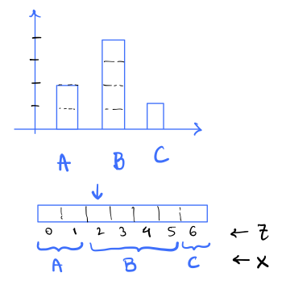

# EE274 (Fall 23): Homework-2

- **Focus area:** Lossless Compression
- **Due Date:** Nov 1, midnight (11:59 PM)
- **Weightage:** 15%
- **Total Points:** 110


### Q1: Camping Trip (*20 points*)

During one of the camping trips, Pulkit was given $n$ rope segments of lengths $l_1, l_2,\ldots, l_n$ by Kedar, and was asked to join all the ropes into a single long segment of length $\sum_{i=1}^n l_i$. Pulkit can only join two ropes at a time and the "effort" in joining ropes $i, j$ using a knot is $l_i + l_j$. Pulkit is lazy and would like to minimize his "effort" to join all the segments together.  

1. [5 points] Do you see any parallels between the problem and one of the prefix-free codes you have learnt about? Please justify your answer.

    **Solution**

    Yes, the problem is connected to `Huffman Codes`. The cost of joining a rope into the final segment is proportional to number of times it is used in the knotting process. We will need to pay a larger penalty for a rope if it is used for creating a knot earlier, than later. We can visualize the process of creating the final long segment as a prefix-free tree construction where nodes represent the cost of joining the ropes and depth of the node indicates how many times the particular rope corresponding to this node was used for creating the final segment. Mathematically, the problem is same as 

    $$ \min_{\text{prefix-free code}} \sum_{i=1}^n l_i \cdot d_i $$

    where $l_i$ is the length of the rope and $d_i$ is the number of times the rope is knotted.

    We have seen this optimization problem before in class when we were constructing `Huffman tree`! 

2. [5 points] Let $E_{opt}$ be the optimal (minimal) value for the effort required to join all the segments. Without solving the problem, can Pulkit get an estimate of what the $E_{opt}$ would be? Leaving your answer in terms of inequalities is fine.

    **Solution**

    To map the problem precisely to Huffman Tree construction as seen in class, we need to ensure that we are optimizing over probability distribution over ropes. This can be trivially done by normalizing the rope lengths. Let $p_i = \frac{l_i}{\sum_{i=1}^n l_i}$ be the probability corresponding to Huffman tree for rope $i$. Then, the problem can be mapped to the following optimization problem:

    $$ \min_{\text{prefix-free code}} \left (\sum_{i=1}^n p_i \cdot d_i \right) \times \left( \sum_{i=1}^n l_i \right)$$

    Note that $\sum_{i=1}^n p_i = l_i$ is constant given rope-lengths. We can now use the fact that the optimal value of the above optimization problem is equal to the entropy of the probability distribution over ropes $H(P)$ scaled by the sum of rope-lengths. Therefore, 

    $$\left(\sum_{i=1}^n l_i\right) \cdot H(P) \leq E_{opt} \leq \left(\sum_{i=1}^n l_i\right) \cdot \left(H(P) + 1 \right) $$

    where $H(P) = \sum_i p_i \log_2 \frac{1}{p_i}$ is the entropy of the probability distribution over ropes as defined above.

3. [10 points] Implement the function `compute_minimum_effort()` in the file `hw2_p1.py`.  
HINT: You may use one of the prefix-free code implementations in the SCL Library

    **Solution**

    ```python
    def compute_minimal_effort(rope_lengths_arr: List[float]) -> float:
    """
    lengths_arr -> list of rope lengths (positive floating points)
    output -> the value of the minimum effort in joining all the ropes together 
    """
    effort = None
    ###########################################################
    # Q5.3: Add code here to compute the minimal effort
    ###########################################################
    # raise NotImplementedError

    from compressors.huffman_coder import HuffmanTree
    from core.prob_dist import ProbabilityDist

    # create a prob_dist out of the rope_lengths_arr
    rope_lengths_dict = {f"rope_id_{ind}": val for ind, val in enumerate(rope_lengths_arr)}
    prob_dist = ProbabilityDist.normalize_prob_dict(rope_lengths_dict)
    encoding_table = HuffmanTree(prob_dist).get_encoding_table()

    # compute minimal effort as the average codelength of huffman code
    effort = 0
    for rope_id in encoding_table:
        effort += len(encoding_table[rope_id]) * rope_lengths_dict[rope_id]

    ###########################################################
    return effort  
    ```

### Q2: Generating random non-uniform data (*25 points*)

Consider the problem of sampling a non-uniform discrete distribution, when you given samples from a uniform distribution. 

Let's assume that we are given a single sample of random variable `U`, uniformly distributed in the unit interval `[0,1)` (e.g. `U = numpy.random.rand()`). The goal is to generate samples from a non-uniform discrete distribution $P$. We will assume that $P$ is a *rational distribution*. i.e. for any symbol $s$, $P(s) = n_s/M$, where $n_s, M$ are integers. 

1. [5 points] Given a non-uniform rational distribution, we can sample a single random value $X_1 \sim P$ from `U` by finding the cumulative distribution bin in which the sample `U` falls since the cumulative distribution also lies between `[0,1)`. For example, if $P$ is the distribution such as `P = {A: 2/7, B: 4/7, C: 1/7}`, then we output the symbols `A,B,C` based on the intervals in which they lie as follows:
    ```
    if U in [0.0, 2/7) -> output A
    if U in [2/7, 6/7) -> output B
    if U in [6/7, 1.0) -> output C
    ```
    Generalize the above algorithm to any given rational distribution, and describe it in a few lines. For a distribution of alphabet size $k$ (e.g. $k=3$ in the example above), what is the time/memory complexity of your algorithm wrt $k$? 

    **Solution**

    We can use the cumulative distribution function to find the bin in which the sample `U` falls and output the sample corresponding to that bin. The cumulative distribution function is defined as: $F(x) = \sum_{i=1}^{x} P(i)$. We can find the bin in which the sample `U` falls by finding the smallest $x$ such that $F(x) > U$ and then output symbol `x`. We can use `binary search` for finding the bin. The time complexity of this algorithm is $O(log(k))$, where $k$ is the size of the alphabet. The memory complexity is $O(k)$, since we need to store the cumulative distribution function.

2. [5 points] Complete the function `generate_samples_vanilla` in `hw2_p2.py` which takes in a non-uniform  rational distribution `P` and returns `data_size` number of samples from it. You can assume that the distribution is given as a dictionary, where the keys are the symbols and the values are the frequency of occurrence in the data. For example, the distribution `P = {A: 2/7, B: 4/7, C: 1/7}` can be represented as `P = Frequencies({'A': 2, 'B': 4, 'C': 1})`. Ensure that your code passes the `test_vanilla_generator` test in `hw2_p2.py`. Feel free to add more test cases.

    **Solution**

    ```python
    def generate_samples_vanilla(freqs: Frequencies, data_size):
        """
        Generate data samples with the given frequencies from uniform distribution [0, 1) using the basic approach
        :param freqs: frequencies of symbols (see Frequencies class)
        :param data_size: number of samples to generate
        :return: DataBlock object with generated samples
        """
        prob_dist = freqs.get_prob_dist()
    
        # some lists which might be useful
        symbol_list = list(prob_dist.cumulative_prob_dict.keys())
        cumul_list = list(prob_dist.cumulative_prob_dict.values())
        cumul_list.append(1.0)
    
        generated_samples_list = []  # <- holds generated samples
        for _ in range(data_size):
            # sample a uniform random variable in [0, 1)
            u = np.random.rand()
    
            ###############################################
            # ADD DETAILS HERE
            ###############################################
    
            # NOTE: side="right" corresponds to search of type a[i-1] <= t < a[i]
            bin = np.searchsorted(cumul_list, u, side="right") - 1
            s = symbol_list[bin]
            generated_samples_list.append(s)
            ###############################################
    
        return DataBlock(generated_samples_list)
    ```

3. [5 points] Given a single sample of a uniform random variable `U`, how can you extend your algorithm in part `2.1` above to sample $n=2$ i.i.d random values $X_1, X_2 \sim P$? Provide a concrete algorithm for `P= {A: 2/7, B: 4/7, C: 1/7}`. Generalize your method to an arbitrary number of samples $n$ and describe it in a few sentences. 

    **Solution**

    We can sample $n$ i.i.d random values $X_1, X_2, \ldots, X_n \sim P$ by first calculating the cumulative distribution corresponding to all possible symbols of block length `n` and then following the procedure as described above. Note this method scales very poorly with `n` since the size of the alphabet increases exponentially with `n`.

4. [5 points] Pulkit suggested that we can slightly modify Arithmetic Entropy Coder (`AEC`) we learnt in the class to sample a potentially infinite number of i.i.d samples $X_1, X_2, \ldots, X_n \sim P$ given any rational distribution $P$ from a single uniform random variable sample `U`! You can look at Pulkit's implementation `generate_samples_aec` in `hw2_p2.py` to get an idea of how to exploit `AEC`. Can you justify the correctness of Pulkit's method in a few lines?

    **Note**: Even though we say that we can sample potentially infinite number of samples, in practice we are limited by the precision of floats.

    **Solution**

    Pulkit's solution first samples a random number `U` in $[0,1)$ and then truncates it to 32 bits. Then it artificially considers the truncated sample as the output of an arithmetic encoder coming from data with same probability as distribution we want to sample from. Finally, it outputs a random bit sequence based on the output of arithmetic decoding on this encoded bitstream. The scheme works because we know that the probability of the uniform random variable lying in an interval in $[0,1)$  is proportional to the interval length and an arithmetic encoder-decoder pair works by dividing the number line between $[0,1)$ in interval lengths proportional to the probability of corresponding n-block symbols. Therefore, we can recover an arbitrary `n` bit symbol (upto precision of floats) with correct probabilities as given distribution by simply using arithmetic encoding followed by arithmetic decoding. 

5. [5 points] Now let's say that you have to sample data $X_0, X_1, \ldots, X_n$ from a Markov distribution $Q$. Recall for a Markov Chain, $Q(X_0, X_1, \ldots, X_n) = Q(X_0)Q(X_1|X_0) \ldots Q(X_n|X_{n-1})$. Can you use your technique from `Q2.3` or the technique suggested by Pulkit in `Q2.4` to sample any number of samples $n$ with Markov distribution $Q$ from a single uniform random variable sample `U in [0,1)`? Describe the algorithm in a few lines.

    **Solution**

    We can use either of the techniques in `Q2.3` or `Q2.4` to sample from a markov chain by simply modifying the probability distribution of n-block symbols to be the markov chain distribution. For example, we can use technique in `Q2.3` by calculating the cumulative distribution corresponding to all possible symbols of block length `n` using the described markov chain probability decomposition and then following the procedure as described in `Q2.3`. We can use technique in `Q2.4` by considering the truncated sample as the output of an arithmetic encoder coming from data with same probability as markov chain distribution we want to sample from. In this case, we'll use the conditional distribution at each arithmetic decoding step as we did in lecture 9. 

### Q3: Conditional Entropy (*20 points*)
In this problem we will get familiar with conditional entropy and its properties. 

We learnt a few properties of conditional entropy in class: 
- $H(X) \geq H(X|Y)$
- $H(X,Y) = H(Y) + H(X|Y)$

We will use these properties to show some other useful properties about conditional entropy and solve some fun problems!

1. [5 points] Let $f(X) = Z$ be an arbitrary function which maps $X \in \mathcal{X}$ to a discrete set $Z \in \mathcal{Z}$. Then show that: $H(f(X)|X) = 0$. Can you intuitively explain why this is the case? 

    **Solution**

    Given a value of $X=x$, $f(X)$ has a deterministic value $f(x)$. Therefore $H(f(X)|X=x) = 0$ and
 
    $H(f(X)|X) = \sum_x p(x, f(x)) H(f(X) | X = x) = \sum_x 0 $

2. [5 points] Show that $H(f(X)) \leq H(X)$, i.e. processing the data in any form is just going to reduce the entropy. Also, show that the equality holds if the function $f$ is invertible, i.e. if there exists a function $g$ such that $g(f(X)) = X$. Can you intuitively explain why this is the case?

    **Solution**

    Let's use the chain rule of entropy in two different ways:

    $$
    \begin{align}
    H(X, f(X)) &= H(X) + H(f(X)|X) = H(X) \\
    H(X, f(X)) &= H(f(X)) + H(X|f(X)) \geq H(f(X))
    \end{align}
    $$

    since $H(f(X)|X) = 0$ and $H(X|f(X)) \geq 0$. Therefore, $H(X) \geq H(f(X))$.

    The equality holds when $H(X|f(X)) = 0$. This holds when $X$ is a deterministic function of $f(X)$ implying that $f(X)$ is invertible. Intuitively, if there is a one-to-one mapping between $X$ and $f(X)$, then the entropy of $X$ is the same as the entropy of $f(X)$ as all we are doing is changing the alphabets but not the probability distribution across those alphabets! 

3. [4 points] In the HW1 of the 2023 edition of EE274, Pulkit and Shubham had an assignment to compress the Sherlock novel (lets call it $x_{orig}$). Pulkit computed the empirical `0th` order distribution of the letters and used those with Arithmetic coding to compress $x_{orig}$, and received average codelength $L_1$. While working on the assignment, Shubham accidentally replaced all letters with lowercase (i.e `A -> a`, `B -> b` etc.). Lets call this modified text $x_{lowercase}$. Shubham compressed $x_{lowercase}$ with the same algorithm as Pulkit, and got average codelength $L_2$. Do you expect $L_1 \geq L_2$, or $L_2 \geq L_1$. Justify based on properties of Arithmetic coding and `Q3.2`.

    **Solution**

    We know that $H(X) \geq H(f(X))$. Since Shubham replaced all capital letters with lowercase, the operation can only reduce the entropy, i.e. $H(x_{orig}) \geq H(x_{lowercase})$. We also know that arithmetic coder achieves entropy of any given probability distribution, and hence, $L_1 \geq L_2$.

4. [6 points] We say that random variables $X_1, X_2, \ldots, X_n$ are pairwise independent, if any pair of random variables $(X_i,X_j), i \neq j$ are independent. Let $X_1, X_2, X_3$ be three pairwise independent random variables, identically distributed as $Ber({1\over 2})$. Then show that:

   1. [3 points] $H(X_1,X_2,X_3) \leq 3$. When is equality achieved?
   2. [3 points] $H(X_1,X_2,X_3) \geq 2$. When is equality achieved?

    **Solution**

    Using chain rule of entropy and the fact that $X_i$ are pairwise independent, we have:    
    $$
    \begin{align}
    H(X_1,X_2,X_3) &= H(X_1) + H(X_2 | X_1) + H(X_3 | X_1, X_2) \\
    &= H(X_1) + H(X_2) + H(X_3 | X_1, X_2) \\
    &= 1 + 1 + H(X_3 | X_1, X_2) \\
    &= 2 + H(X_3 | X_1, X_2)
    \end{align}
    $$

    where $H(X_2 | X_1) = H(X_1)$ since $X_2$ and $X_1$ are independent. But note that, $H(X_3 | X_1, X_2)$ need not be always $0$ as our random variables are pairwise independent but need not be mutually independent! Third line follows from the fact that $X_i$ are $Bern(0.5)$ and hence $H(X_i) = 1$.

    a. To show this note that: $H(X_3 | X_1, X_2) \leq H(X_3) = 1$, since conditioning reduces entropy. This equality is achieved when $X_3$ is independent of $X_1$ and $X_2$, i.e. random variables are mutually independent.\
    b. To show this note that: $H(X_3 | X_1, X_2) \geq 0$, since entropy is always positive. From `Q1.1` this equality is achieved when $X_3$ is a function of $X_1, X_2$. Since the marginal distribution of $X_3$ is $Bern(0.5)$, you can show that only function which satisfies this property is $X_3 = X_1 \oplus X_2$.   


5. *[NOT GRADED, THINK FOR FUN!]* Let $Z_1, Z_2, \ldots, Z_k$ be i.i.d $Ber({1\over 2})$ random variables. Then show that using the $Z_i's$, you can generate $n=2^k - 1$ pairwise independent random variables, identically distributed as $Ber({1\over 2})$. 

    **Solution**

    Consider all possible xor combinations of $Z_i$, i.e. $Z_1, Z_2, \ldots, Z_k, Z_1 \oplus Z_2, Z_1 \oplus Z_3, Z_2 \oplus Z_3, \ldots, Z_1 \oplus Z_2 \oplus Z_3 \oplus \ldots \oplus Z_k$. We can see that each of these random variables are pairwise independent since $Z_i$ are i.i.d. and $Bern(0.5)$. Hence, we can generate $n=2^k - 1$ pairwise independent random variables, identically distributed as $Bern(0.5)$.

### Q4: Bits-Back coding and rANS (*45 points*)

In class, we learnt about rANS. We started with the basic idea of encoding a uniform distribution on `{0, ..., 9}` (see Introduction section in [notes](https://stanforddatacompressionclass.github.io/notes/lossless_iid/ans.html)) and then extended it to non-uniform distributions. In this problem we will look at a different way of thinking about rANS, which will help us understand the modern entropy coder.

Let's start by first generalizing our idea of encoding a uniform distribution on `{0, ..., 9}` to a uniform distribution on `{0, ..., M-1}`, where `M` can be thought of as number of symbols in the alphabet. The encoding works as following:

```python
def encode_symbol(state, s, M):
    state = (state * M + s) 
    return state
```
The encoder maintains a single state, which we increase when we encode a symbol. Finally, we save the state by simply writing it out in the binary form. This function is implemented in `hw2_p4.py` as `UniformDistEncoder`.

1. [2 points] Write a `decode_symbol` pseudocode which takes in the encoded state `state` and `M` and returns the symbol `s` and the updated state `state`. Show that your decoder along with above encoding is lossless, i.e. we can recover the original symbol `s` from the encoded state `state` and `M`.

    **Solution**
    ```python
    def decode_symbol(state, M):
        s = state % M
        state = state // M
        return s, state
    ```
    Since the state input into the decoder is `state = state_prev * M + s` with `0 <= s < M`, then `(state_prev * M + s) % M = s`. Therefore, we can recover the original symbol `s` from the encoded state state and `M`. And the previous state is then just `(state_prev * M + s) // M`.

2. [3 points] Show that given data in `{0, ..., M-1}`, the encoder/decoder pair can be used to
   achieve lossless compression with `~ log2(M)` bits/symbol as we encode large number of symbols.

   **Solution**

    Just like in the case where `M=10` we discuss in the [course notes](https://stanforddatacompressionclass.github.io/notes/lossless_iid/ans.html), the size of the state increases by a factor of` M` for every symbol we encode, plus an addition of `s`. After some time, this `s` term will be small relative to the state, which is several powers of `M` larger, so in the limit of a large number so symbols, we can ignore the `s` term. and the number of bits required to encode the state is `log2(M)` times the number of symbols encoded.

3. [5 points] Now, implement your decoder in `hw2_p4.py` as `UniformDistDecoder`. Specifically, you just need to implement `decode_op` function. Ensure that your code passes the `test_uniform_coder` test in `hw2_p4.py`. Feel free to add more test cases.

    **Solution**

    ```python
    def decode_op(state, num_symbols):
    '''
    :param state: state
    :param num_symbols: parameter M in HW write-up
    :return: s, state_prev: symbol and previous state
    '''
    s = state_prev = None
    ####################################################
    # ADD CODE HERE
    # raise NotImplementedError
    ####################################################
    s = state % num_symbols
    state_prev = state // num_symbols

    return s, state_prev
    ```

Now, we want to implement a compressor which works well for non-uniform data. We will use the base encode/decode functions from `UniformDistEncoder`, `UniformDistDecoder` and approach this problem from a new perspective. In class, we learned $H(X,Z) = H(X) + H(Z|X)$ for any two random-variables $X$ and $Z$. We will use this property to encode the data $X$. Note that this identity implies
$$ H(X) = H(X,Z) - H(Z|X)$$

Interpreting this intuitively, it should be possible to encode data `X` in following two steps:

a. Encode `X,Z` together using a joint distribution `P(X,Z)`. Assuming an ideal compressor, this will require `H(X,Z)` bits. 

b. Decode `H(Z|X)` from the encoded state using distribution `P(Z|X)`. Again, assuming an ideal compressor, this lets us _recover_ `H(Z|X)` bits. 

Step b gives you an intuition for the question name -- `bits-back`! Here `Z` is an additional random variable typically latent variable (latent means hidden).
Be careful while reading this step, as it is not a compressor for `X` but a decompressor for `Z|X`! This compressor assumes knowledge of `X` and decodes `Z` from the encoded state. 
More concretely, we will have an encoder-decoder pair which will work as follows:

```python
def encode_symbol(state, X):
    state, Z = decode_zgx(state, X) # decode Z|X from state; knows X. returns Z and updated state.
    state = encode_xz(state, (X, Z)) # use this Z, and known X, to encode X,Z together. returns updated state.
    
    return state


def decode_symbol(state):
    state, (X, Z) = decode_xz(state) # decode X,Z from state. returns X,Z and updated state.
    state = encode_zgx(state, Z, X) # encode Z|X by updating state; knows X. returns updated state.
    
    return state, X
```

Note that how the encode step now involves both a decoding and an encoding step from another compressor! This is one of the key idea behind bits-back coding. We will now implement the above encoder/decoder pair for non-uniform data. 

To see the idea, let's work out a simple case together. As usual let's assume that the non-uniform input is parametrized by frequencies `freq_list[s] for s in {1,..,num_symbols}` and `M = sum(freq_list)`. For instance, if we have 3 symbols `A,B,C` with probabilities `probs = [2/7, 4/7, 1/7]`, then we can think of frequencies as `freq_list = [2,4,1]` and `M = 7`. 
We can also create cumulative frequency dict as we saw in class, i.e. `cumul = {A: 0, B: 2, C: 6}`.

 We will assume `Z` to be a uniform random variable in `{0, ..., M-1}`. Then, we can think of `X` as a function of `Z` as follows:
```python
def X(Z):
    for s in symbols:
        if cumul(s) <= Z < cumul(s) + freq_list[s]:
            return s
```
i.e. `X` is the symbol `s` such that `Z` lies in the interval `[cumul(s), cumul(s)+freq_list[s])`. This is shown in the figure below for the example above. 



For example if `Z = 4`, then `X = B` as `cumul(B) = 2 <= 4 < 6 = cumul(B) + freq_list[B]`.

4. [2 points] What are the values of $H(X), H(Z), H(X|Z)$ in the above example?

    **Solution**
    $$H(X) = -(\frac{2}{7}\log{\frac{2}{7}}+\frac{4}{7}\log{\frac{4}{7}}+\frac{1}{7}\log{\frac{1}{7}}) \approx 1.378783$$
    $$H(Z) = -\log{\frac{1}{M}} = \log{M} \approx 2.81$$
    $$H(X|Z) = \sum_{z =0}^{M-1}p(z)H(X|Z=z) = -\sum_{z = 0}^{M-1}p(z)\sum_{x \in X}p(x|z)\log{p(x|z)}$$

    Notice that $p(x|z) = 1$ if $x = X(z)$ and $0$ otherwise. If $p(x|z) = 0$, then the term $p(x|z)\log{p(x|z)}$ in the sum is also $0$, and if $p(x|z) = 1$, then $\log{p(x|z)}=0$, and the term also disappears, since this is true for all terms in the sum, $H(X|Z) = 0$. In general, for some variable, $Y$, $H(f(Y)|Y) = 0$ for any function $f$. This is because f(Y) is completely determined by $Y$, so given $Y$, there is no uncertainty in $f(Y)$ and the entropy is 0.


5. [3 points] What is the distribution and entropy of $Z$ given $X$, i.e. $P(Z|X)$ and $H(Z|X=x)$ in the above example? Note that $H(Z|X=x)$ is a function of `x` and hence you need to report it for each symbol `x` in the alphabet `A,B,C`.

    **Solution**
    Notice that given a value of $X=x$, $Z$ is uniformly distributed over the range of $x$. So,

    $$
    \begin{align}
    P(Z=z \mid X=A) &= \begin{cases}\frac{1}{2} & z \in[0,1] \\ 0 & \text { else }\end{cases}
    \\
    P(Z=z \mid X=B) &= \begin{cases}\frac{1}{4} & z \in[2,3,4,5] \\ 0 & \text { else }\end{cases}
    \\
    P(Z=z \mid X=C) &= \begin{cases}1 & z \in[6] \\ 0 & \text { else }\end{cases}
    \end{align}
    $$  

    This means that the conditional entropy $H(Z|X)$ for $X \in \[A,B,C\]$ is just that of a uniform distribution over 2, 4, and 1 possibilities, respectively. So,

    $$
    \begin{align}
    H(Z|X=A) &= -\log_2{\frac{1}{2}} = \log_2{2} = 1 \\
    H(Z|X=B) &= -\log_2{\frac{1}{4}} = \log_2{4} = 2 \\
    H(Z|X=C) &=-\log_2{1} = 0
    \end{align}
    $$

    (if you are curious) The full calculation of $H(Z|X)$ is shown below:

    $$
    \begin{align}
    H(Z|X) &= \sum_{x \in \left[A,B,C\right]}p(x)H(Z|X=x) = -\sum_{x \in \left[A,B,C\right]}p(x)\sum_{z = 0}^{M-1}p(z|x)\log{p(z|x)}\\
    &= p(x=A)H(Z|X=A) + p(x=B)H(Z|X=B) + p(x=C)H(Z|X=C)\\
    &= -(\frac{2}{7}(\log_2{\frac{1}{2}})+\frac{4}{7}(\log_2{\frac{1}{4}})+\frac{1}{7}(\log_2{1}))\\
    &= \frac{2}{7}+\frac{4}{7}*2 = \frac{10}{7} \approx 1.428571
    \end{align}
    $$

Now, let's implement the encoder/decoder pair for the above example. We will use the following notation:
- `state` is the encoded state
- `s` is the symbol to be encoded (`X`)
- `freq_list` is the list of frequencies of the symbols
- We want to code the above scheme utilizing the joint compressors over `X, Z` (where `Z` is the latent variable). `Z` is uniformly distributed in `{0, ..., M-1}`. 
  - `combined_symbol` is the joint random variable `Y = (X, Z)`. In our example, we only need to encode `Z` as `X` is a deterministic function of `Z`, i.e. `combined_symbol = Z` and will be in `{0, ..., M-1}`. For above example, say we want to encode `Y = (B, 4)`, then we only need to encode `Z = 4` as `X=B` is implied.
  - `fake_locator_symbol` is the value of `Z|X=x` relative to `cumul(x)`. This is a function of `X=x`. For above example of `X = B`, `Z|X=B` can be `{2, 3, 4, 5}` and hence `fake_locator_symbol` can be `{0, 1, 2, 3}` respectively as `cumul(B) = 2`.
  - Therefore, `combined_symbol` and `fake_locator_symbol` allows us to have encoder/decoder pair for both `(X,Z)` and `Z|X`. Continuing our example, if we were to encode `Y = (X=B, Z=4)`, we will encode it as `combined_symbol = 4` and `fake_locator_symbol = 2`. Conversely, if we were to decode `combined_symbol = 4`, we will decode it as `Y = (Z=4, X=B)` and infer that `fake_locator_symbol=2`.
  
6. [5 points] We have implemented the `encode_symbol` function for `NonUniformDistEncoder`. Looking at the pseudocode above and the example, explain briefly how it works. Specifically, explain how `encode_symbol` achieves the relevant `decode_zgx` and `encode_xz` functions given in pseudocode in the context of example above.

    **Solution**
    encode_symbol is shown below:

```python
def encode_symbol(self, x, state):
    '''
    :param x: symbol
    :param state: current state
    :return: state: updated state
    '''
    # decode a "fake" uniform sample between [0, freq[x]]
    fake_locator_symbol, state = decode_op(state, self.freq.freq_dict[x])
    # print(s, fake_locator_symbol, state)
    # create a new symbol
    combined_symbol = self.freq.cumulative_freq_dict[x] + fake_locator_symbol

    # encode the new symbol
    state = encode_op(state, combined_symbol, self.freq.total_freq)
    # print(state)
    # print("*" * 5)
    return state
```
By using `decode_op` from our `UniformDistDecoder`, we can decode a "fake" uniform sample between `[0, freq[x]]`. We then add this to the cumulative frequency of `x` to get the value of `Z`, which we encode as combined_symbol (see the first bullet point above). We can now encode the state, `encode_op` with the value of `Z` being used for `s`. `decode_zgx` is accomplished by the first two lines where we pass the function the state and the value of `X` and decode `Z` (which is stored as `combined_symbol`), and update the state. Then, `encode_xz` is accomplished by the last line by feeding `encode_op` the state, `Z` and `X`.


7. [10 points] Now implement the `decode_symbol` function for `NonUniformDistEncoder`. You can use the `encode_op` and the `decode_op` from uniform distribution code. Ensure that your code passes the `test_non_uniform_coder` test in `hw2_p4.py`.  Feel free to add more test cases.

    **Solution**

    ```python
        def decode_symbol(self, state):
            '''
            :param state: current state
            :return: (s, state): symbol and updated state
            '''
            #################################################
            # ADD CODE HERE
            # a few relevant helper functions are implemented:
            # self.find_bin, self.freq.total_freq, self.freq.cumulative_freq_dict, self.freq.freq_dict, self.freq.alphabet

            # Step 1: decode (s, z) using joint distribution; (i) decode combined symbol, (ii) find s
            # Step 2: encode z given s; (i) find fake locator symbol, (ii) encode back the fake locator symbol

            # You should be able to use encode_op, decode_op to encode/decode the uniformly distributed symbols

            # decode combined symbol
            combined_symbol, state = decode_op(state, self.freq.total_freq)
            cum_prob_list = list(self.freq.cumulative_freq_dict.values())
            decoded_ind = self.find_bin(cum_prob_list, combined_symbol)
            s = self.freq.alphabet[decoded_ind]

            # find fake locator symbol
            fake_locator_symbol = combined_symbol - self.freq.cumulative_freq_dict[s]

            # encode back the fake locator symbol
            state = encode_op(state, fake_locator_symbol, self.freq.freq_dict[s])

            #################################################
            return s, state
    ```

8. [5 points] Show that for a symbol `s` with frequency `freq[s]`, the encoder uses `~ log2(M/freq[s])` bits and is hence optimal.

    **Solution**

    For a symbol, `s`, the function `encode_symbol(s,state)` first divides the input state by `freq[s]` in the line `fake_locator_symbol, state = decode_op(state, self.freq.freq_dict[s])`. Then, the state is multiplied by `M` in the line `state = encode_op(state, combined_symbol, self.freq.total_freq)`. So, in each step of the encoding, we scale by `M/freq[s]`, so in the limit of a large number of symbols, we require `log2[M/freq[s]]` bits to encode a state.


Great, we have now implemented a bits-back encoder/decoder pair for a non-uniform distribution. Let us now see how it is equivalent to rANS we studied in class. As a reminder, the rANS base encoding step looks like

```python
def rans_base_encode_step(x,s):
   x_next = (x//freq[s])*M + cumul[s] + x%freq[s]
   return x_next
```

9. [5 points] Justify that `encode_symbol` in `NonUniformDistEncoder` performs the same operation as above.

    **Solution**
    Let's walk through the transformation of the state in `encode_symbol` step-by-step. First off, `fake_locator_symbol, state = decode_op(state, self.freq.freq_dict[s])` proforms the transformation `state -> state // freq[s]` and gives `fake_locator_symbol = state%freq[s]`. Then the line `state = encode_op(state, combined_symbol, self.freq.total_freq)` performs the transformation `state // freq[s] -> (state // freq[s])*M + combined_symbol`, but `combined_symbol = self.freq.cumulative_freq_dict[s] + fake_locator_symbol = cumul[s] + state%freq[s]`, so overall we have `state -> (state // freq[s])*M + cumul[s] + state%freq[s]`. This is exactly the same as the rANS base encoding step, so `encode_symbol` performs the same operation as the rANS base encoding step.


Similarly, as a reminder, the rANS base decoding step looks like
```python
def rans_base_decode_step(x):
   # Step I: find block_id, slot
   block_id = x//M
   slot = x%M
   
   # Step II: Find symbol s
   s = find_bin(cumul_array, slot) 
   
   # Step III: retrieve x_prev
   x_prev = block_id*freq[s] + slot - cumul[s]

   return (s,x_prev)
```

10. [5 points] Justify that `decode_symbol` in `NonUniformDistEncoder` performs the same operation as above.

    **Solution**
    `combined_symbol = state % M` and `state = state//M`, so `combined_symbol = slot` and `state = block_id`. Then `decoded_ind = self.find_bin(cum_prob_list, combined_symbol)` and  `s = self.freq.alphabet[decoded_ind]` implement `s = find_bin(cumul_array, slot)`. Finally, `state = encode_op(state, fake_locator_symbol, self.freq.freq_dict[s])` performs the transformation `state -> state*freq[s] + fake_locator_symbol`, but `fake_locator_symbol = combined_symbol - self.freq.cumulative_freq_dict[s]`, so we have `state -> (state//M)*freq[s] + state % M - cumul[s]` for the whole function, which is the same as the rANS base decoding step.

Therefore, bits-back coding is equivalent to rANS! Thinking again in terms of $H(X) = H(X,Z) - H(Z|X)$, it allows us to interpret rANS in terms of latent variables $Z$ in a more intuitive way. This question was highly motivated by the IT-Forum talk by James Townsend in 2022. Check out the [YouTube video](https://www.youtube.com/watch?v=dHwfgw-ZKKA) if you are interested to learn more!
   
