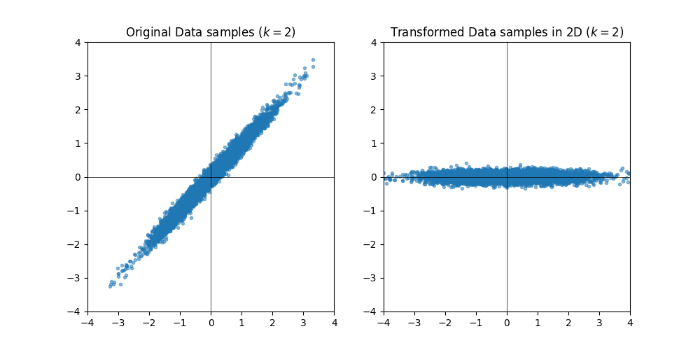

# EE274: Homework-3

- **Focus area:** Lossy compression
- **Due Date:** 11th Dec (Sun), 11.59pm
- **Weightage:** 20%
- **Total Points:** 125
- **Submission Instructions:** Provided at the end of HW (ensure you read these!)
- **Submission link:** 
  - For written part: [HW3-Written](https://www.gradescope.com/courses/436519/assignments/2448816)
  - For programming part: [HW3-Code](https://www.gradescope.com/courses/436519/assignments/2448836)

The Homework-3 is designed to learn more about lossy compressors.

*Please ensure that you follow the [Stanford Honor Code](https://communitystandards.stanford.edu/policies-guidance/honor-code) while doing the homework. You are encouraged to discuss the homework with your classmates, but you should write your own solutions and code. You are also encouraged to use the internet to look up the syntax of the programming language, but you should not copy-paste code from the internet. If you are unsure about what is allowed, please ask the instructors.* 

**Note for the coding part**<br>
Before starting the coding related HW1 questions ensure following instructions from HW0 are followed:
- Ensure you are using the latest version of the SCL `EE274/HWs` GitHub branch. To ensure run the following command in the SCL repository you cloned from HW0:
   ```sh
   git status
   ```   
  You should get an output saying `On branch EE274/HWs`. If not, run the following command to switch to the correct branch:
   ```sh
   git checkout EE274/HWs
   ```
  Finally ensure you are on the latest commit by running:
   ```sh
   git pull
   ```
  You should see a `HW3` folder in the `HWs` folder.
- Ensure you are in the right conda environment you created in `HW0`. To ensure run the following command:
   ```sh
   conda activate ee274_env
   ```
- Ensure you have `stanford_compression_library` folder added to your `PYTHONPATH` by running the following command:
   ```sh
   echo \$PYTHONPATH
   ```
  You should see the path to the `stanford_compression_library` folder. If not, run the following command to add it to your `PYTHONPATH`:
   ```sh
   export PYTHONPATH=\$PYTHONPATH:/path/to/stanford_compression_library
   ```
  You can also add this line to your `~/.bashrc` file to make sure it is added every time you open a new terminal.
- Update the requirements in the conda environment by running the following command in `stanford_compression_library` folder:
   ```sh
   python -m pip install -r requirements.txt
   ```

### Q1: Mutual Information and Rate Distortion _(20 points)_
1. [5 points] Consider random variables $X$ and $Y$ and let $f$ be an arbitrary function applied to $Y$. Show that
$$I(X; Y) \geq I(X; f(Y))$$
When does equality hold?

    **Note**: This is a special case of the **data-processing inequality**, which more generally holds whenever $X-Y-Z$ form a Markov chain (i.e., $X$ and $Z$ are conditionally independent given $Y$) and says that $I(X; Y) \geq I(X; Z)$. Intuitively, this says that no processing of $Y$, deterministic or random, can increase the information that $Y$ contains about $X$. You can't boost information about $X$ contained in $Y$ just by processing it further!

2. [15 points] Consider a source $X \sim \mathrm{i.i.d.}\ Ber({1\over 2})$ which we wish to lossily compress. The reconstruction $Y$ is allowed to take values in $\{0,1,e\}$ where $e$ represents an erasure symbol. The distortion function is given by
$$
d(x,y)=
\begin{cases}
0, \ \ y=x\\
1, \ \ y=e\\
\infty, \ \mathrm{otherwise}
\end{cases}
$$
In words, erasures incur a distortion of $1$, but making a mistake is not allowed (infinite distortion).

    a. [10 points] Show that $R(D) = \min_{E[d(x,y)]\leq D} I(X;Y) = 1-D$ for $D\in [0,1]$.

    **Hint:** You can first show that $I(X;Y) = H(X) - P(Y=e)H(X|Y=e)$. Can you relate $P(Y=e)$ to $E[d(X,Y)]$?

    b. [5 points] Suggest a simple and efficient scheme for some finite block size $k$ which achieves the optimal
    rate-distortion performance for this setting. You
    can assume that $D$ is rational.

    **Hint:** You can start working with a simple example where $D=\frac{1}{2}, k=2$ and the optimal rate is $\frac{1}{2}$, i.e. you encode two input bits into a single codeword bit.

### Q2: Audio Compression _(20 points)_

In this problem, we'll play with audio compression. The problem and the subparts are available at [audio_compression.html](audio_compression.html). 

**Note:** While not required for this problem, you are welcome to check out and play with the underlying notebook and audio files, which are available at [https://github.com/kedartatwawadi/stanford_compression_library/tree/EE274/HWs/HWs/HW3/audio_compression](https://github.com/kedartatwawadi/stanford_compression_library/tree/EE274/HWs/HWs/HW3/audio_compression).

### Q3: Vector Quantization _(20 points)_

We have studied vector quantization (VQ) in class. In this question we will first implement part of vector quantization and then study the performance of vector quantization for a correlated Gaussian process. 

1. [10 points] Implement the `build_kmeans_codebook()` method in `vector_quantizer.py`. You cannot use the existing kmeans implementations for this part (e.g. `build_kmeans_codebook_scipy()` method) and must implement your own version. You can use the methods pre-implemented in `vector_quantizer` module. It will be instructive to look at the provided test cases in the module. Ensure that the test case `test_vector_quantization` passes on the provided data. You can use the following command to run the test cases:

    ```python
    py.test -s -v vector_quantizer.py -k test_vector_quantization               
    ```

2. [10 points] Now we use the VQ to encode a correlated source. Consider a simple Gaussian process where $$X_n = \rho X_{n-1} + \sqrt{1 - \rho^2} \mathcal{N}(0, \sigma^2) $$
the second term is independent of $X_0,\dots,X_{n-1}$, and $$X_0 \sim \mathcal{N}(0, \sigma^2)$$ 

   Below we visualize the Rate-Distortion performance as well as encoding complexity for different values of $k$ (block sizes) and $\rho$ (parameter in the Gaussian process), for a given rate of `1 bits per symbol`. Based on these plots and what we have learnt in the class, answer following questions:

      

      1. [2 points] What is the theoretical distortion limit for $\rho=0$ at rate of `1 bits per symbol`?
      2. [4 points] What do you observe as $k$ increases for a given $\rho$? Comment on the performance and complexity of the encoder as $k$ increases. Justify your observations in a few lines.
      3. [4 points] What do you observe as $\rho$ increases? Comment on how the change in performance of the encoder with increasing $k$ depends on the value of $\rho$. Justify your observations in a few lines.


### Q4: Transform Coding _(30 points)_

In this question, we will first theoretically derive the transform for the given Gaussian process in the previous question (reproduced below) and then implement the decoding part of the transform coding. Finally, we will try to understand some properties of Transform Coding. Throughout this question, we will be working with a block-size of $k=2$. 

Consider a simple Gaussian process where $$X_n = \rho X_{n-1} + \sqrt{1 - \rho^2} \mathcal{N}(0, \sigma^2) $$ 
the second term is independent of $X_0,\dots,X_{n-1}$, and $$X_0 \sim \mathcal{N}(0, \sigma^2)$$ 

In this question we will study the quantization of such a source. 

1. [10 points] **Theory**

    In class, we studied that transform coding can be used to improve the performance of vector quantization. In particular, let's say we are working with block-size $k=2$. Then, we can construct a $2\times2$ covariance matrix from the data by assuming each block of $k=2$ to be sampled from a distribution. We saw that eigenvalue decomposition of correlation matrix can be used to decorrelate the data. [Here](https://courses.media.mit.edu/2010fall/mas622j/whiten.pdf) is a very short tutorial on how eigenvalue based decomposition can lead to decorrelation by Rosalind Picard. In this question, we will study this particular eigenvalue based transform and see the performance of transform coding for the given source.

   1. [2 points] Calculate the $2 \times 2$ covariance matrix 
   
   $$\Sigma = \mathbb{E}\left[\begin{bmatrix}X_i - \mathbb{E}X_i\\ X_{i+1} - \mathbb{E}X_{i+1}\end{bmatrix}\begin{bmatrix}X_i - \mathbb{E}X_i & X_{i+1} - \mathbb{E}X_{i+1}\end{bmatrix}\right]$$ for the given source. Your answer should be in terms of $\rho$ and should not depend on $i$.

   2. [4 points] Now, let's do eigenvalue decomposition of $\Sigma$. What are the eigenvalues ($\lambda_1$, $\lambda_2$) and corresponding eigenvectors ($V_1$, $V_2$) of $\Sigma$? Again, your answer should be in terms of $\rho$. Remember, the eigenvectors should be unit-norm. 
   3. [2 points] Based on the above eigenvectors, we get the following eigenvalue-based transform at block-size $k=2$:
        
        $$
        \begin{align}
        Y_i &= (X_i + X_{i+1})/\sqrt{2} \\
        Y_{i+1} &= (X_i - X_{i+1})/\sqrt{2}
        \end{align}
        $$
    
        What is the $2 \times 2$ covariance matrix $$\Lambda = \mathbb{E}\left[\begin{bmatrix}Y_i - \mathbb{E}Y_i\\ Y_{i+1} - \mathbb{E}Y_{i+1}\end{bmatrix}\begin{bmatrix}Y_i - \mathbb{E}Y_i & Y_{i+1} - \mathbb{E}Y_{i+1}\end{bmatrix}\right]$$
        Again, your answer should be in terms of $\rho$ and should not depend on $i$.
   4. [2 points] Below we show how this transform changes the distribution of the data for samples generated from given Gaussian process with $\rho=0.99$ and $k=2$ (same plots, just different scale on the axis). What do you observe? Justify in a few lines.
       
       

2. [10 points] **Transform Coding Implementation**

    Now, we use the transform defined in part `4.1.3` to first transform the data, and then use vector quantization on each component of $Y$ independently using VQ. We can use different number of bits per component of the transform output $Y$. The average bitrate per symbol is the average number of bits per component of $Y$. `transform_coder.py` provides a simple implementation of this transform coding. You can look at the provided code and test cases to understand how to use the provided code. 

   Implement the `decode_block()` method in `TransformVQDecoder` class. It will be instructive to look at provided test cases in the module. Ensure that the test case `test_transform_vq` passes. You can use the following command to run this test-case:
    
    ```python
    py.test -s -v transform_coder.py -k test_transform_vq
    ```

3.  [10 points] **Properties of Transform Coding**

    Next we study the performance of transform coding for different number of bits per component of transform and different values of $\rho$. 
    
    1. [5 points] Below we show the results for $\rho=0.9$ at `1 bit per symbol`. We show results for `Vector Quantization` at block-lengths of $k=2,4$. We also show results for `Transform Coding` when we encode each transformed component with a block-size of $k=2$ but at different bitrate splits between the individual transformed components. The bitrate split shows the bits per symbol used to encode the two components. Recall that we are independently applying vector quantization on the two components of the transform output, i.e., we perform the transform on $k=2$ blocks (each with $2$ symbols) and then apply VQ on the vector formed by the first component of each block (and similarly for the second component). Therefore, a bitrate split of `[1,1]` for $k=2$ implies that we are using `num_vectors=4` for the codebook of each component, whereas a bitrate-split of `[2,0]` for $k=2$ implies that we are using `num_vectors=16` for codebook of first component and `num_vectors=1` for codebook of second component.  We see that the performance of `Transform Coding` is better than `Vector Quantization` for bitrate-split `[2,0]` but not for bitrate-split `[1,1]` or `[0,2]`. Justify this observation in a few lines.

    ```python
    ==================================================
    Processing rho: 0.9
    ==================================================
    Vector Quantization Experiment
    ==================================================
    [VQ][Bit per symbol: 1][Block Size: 2]Rate: 1.0, Distortion: 0.163
    [VQ][Bit per symbol: 1][Block Size: 4]Rate: 1.0, Distortion: 0.095
    ==================================================
    TC Vector Quantization Experiment
    ==================================================
    [TC_VQ][Bit per symbol: 1][Block Size: 2][Bitrate Split: [1, 1]]Rate: 1.0, Distortion: 0.276
    [TC_VQ][Bit per symbol: 1][Block Size: 2][Bitrate Split: [0, 2]]Rate: 1.0, Distortion: 0.970
    [TC_VQ][Bit per symbol: 1][Block Size: 2][Bitrate Split: [2, 0]]Rate: 1.0, Distortion: 0.122
    ================================================
    ```
   
    2. [5 points] Now, we will study the performance of transform coding for different values of $\rho$. Below we repeat above experiment for $\rho=0.99$ and $\rho=0.5$. Based on these observations answer the following questions:

    - How does `Transform Coding` perform for different values of $\rho$? Justify your answer in a few lines.
    - We observe that the performance of `Transform Coding` is worse than `Vector Quantization` for $\rho=0.5$ at all shown bitrate splits between the components. Why is this the case? Justify your answer in a few lines. *HINT:* the optimal rate is given by water-filling based bitrate allocation at a given distortion. 
    
    ```python
    ==================================================
    Processing rho: 0.99
    ==================================================
    Vector Quantization Experiment
    ==================================================
    [VQ][Bit per symbol: 1][Block Size: 2]Rate: 1.0, Distortion: 0.107
    [VQ][Bit per symbol: 1][Block Size: 4]Rate: 1.0, Distortion: 0.020
    ==================================================
    TC Vector Quantization Experiment
    ==================================================
    [TC_VQ][Bit per symbol: 1][Block Size: 2][Bitrate Split: [1, 1]]Rate: 1.0, Distortion: 0.204
    [TC_VQ][Bit per symbol: 1][Block Size: 2][Bitrate Split: [0, 2]]Rate: 1.0, Distortion: 0.890
    [TC_VQ][Bit per symbol: 1][Block Size: 2][Bitrate Split: [2, 0]]Rate: 1.0, Distortion: 0.030
    ================================================
    ```
   
    ```python
    ==================================================
    Processing rho: 0.5
    ==================================================
    Vector Quantization Experiment
    ==================================================
    [VQ][Bit per symbol: 1][Block Size: 2]Rate: 1.0, Distortion: 0.305
    [VQ][Bit per symbol: 1][Block Size: 4]Rate: 1.0, Distortion: 0.271
    ==================================================
    TC Vector Quantization Experiment
    ==================================================
    [TC_VQ][Bit per symbol: 1][Block Size: 2][Bitrate Split: [1, 1]]Rate: 1.0, Distortion: 0.374
    [TC_VQ][Bit per symbol: 1][Block Size: 2][Bitrate Split: [0, 2]]Rate: 1.0, Distortion: 0.786
    [TC_VQ][Bit per symbol: 1][Block Size: 2][Bitrate Split: [2, 0]]Rate: 1.0, Distortion: 0.343
    ================================================
    ```


### Q5: Lower Bounds via Information Theory (*35 points*)
At the annual *Claude Shannon rowing contest*, there are $n$ participants, with $n-1$ out of them having exactly same strength but one of the rowers is exceptionally strong. The contest aims at finding that one strongest rower. The competition organizers are unfortunately limited on the funds, and so want to minimize the number of rounds to declare the winner. 

As a world renowned information theorist and compression expert, you have been roped in as a consultant, and have been tasked with deciding the match fixtures so that the exceptionally strong rower can be figured out in minimal number of matches. You have the following information:
  - The matches can be between any two teams, where both team consists of an equal number of rowers. E.g. you can decide to have match between Rower 1 and Rower 2, or between (Rower 1, Rower 5) and (Rower 3, Rower 4) or between (Rower 1, Rower 4, Rower 5) and (Rower 2, Rower 3, Rower 6), etc.
  - Each match can result in 3 outcomes: either the first team wins, or the second team wins, or it results in a draw. The team with the exceptionally strong rower always wins the match. If both the teams don't contain the strong rower, then the result is always a draw. Thus, the outcome of a fixture is deterministic given the team composition. 
  - Note that you are allowed to decide the teams in the second match based on the outcome of the first match, i.e. your match-deciding scheme can be *adaptive*. 
  - The teams in the matches should be chosen deterministically. They can depend on the outcome of previous matches, but not on any other random variable (e.g., you can't toss a coin to choose the teams!).


1. [10 points] Let the number of players be $n=9$. Show that you can determine the strongest rower using just 2 matches. 

2. [5 points] Generalize your strategy to $n$ rowers. Show that you can find one strongest rower in $\lceil \log_3 n \rceil$ matches. 

To get your full fees, you have also been asked to *prove* that your strategy is indeed the optimal. Let $X$ be the random variable representing which player is the stronger rower. $X$ is uniformly distributed in the set of all participants $\{1, 2, \ldots, n\}$
$$P_X(x=i) = 1/n, \forall i = \{1, 2, \ldots, n\}$$

 Let $Y_1, Y_2, \ldots, Y_k$ be the random variable representing the outcome of the $k$ matches you organize. 

3. [5 points] Show the following sub-problems. For each of the sub-problems, also intuitively explain in a single sentence why the inequalities are true.
   - Show that $H(X) = \log_2 n$, and $H(Y_i) \leq log_2 3$ for each $i$. When is equality achieved? 
   - Argue why $H(Y_1,Y_2,\ldots,Y_k|X) = 0$.

4. [10 points] We want to show that we will at least need $\log_3 n$ matches to determine the strongest rower. 
   - Argue why we can determine the strongest rower from your $k$ matches, if and only if $H(X|Y_1, Y_2, \ldots, Y_k) = 0$. 
   - Using the sub-problem above, show that $k \geq \log_3 n$ matches are required to determine the strongest rower. Thus, proving that the scheme in Q4.1 is indeed optimal! 
   (*HINT: think about using $I(X; Y_1, \ldots, Y_k)$, and its properties*).

5. [5 points] Let's get back to the $n=9$ rowers scenario. To simplify the logistics, the organizers wanted to pre-decide what the matches are going to be, even before the contest began. That is, the teams for the $i$th match are pre-decided, and do not depend upon the outcome of the first $i-1$ matches. In other words the match deciding strategy is *non-adaptive*. Show that even in this *non-adaptive* case, you can find the strongest rower using the outcome of 2 pre-decided matches! 


### Submission Instructions
Please submit both the written part and your code on Gradescope in their respective submission links. **We will be using both autograder and manual code evaluation for evaluating the coding parts of the assignments.** You can see the scores of the autograded part of the submissions immediately. For code submission ensure following steps are followed for autograder to work correctly:

- As with HW0, you only need to submit the modified files as mentioned in the problem statement.
  - Compress the `HW3` folder into a zip file. One way to obtain this zip file is by running the following zip command in the `HWs` folder, i.e.
    ```sh
    cd HWs
    zip -r HW3.zip HW3
    ```
    Note: To avoid autograder errors, ensure that the directory structure is maintained and that you have compressed `HW3` folder containing the relevant files and not `HWs` folder, or files inside or something else. Ensure the name of the files inside the folder are exactly as provided in the starter code, i.e. `vector_quantizer.py` and `transform_coder.py`. In summary, your zip file should be uncompressed to following directory structure (with same names):
    ```
    HW3
    ├── vector_quantizer.py
    └── transform_coder.py
    ```
  
- Submit the zip file (`HW3.zip` obtained above) on Gradescope Programming Part Submission Link. Ensure that the autograded parts runs and give you correct scores. 

**Before submitting the programming part on Gradescope, we strongly recommend ensuring that the code runs correctly locally.**
