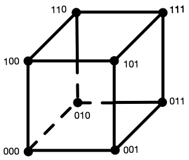
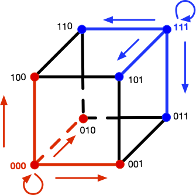

# EE274 (Fall 23): Homework-3

- **Focus area:** Context-based compression
- **Due Date:** Nov 15, midnight (11:59 PM)
- **Weightage:** 15%
- **Total Points:** 140

### Q1 LZ77 compression for small data (*25 points*)

In this problem, we will understand how LZ77 compression perform on small files and how to improve its performance. Recall that the LZ77 algorithm looks for matches in a window storing the previously seen data and then encodes the match lengths, match offsets and unmatched characters (literals). We use the LZ77 implementation provided in SCL for the experiments below, and you can take a look at the code [here](https://github.com/kedartatwawadi/stanford_compression_library/blob/main/scl/compressors/lz77.py) to understand the details better. We have provided a set of small json files in the `p1_data/github_data` directory. Run the script `python hw3_p1.py -i p1_data/github_data` which produces the following output:

```
Compressing without using a seed input
Number of files: 134
Total uncompressed size (in bits): 956272
Normalized uncompressed size (in avg. bits/file): 7136
Total size after compressing the files individually (in bits): 363774
Total size after compressing the files jointly (in bits): 71792
```

Ignore the first line for a moment. We see that we have `134` relatively small files with average size of `7136 bits`. If we compress the files individually and then sum the sizes, we get a total of `363774 bits`, whereas if we concatenate the files and then compress them as a single block ("jointly") the compressed size is just `71792 bits`! 

1. [4 points] Give two reasons why concatenating the files together provides a reduction in file size.

   **HINT**: One of the reasons is applicable even if the files were from completely distinct sources and had no similarity whatsoever.

    **Solution**

    1. The first reason is that the LZ77 algorithm works best if it can find longer matches within the past symbols in a file. If we concatenate the files, then the LZ77 algorithm will be able to find longer matches within the concatenated file compared to the original small file. 
    2. The second reason is that now we have increased the block size for LZ77, and thus the LZ77 algorithm will be able to converge closer to the entropy (see Slide 29 in [LZ77 slides](https://stanforddatacompressionclass.github.io/Fall22/static_files/L9_slide.pdf)). Another related reason is that compressed files have a bunch of overhead due to headers, etc. which gets amortized for larger files.


Ideally one would just combine these small files into bigger batches for the best compression. However, we sometimes need to store, transmit or compress small files. For example, we need to transmit short JSON messages/network packets between servers where latency is important, and we can't batch requests. Another common use case is when databases use small data pages for fast random access. Small files also show up when we are working with resource constrained devices that cannot hold large files. 

To improve the compression on small files, we consider a slight modification of the LZ77 algorithm we studied in class. Both the compressor and the decompressor now take an additional seed input, which is just a sequence of bytes. The idea is simple: instead of starting the LZ77 compressor with an empty window, we instead initialize the window with a seed input (and appropriately update the other indexing data structures). The same seed input should be used during compression and decompression to enable recovery. 

The overall system architecture needs to maintain these seed inputs (which might be specific to particular data categories), and make sure the encoders and decoders can access these. The seed inputs are usually constrained to be small to avoid extra overhead.

We provide a sample seed input for the above dataset in `p1_data/github_data_seed_input.txt`. Run `python hw3_p1.py -i p1_data/github_data -s p1_data/github_data_seed_input.txt` to obtain the following:

```
Loading seed input from p1_data/github_data_seed_input.txt
Number of files: 134
Total uncompressed size (in bits): 956272
Normalized uncompressed size (in avg. bits/file): 7136
Total size after compressing the files individually (in bits): 224738
Total size after compressing the files jointly (in bits): 70668
```

2. [6 points] We see a significant reduction in the total size for compressing the files individually (`363774` bits to `224738` bits). Based on your understanding of the LZ77 algorithm and your answer to `Q1.1`, explain why this is the case. You might find it useful to look both at the json files in `p1_data/github_data/` and the seed input in `p1_data/github_data_seed_input.txt`.

    **Solution**

    Seed file consists of data which is similar to the input files. Thus, LZ77 algorithm is able to find more matches in the seed file while compressing the individual files resulting in better compression of the individual files better.

3. [2 points] Why is the impact of using the seed input negligible when we compress the files jointly?

    **Solution**
    Since the concatenated file already consists of the data present in individual files, adding a seed file with similar data as the individual files does not help in finding significantly more matches. Therefore, we get negligible benefit on using the seed file when we compress the files jointly. We might get some benefit for the initial part of the concatenated file, but for most later parts the benefit is minimal. 

4. [3 points] The provided seed input file is less than 1 KB in size. If you were allowed to choose an arbitrarily large seed input, how might you design it to minimize the compressed size for this specific dataset. 

   **HINT**: Think about the best case scenario for LZ77 parsing - longest possible matches and no literals.

    **Solution**

    Concatenating all files and using them as a seed file can be a good choice. This will result in the LZ77 algorithm finding the longest possible matches and no literals. Thus, we will get the best possible compression.

5. [10 points] Now you will create a seed input for another dataset provided in the `p1_data/pokemon_data` directory. We will evaluate your submissions on a test dataset which has similar files as the `p1_data/pokemon_data` directory. Your submission should satisfy the following:
   - name the seed input file as `p1_data/pokemon_data_seed_input.txt`
   - the seed input file should be less than 1 KB large
   - the total size for compressing the files individually should reduce to at least 2x when using the seed input (vs. when not using it) for both the `pokemon_data` set and the autograder submission

    **Solution**

    The seed file we used can be found at [`p1_data/pokemon_data_seed_input.txt`](p1_data/pokemon_data_seed_input.txt). The total size for compressing the files individually reduces by $\sim2\times$ when using the seed input for both the `pokemon_data` set and the autograder submission.

**Note:** 
- To learn more about small data compression using seed inputs and how it is used in practice, you can have a look at Yann Collet's IT-forum talk available on [YouTube](https://www.youtube.com/watch?v=jl9ncLcMlVY&t=126s&ab_channel=StanfordResearchTalks). 
- zstd uses the term "dictionary" to refer to what we called seed inputs above.


### Q2: Burrows Wheeler Transform and compression (*50 points*)

*DISCLAIMER: This problem looks longer but is actually simpler :P*

You might be familiar with Fourier transforms, DCT transform, wavelet transform, etc. for images and audio signals. These transforms are widely used as they are invertible and make the data easier to analyse, compress, etc.

In this problem, we will learn about a few lossless transform for textual data, which have been used for various applications, including data compression. 

**I. The BWT algorithm:**

In 1994, David Wheeler and Michael Burrows discovered (co-incidentally at the DEC Research Labs in Palo Alto!) an invertible transform for textual data, which supposedly made the data easier to compress. In this question, we will learn more about the BWT algorithm and its properties.

The BWT forward transform works the following way: 
- *STEP-I* 
  
  Let's say you are given a sequence `BANANA`. The first thing you do is add a delimiter `~` to the end. Thus, our new sequence is now: `BANANA~`. Note that the delimiter is a unique character we are sure never occurs in the input sequence, and is useful to mark the ending of our sequence

- *STEP-II* 

  In the next step, we form all cyclic rotations of the word `BANANA~`. As the sequence length is `n=7`, we will have `7` such rotations. 

    ```py
    Input string: BANANA
    # all cyclic rotations
    BANANA~
    ~BANANA
    A~BANAN
    NA~BANA
    ANA~BAN
    NANA~BA
    ANANA~B
    ```
  
- *STEP-III* 

  Sort these strings lexico-graphically. This results in `n` permutations of a string of length `n` resulting in a `n X n` 2D table &mdash; called a Burrows Wheeler's Matrix (BWM). The `7 X 7` BWM for our example is shown below:

    ```py
    # sorted strings
    ANANA~B
    ANA~BAN
    A~BANAN
    BANANA~
    NANA~BA
    NA~BANA
    ~BANANA
    ```

- *STEP-IV*

  Now consider the string formed by last letters of the sorted strings. This new string is the BWT transform of the input! 

    ```
    BANANA -> BNN~AAA
    ```
  
1. [5 points] Here are some other examples of BWT: 
    ```
    BANANA -> BNN~AAA
    abracadabraabracadabraabracadabra -> rrdd~aadrrrcccraaaaaaaaaaaabbbbbba
    hakunamatata -> hnmtt~aauaaka
    ```
    Notice that the BWT forward transform of `x_input = BANANA -> BNN~AAA` has the letters of `BANANA~` permuted, i.e. `BWT(x_input)` is just reordering the letters in the input in a particular way. Justify in a few lines why `BWT(x_input)` is a permutation of the string `x_input~` (`x_input~` -> `x_input` concatenated with the delimiter `~`).

    **Solution**
    Since we are taking circular rotations of the string, each character of the string `x_input~` will be present in the last column of list of strings (output of Step-II). Sorting this list of strings only changes the order of the last characters (output of Step-I). Thus, `BWT(x_input)` is a permutation of the string `x_input~`.

2. [5 points] Manually compute and show the BWT transform for `panama`, using the method above. Show your work to get credit (that is you can't just write the final transform but show the steps described above).

   **Solution:** 

    - Step-II: calculate cyclic rotations of `panama~`

    ```py
    Input string: PANAMA~
    # all cyclic rotations
    PANAMA~
    ~PANAMA
    A~PANAM
    MA~PANA
    AMA~PAN
    NAMA~PA
    ANAMA~P
    ```
   
    - STEP-III: Sort these strings lexico-graphically. 
    ```py
    # sorted strings
    AMA~PAN
    ANAMA~P
    A~PANAM
    MA~PANA
    NAMA~PA
    PANAMA~
    ~PANAMA
    ```
   
    - Step-IV: BWT forward transform is last letters of the sorted strings. 
    
    Therefore, BWT forward transform of `panama` is `NPMAA~A`

3. [10 points] Implement the BWT (forward) transform in the `hw3_p2.py` file, `BurrowsWheelerTransform::forward` function. Remember to add a delimiter in the input string (you can use `~` as delimiter as `~` has the highest ascii value). You may use the `test_bwt_transform()` (by commenting out the inverse bwt part) to test your implementation. What is the complexity of your BWT forward transform implementation for an input of length `n`? 

    **Solution**
    
    ```python
    def forward(self, data_block: DataBlock):
        """
        Generates the forward transform of BWT
        NOTE: for consistency all forward and inverse functions take in as input
        a DataBlock
        """

        # create a string using data_block
        input_block_str = "".join(data_block.data_list)

        ###############################################
        # ADD DETAILS HERE
        # to generate bwt_str (BWT transformed string)
        # Note: remember to add the delimiter to the string!
        ###############################################
        bwt_str = ""

        # STEP-1: add a delimiter
        input_block_str += self.delimiter

        # STEP-2: get all cyclic rotations, and sort
        N = len(input_block_str)
        cyclic_rotations = []
        cur_str = input_block_str
        for _ in range(N):
            cur_str = cur_str[-1] + cur_str[:-1]
            cyclic_rotations.append(cur_str)
        cyclic_rotations.sort()

        # STEP-3: pick the last column and make a single string
        bwt_str = "".join([rot_str[-1] for rot_str in cyclic_rotations])

        ###############################################

        data_bwt_block = DataBlock(list(bwt_str))
        return data_bwt_block
    ```
    The forward transform involves creating a $n$-length list of $O(n)$ length strings, followed by
    sorting the $O(n)$ length strings. Assuming sorting is $O(n\log n)$ comparisons and each comparison is $O(n)$ (since we are working with $n$-length strings), the overall complexity will be $O(n^2\log n)$.

**II. The Inverse BWT Algorithm**

The surprising part is that BWT is actually a fully invertible transform, i.e. we can fully retrieve back the original input from the BWT transform e.g. we can recover input string `BANANA~` from the BWT transform `BNN~AAA`. The inverse transform works by retrieving the Burrows Wheeler Matrix (BWM) one column at a time. The inverse BWT proceeds in the following way:

- In the beginning we only have the BWT transform which is the last column of the BWM. We show the BWT transform and the BWM below.

    ```py
    # STEP-0
    ------B
    ------N
    ------N
    ------~
    ------A
    ------A
    ------A
    ```

- Notice that each column is a permutation of `BANANA~`. As the rows of BWM are lexicographically sorted, we can retrieve the first column on BWM by sorting the last column.

    ```py
    # STEP-1
    A-----B
    A-----N
    A-----N
    B-----~
    N-----A
    N-----A
    ~-----A
    ```

- Due to the cyclic rotations which we used to form the BWM, we can now copy over the last column to the beginning, and we have the first two letters for each row of BWM (although in the incorrect order). We can sort these rows to get the first two columns of the BWM.

    ```py
    # STEP-2
    A-----B  -> BA-----                   AN-----
    A-----N  -> NA-----                   AN-----
    A-----N  -> NA-----                   A~-----
    B-----~  -> ~B-----   ===> SORT ===>  BA-----
    N-----A  -> AN-----                   NA-----
    N-----A  -> AN-----                   NA-----
    ~-----A  -> A~-----                   ~B-----
    ```

- We can now repeat the procedure, since we know the last column is the BWT transformed string:

    ```py
    # STEP 1,2 (repeated)
    AN----B  -> BAN----                   ANA----
    AN----N  -> NAN----                   ANA----
    A~----N  -> NA~----                   A~B----
    BA----~  -> ~BA----   ===> SORT ===>  BAN----
    NA----A  -> ANA----                   NAN----
    NA----A  -> ANA----                   NA~----
    ~B----A  -> A~B----                   ~BA----
    ```

- Continuing, this way, we can retrieve the full BWM, and then just pick the row which ends with `~`
    
    ```py
    # BWM
    ANANA~B
    ANA~BAN
    A~BANAN
    BANANA~    ===> BANANA~  ---> :D
    NANA~BA
    NA~BANA
    ~BANANA
    ```


4. [5 points] Manually compute the inverse of `tgca~aa`. Show your work to get credit (that is you can't just write the final inverse transform but show the steps described above).

    **Solution**
    
    We fill in the BWM matrix as described above.
    - STEP-0:
      ```py
      # STEP-0
      ------T
      ------G
      ------C
      ------A
      ------~
      ------A
      ------A
      ```
    - STEP-1:
      ```py
      A-----T
      A-----G
      A-----C
      C-----A
      G-----~
      T-----A
      ~-----A
      ```
    - STEP-2:
      ```py
      A-----T -> TA-----                   AC-----
      A-----G -> GA-----                   AT-----
      A-----C -> CA-----                   A~-----
      C-----A -> AC-----   ===> SORT ===>  CA-----
      G-----~ -> ~G-----                   GA-----
      T-----A -> AT-----                   TA-----
      ~-----A -> A~-----                   ~G-----
      ```
      
    - Repeating steps 1-2 above we get:
      ```py
      # STEP 1,2 (repeated)
      ACA~GAT  
      ATACA~G
      A~GATAC
      CA~GATA
      GATACA~
      TACA~GA
      ~GATACA
      ```
      
    Therefore, the inverse-BWT of `tgca~aa` is `gataca`.

5. [10 points] Implement the BWT inverse transform in `hw3_p2.py` in the `BurrowsWheelerTransform::inverse` function. Please add (some) inline comments describing your algorithm. What is the time, memory complexity of your BWT inverse transform implementation for an input of length `n`?

    **Solution**
    
    ```python
    def inverse(self, bwt_block: DataBlock):
        """
        Generates the inverse of the BWT.
        NOTE: for consistency all forward and inverse functions take in as input
        a DataBlock
        """
        bwt_block_str = "".join(bwt_block.data_list)
        N = len(bwt_block_str)

        ###############################################
        # ADD DETAILS HERE
        # to generate output_str
        # Note: remember to remove the delimiter from the string!
        ###############################################
        output_str = ""

        # decoding loop
        bwm_list = ["" for i in range(N)]
        for _ in range(N):
            bwm_list = [bwt_block_str[i] + bwm_list[i] for i in range(N)]
            bwm_list.sort()

        # find the string which ends with delimiter
        output_str = ""
        for _str in bwm_list:
            if _str.endswith(self.delimiter):
                output_str = _str
                break
        # strip the delimiter and return the input
        output_str = output_str.strip(self.delimiter)

        ###############################################

        return DataBlock(list(output_str))   
    ```
    The reverse transform involves $n$ sorting operations, each applied on $n$ strings of length $O(n)$. Each sort operation has complexity $O(n\times n\log n)$ because we operate with $O(n)$ length strings. Thus the overall time complexity is $O(n^3\log n)$.

    The memory complexity is $O(n^2)$ because we need to store the matrix.

6. [5 points] Notice that the BWT forward transform of typical english language words/sentences have lots of repeated letters. For example: 

    ```py
    # BWT forward transforms of some english words
    BANANA -> BNN~AAA
    abracadabraabracadabraabracadabra -> rrdd~aadrrrcccraaaaaaaaaaaabbbbbba
    hakunamatata -> hnmtt~aauaaka
    
    # first 300 letters of sherlock novel
    The Project Gutenberg eBook of The Hound of the Baskervilles, by Arthur Conan DoyleThis eBook is for the use of anyone anywhere in the United States andmost other parts of the world at no cost and with almost no restrictionswhatsoever. You may copy it, give it away or re-use it under the termsof the
    -->
    yernteedfe.htsfedt,yosgs,ekeeyuttkedsytrroefnrrfftedester  ee       ~e   n    pB th mwn   eielnnnnhhhhnrvsshhhr  ljtthdvhbtktlrohooooo r twtTTtttttwtTtrv th    nwgooosrylia ldraioeuauaoU  oaanns    srooCyiBBc fwcmm YHD oueoeoee  etoePAaeeiiteuuatmoooencsiassiiSiu ai     o rcsraoo h- Gierasy  bapaonne
    ```

    So in a way BWT forward transform is approximately sorting the input strings. Can you think of why BWT has this property? 

    **HINT**: In the BWM, the first $n-1$ rows form cyclic suffixes of the last column.

    **Solution**

    As the hint suggests, the first $n-1$ rows of the BWM form cyclic suffixes of the last column. Since the first $n-1$ rows are sorted, this means the last column will consist of consecutive characters which share the same suffix. Since English has lots of repeated words, this results in lots of repeated letters in the last column of the cyclic BWM and hence in the BWT forward transform. For instance, consider a large english sentence with frequent occurrence of the word `the`, say `Arguably one of the most popular anime is One Piece. The characters, the arc, the manga illustrations are all amazing`. The BWT forward transform on this sentence results in clustering of all the suffixes of every character in this string. This results in `t` present in all occurrences of word`the` being clustered together in the last column everytime there is `he` in the first two columns of BWM.

    ```py
    ...
    ...
    he most popular anime...t
    he characters, the ar...t
    he arc, the manga ill...t
    he manga illustration...t
    ...
    ...
    ```

**III. Using BWT for compression**

As we saw in previous part, BWT tends to club letters of the input string together. We will use this property to see if we can improve compression. To do this, we also implement another invertible transform called the Move to Front (MTF) transform. The Move To Front transform keeps a table of the symbols in the data, and moves the most recent symbol to the top of the table. The transform output is the index of the symbols in this changing table and thus the symbols that are more frequent in a local context get a lower index. The MTF forward and inverse transforms are already implemented and included in `hw3_p2.py` and are described quite well in the wikipedia article here: [https://en.wikipedia.org/wiki/Move-to-front_transform](https://en.wikipedia.org/wiki/Move-to-front_transform). 


Here are some sample outputs on applying MTF transform: 
```
Input str: aaabbbaaacccaaa
MTF: [97, 0, 0, 98, 0, 0, 1, 0, 0, 99, 0, 0, 1, 0, 0]
```

```
Input str: rrdd~aadrrrcccraaaaaaaaaaaabbbbbba
MTF: [114, 0, 101, 0, 126, 100, 0, 2, 3, 0, 0, 102, 0, 0, 1, 3, 0, 0, 0, 0, 0, 0, 0, 0, 0, 0, 0, 102, 0, 0, 0, 0, 0, 1]
```

We use the BWT, MTF transforms to transform the first `50,000` characters (lets call this the `input_data`) of our sherlock novel and analyze the entropy of the empirical distribution of the transformed string. (this output can be obtained by running the test `test_bwt_mtf_entropy` if you are curious!). The output obtained is as below:

```
Input data: 0-order Empirical Entropy: 4.1322
Input data + BWT: 0-order Empirical Entropy: 4.1325
Input data + MTF: 0-order Empirical Entropy: 4.6885
Input data + BWT + MTF: 0-order Empirical Entropy: 2.8649
```

7. [10 points] Let's try to understand the compression results above a bit better: 
   1. Given a good implementation of an Arithmetic coder, what is approximate average codelength you might expect on compressing the `input_data` using its empirical 0-order distribution (i.e. just the symbol counts)? 
   2. Notice that the empirical entropy of `input_data` is almost the same as that of `bwt_data = BWT(input_data)`. In fact the empirical entropy of `bwt_data` is slightly higher than that of `input_data` (`4.1325 vs 4.1322`). Justify why is this the case.
   3. Notice that empirical entropy of `mtf_bwt_data = MTF(BWT(input_data))` is much lower than that of the `input_data` (`2.8649` vs `4.1322`). Can you think of why this is the case? 
   4. Based on the numbers you have, describe a compression scheme which achieves average codelength of approximately `~2.87 bits/symbol` on the `input_data`?. You don't need to implement this compressor, but ensure you clearly describe the steps involved in encoding and decoding. You are free to use any compressors you have learnt in the class.

   Feel free to experiment with the test functions, to print transformed data or to build better intuition with custom examples. Please include any relevant outputs in your submission which you found useful to answer these questions.

    **Solution**

    1. The average codelength will be approximately `4.1322` bits per symbol as Arithmetic coder is a lossless compression algorithm which can compress to entropy.
    2. Since BWT only permutes the characters in a string (`Q5.1`), the frequency count to 0th order is still the same for the input and the BWT transformed data. In-fact, we add a character to the list of characters in input string during the BWT transform: the delimiter character `~`. Hence, the entropy of `input_data` and `bwt_data` is such that $H(input) \lesssim H(BWT)$.
    3. As seen in `Q5.6`, BWT forward transform results in repeating characters which are present in frequent words or group of words because of sorting along suffixes. Since MTF symbol reduces the locally most frequent symbols to lower indices, the MTF transform on BWT transformed data results in a string with lower entropy.
    4. We can use BWT followed by MTF and finally Arithmetic coding to achieve the desired average codelength. The steps involved in encoding and decoding are as follows:
        1. BWT transform the input data.
        2. MTF transform the BWT transformed data.
        3. Encode the MTF transformed data using Arithmetic coding.
        4. Decode the Arithmetic coded data.
        5. Inverse MTF transform the decoded data.
        6. Inverse BWT transform the MTF transformed data.

*NOTE:* compressors such as `bzip2`, and `bsc` in fact use BWT and MTF transforms along with a few other tricks to obtain great compression. BWT algorithms have also found another surprising use: they allow efficient searching over compressed text! Here are more references in case you are interested:
1. [bzip2](https://sourceware.org/bzip2/), [bsc](http://libbsc.com/)
2. wikipedia article: [https://en.wikipedia.org/wiki/Burrows%E2%80%93Wheeler_transform](https://en.wikipedia.org/wiki/Burrows%E2%80%93Wheeler_transform)
3. BWT for searching over compressed text: [slides](https://www.cs.cmu.edu/~ckingsf/bioinfo-lectures/bwt.pdf)


### Q3: Compression with side information (*20 points*)
Lets consider a simple puzzle: 
- Let $X$ be a 3 bit random variable where each bit is i.i.d $Ber(0.5)$, i.e. $X$ is uniformly distributed  in $\{000,001,010,011,100,101,110,111\}$ with probability $1/8$, 
- and $Y= X \oplus e$, where $e \in \{000,001,010,100\}$ and is independent of $X$. The distribution of $e$ is unknown, i.e $Y$ can be different from $X$ in just a one bit position. 

1. [5 points] Show that $H(X) = 3, H(X|Y) \leq 2$.

   **HINT**: Consider $H(X,e|Y)$ and write it in two different ways

   **HINT**: Consider $H(X,e|Y)$ and write it in two different ways

    **Solution**
    $$ H(X) = -\sum_{x \in \{000,001,010,011,100,101,110,111\}} P(x) \log_2 P(x) = 3 $$

    For computing $H(X|Y)$, let's consider $H(X,e|Y)$ in two different ways as suggested in the Hint:

    $$
    \begin{align}
    H(X,e|Y) &= H(X|Y) + H(e|X, Y) \\
    &= H(X|Y)\\
    \end{align}
    $$

    since $e= X \oplus Y$ and thus is a function of $X$ and $Y$ implying $H(e|X, Y) = 0$ from `Q1.1`.
    Similarly, we can write $H(X,e|Y)$ as:

    $$
    \begin{align}
    H(X,e|Y) &= H(e|Y) + H(X|e, Y) \\
    &= H(e|Y) \\
    &\leq H(e) \\
    &= 2
    \end{align}
    $$

    where again since $X$ is a function of $e$ and $Y$, therefore $H(X|e, Y) = 0$ from `Q1.1`. Inequality follows from conditioning inequality $\left(H(X|Y) \leq H(X)\right)$ and $H(e) = 2$ since $e$ is uniformly distributed  in $\{000,001,010,100\}$ with probability $1/4$.

2. [5 points] Kakashi wants to losslessly encode $X$ and send it to Sasuke. What is the optimal compression scheme for Kakashi? 

    **Solution**

    Kakashi needs 3 bits to encode $X$ since $H(X) = 3$. Kakashi can just send $X$ as is to Sasuke as none-of-the-lossless encoder can do better than this.

3. [5 points] Now lets say both Kakashi and Sasuke have access to $Y$, i.e. $Y$ is the side-information available to both Kakashi and Sasuke (through side-information ninjutsu :P). In that case, show that Kakashi can do better than in `Q3.2`, by using `2 bits` to transmit $X$.

    **Solution**

    Now since the entropy of $H(X|Y)\leq2$, Kakashi should be able to get away by just transmitting 2 bits instead. The hint is in the derivation of $H(X|Y)$ in `Q3.3`. Since both Kakashi and Sasuke has access to both $X$ and $Y$, Kakashi can just transmit $e= X \oplus Y$, and Sasuke can recover $X$ from $e$ by $X = Y \oplus e$. We need 2 bits to encode $e$, e.g. by using the following scheme:
```
    | e   | 2-bit encoding |
    |-----|----------------|
    | 000 | 00             |
    | 001 | 01             |
    | 010 | 10             |
    | 100 | 11             |
```

4. [5 points] Unfortunately Kakashi lost access to $Y$, and only knows $X$ but Sasuke still has access to the side information $Y$. Show that in this case Kakashi can still losslessly encode $X$ and send it to Sasuke using `2 bits`, i.e. surprisingly we just need the side-information at the decoder, and not necessarily at the encoder.

    **Solution**
    This problem has a very elegant visualization by noticing that $e$ only has `1` or `0` ones and thus flips at most one bit of $X$ (or [hamming distance](https://en.wikipedia.org/wiki/Hamming_distance) $\leq 1$). Let us represent $X$ on a unit cube where each axis represents one bit of $X$

    
    
    Now notice that $e$ flips at most one bit of $X$ and thus can be represented by a line segment on the unit cube. The following figure shows the possible $Y$ values for $X=000$ (red) and $X=111$ (blue). 
    
    

    Note how these are distinct sets, hence if you knew $Y$ and also knew that $X$ is either $000$ or $111$, you are able to decode. Thus Kakashi can send $X$ using 2 bits by basically pairing symbols with hamming distance $> 2$. For instace one possible encoding is:
```
    | X          | 2-bit encoding |
    |------------|----------------|
    | 000 or 111 | 00             |
    | 001 or 110 | 01             |
    | 010 or 101 | 10             |
    | 100 or 011 | 11             |
```

NOTE: It is quite fascinating that we need side-information only at the decoder. This property can be generalized to more general scenarios, and is the foundation for distributed data compression. E.g. see [Slepian-Wolf coding](https://en.wikipedia.org/wiki/Slepian%E2%80%93Wolf_coding) and [Wyner-Ziv coding](https://en.wikipedia.org/wiki/Distributed_source_coding#:~:text=generate%20syndrome%20bits.-,Wyner–Ziv%20coding%20–%20lossy%20distributed%20coding,and%20corresponding%20reconstruction%20method%20design) for more details.

### Q4: kth order adaptive arithmetic coding (*40 points*)
Shubham wants to test the compression performance of the k-th order context models using Arithmetic Coding he has implemented. However, one problem is that for unknown sources it is very difficult to compute the fundamental limit on the average codelength. So, he decides to test his algorithms on a synthetic dataset. 

He generates data using a noisy version of [Linear Feedback Shift Register based Pseudorandom generator](https://en.wikipedia.org/wiki/Linear-feedback_shift_register). The name sounds quite complicated, but it is a simple concept (you don't need to know anything about it to attempt this problem). The pseudocode to generate noisy-LFSR sequence is given below (also given in HW code `hw3_p4.py`):

```py
def pseudo_random_LFSR_generator(data_size, tap, noise_prob=0):
    # initial sequence = [1,0,0,0,...]
    initial_sequence = [0]*tap
    initial_sequence[0] = 1 

    # output sequence
    output_sequence = initial_sequence
    for _ in range(data_size - tap):
        s = output_sequence[-1] ^ output_sequence[-tap]  # xor
        if noise_prob > 0: 
            s = s ^ Bernoulli(p=noise_prob) # add noise
        output_sequence.append(s)
    return output_sequence
```
Our `pseudo_random_LFSR_generator` generates an output sequence of length `data_size`. At each step, it calculates the next bit using XOR between the last bit in the sequence and the bit located `tap` positions before it (this simulates LFSR behavior). Optionally, if `noise_prob` is greater than `0`, it adds noise to the calculated bit by XOR-ing it with a random binary value generated with a given probability (`noise_prob`). The calculated (possibly noisy) bit is appended to the sequence in each iteration. To initialize the sequence, we always start it with `[1,0,0,0,...]` so that we have `tap` number of bits available to calculate the next bit.

For concreteness lets take a specific parameter setting (function in `hw3_p4.py`):

```py
pseudo_random_LFSR_generator(DATA_SIZE=10000, TAP=3, noise_prob=0)
```

We see that the first 12 symbols of the sequence looks like:
```
1, 0, 0, 1, 1, 1, 0, 1, 0, 0, 1, 1, ...
```

Notice that the sequence looks random-ish but starts repeating after 8 symbols. In fact if we look at each first 7 3-mers (substrings of length 3), i.e. `100`, `001`, ..., `010`, then we see that they are all unique and do not repeat! The LFSR sequence with `noise_prob=0`, are in fact simple pseudo-random generators used in the past. We will use this source to further our understanding of context based compression.

Let's start by defining the $k^{\text{th}}$ order `empirical entropy` of the sequence. Recall, if your sequence is $x_0, x_1, x_2, \ldots, x_n$, the  $k^{\text{th}}$-order empirical entropy of the sequence can be computed by making a joint and conditional probability distribution table using counts of the previously seen symbols (we saw this in class in L9 on context based AC lecture). Specifically,
$$
p(x_0, x_1, x_2, \ldots x_k) = \frac{\text{count}(x_0, x_1, x_2, \ldots x_k)}{\text{total count of k+1-tuples}}
$$

and the $k^{\text{th}}$-order empirical entropy is then given by 

$$H_k(X) = \sum_{x_0, x_1, x_2, \ldots, x_k} p(x_0, x_1, x_2, \ldots, x_{k}) \log {\frac{1} {p(x_k | x_0, x_1, x_2, \ldots, x_{k-1})}}$$

1. [5 points] Show that for infinite data ($n \rightarrow \infty$) and $k_1 > k_2$, 
    $$H_{k_1}(X) \leq H_{k_2}(X)$$
    i.e. $k_1^{\text{th}}$-order empirical entropy is always less than (or equal to) $k_2^{\text{th}}$-order empirical entropy.

    **Solution**
    In class we learned that conditioning reduces entropy (i.e. $H(X|Y) \leq H(X)$). We can see that $H_k(X) = H(x_k|x_0,x_1,\ldots,x_{k-1})$ and thus $H_{k}(X) \leq H_{k-1}(X)\  \forall k$ which implies that $H_{k_1}(X) \leq H_{k_2}(X)$ when $k_1 > k_2$.

    (If you are curious) There are several ways to prove conditioning reduces entropy. The textbook *Elements of Information Theory* by Cover and Thomas has a proof in Chapter 2. That relies on the fact that $I(X;Y) = H(X) - H(X|Y)$ and $I(X;Y) \geq 0$, therfore $H(X) \geq H(X|Y)$. An alternative proof, which uses Jensen's inequality can be found [here](https://www.cim.mcgill.ca/~langer/423/lecture16.pdf), and proceeds as follows:

    $$
    \begin{aligned}
    H(X \mid Y)-H(X) & =\sum_{X, Y} p(X=i, Y=j) \log \frac{1}{p(X=i \mid Y=j)}-\sum_X p(X=i) \log \frac{1}{p(X=i)} \\
    & =\sum_{X, Y} p(X=i, Y=j)\left(\log \frac{p(Y=j)}{p(X=i, Y=j)}+\log p(X=i)\right) \\
    & =\sum_{X, Y} p(X=i, Y=j)\left(\log \frac{p(Y=j) p(X=i)}{p(X=i, Y=j)}\right) \\
    & \leq \log \sum_{X, Y} p(X=i, Y=j) \frac{p(Y=j) p(X=i)}{p(X=i, Y=j)}, \text { by Jensen's inequality } \\
    & =0 .
    \end{aligned}
    $$
    Of course, the positivity of mutual information is a consequence of the non-negativity of the Kullback-Leibler divergence, which is itself a consequence of Jensen's inequality.

2. [10 points] Next let's calculate $H_k(X)$ for the above given sequence with `TAP=3`, `noise_prob=0`. 
   (Recall the sequence from above: `1, 0, 0, 1, 1, 1, 0, 1, 0, 0, 1, 1, ...`)
   1. Compute the $0^{\text{th}}$ order count-distribution and empirical entropy of the sequence. **HINT**: sequence repeats itself!
   2. Compute the $1^{\text{st}}$ order count-distribution and empirical entropy of the sequence.
   3. Finally, argue that for $k \geq 3$, the $k^{\text{th}}$-order empirical entropy of the sequence is `0`. 

   **Solution**
    1. Since the sequence repeats after 7 bits, the empirical probabilities are just given by their respective frequencies in the first 7 bits (i.e. $p(x_0=0) = \frac{3}{7}$ and $p(x_0=1) = \frac{4}{7}$). 
    $$-\frac{4}{7}\log_2{\frac{4}{7}} - \frac{3}{7}\log_2{\frac{3}{7}} \approx 0.985$$
    2. For $k=1$, we have to consider all tuples of length 2 (i.e. $\[00,01,10,11\]$). Before the pattern repeats, we record the following frequency counts: $\{00: 1, 01: 2, 10: 2, 11: 2\}$. The total count of 2 tuples is 7. Thus, the empirical joint probabilities are given by $\{00: \frac{1}{7}, 01: \frac{2}{7}, 10: \frac{2}{7}, 11: \frac{2}{7}\}$. Marginalizing across these, we see that 

    $$
    p(x_1|x_0=0) = 
    \begin{cases}
    \frac{1}{3} & x_1 = 0\\
    \frac{2}{3} & x_1 = 1
    \end{cases}
    $$

    $$
    p(x_1|x_0=1) = 
    \begin{cases}
    \frac{1}{2} & x_1 = 0\\
    \frac{1}{2} & x_1 = 1
    \end{cases}
    $$
    
    Then, we have $H_1(X) = -(\frac{3}{7} (\frac{1}{3}\log_2{\frac{1}{3}}+\frac{2}{3}\log_2{\frac{2}{3}})+\frac{4}{7}(\frac{1}{2}\log_2{\frac{1}{2}}+\frac{1}{2}\log_2{\frac{1}{2}})) \approx 0.965 $

    3. For $k \geq 3$, The conditional probabilities, $p(x_k|x_0,x_1,\ldots,x_{k-1})$ are all 1 for the non-zero $p(x_0,x_1,x_2,\ldots,x_k)$ because the the $k$th bit is completly determined by the preceeding `TAP` bits, so when `TAP=3` conditioning on the previous 3 bits is enough to give us complete information about the $k$th bit. Of course, conditioning on more than the 3 previous bits won't hurt us since all we need for the $k$th bit to be deterministic are the first 3, so conditioning on $k>3$ will also do the trick. Thus, $H_k(X) = 0$ for $k \geq 3$.

3. [5 points] Now, Shubham decides to use Adaptive Arithmetic coding to compress data from this source. For the case with no added noise (`noise_prob=0`) and , the number of bits/symbol we achieve is as follows for different context size `k`. You can use the test code in `hw3_p4.py` to generate these numbers by changing and choosing appropriate parameters.

    ```
    ----------
    Data generated as: X[n] = X[n-1] ⊕ X[n-3]
    data_size=10000
    AdaptiveArithmeticCoding, k=0, avg_codelen: 0.989
    AdaptiveArithmeticCoding, k=1, avg_codelen: 0.969
    AdaptiveArithmeticCoding, k=2, avg_codelen: 0.863
    AdaptiveArithmeticCoding, k=3, avg_codelen: 0.012
    AdaptiveArithmeticCoding, k=4, avg_codelen: 0.011
    AdaptiveArithmeticCoding, k=7, avg_codelen: 0.011
    AdaptiveArithmeticCoding, k=15, avg_codelen: 0.012
    AdaptiveArithmeticCoding, k=22, avg_codelen: 0.013
    ```
    
    Argue why these results make sense. In particular, argue that Adaptive Arithmetic coding with order `k=0,1,2` cannot do much better than `1 bit/symbol`. Also, argue that for `k >= 3`, the compression should be `~0 bits/symbol`. 

    **Solution**
    From our answer to the previous part of the question, we see that the empirical entropy of the sequence is approximately 1 bit/symbol for `k=0,1`. We expect the same for `k=2` since the $k$th bit is completely determined by the bit located `TAP` indcies earlier, so in the case of `TAP=3`, the previous 2 bits don't really give us much predictive information. However, as we explained in our solution to the previous part of the question, the $k$th bit is completely determined by the bit located `TAP` indcies earlier, so in the case of `TAP=3`, the previous 3 bits give us complete information about the $k$th bit. Thus, we expect the empirical entropy to be 0 bits/symbol for `k >= 3`. Assuming our Arithmetic coder is optimal, we expect the average codelength to be close to the empirical entropy, so for `k=0,1,2` we shouldn't be able to do much better than `1 bit/symbol`, and for `k >= 3` we should achieve close to `0 bits/symbol`.

Next, Shubham decides to encode noisy-LFSR sources with `noise_prob=0.01`, and `TAP=3,7,13`. The noisy LFSR is very similar to the non-noisy version, except we add a bit of noise after xoring the two past symbols as shown in the pseduo-code above.

4. [5 points] For the `TAP=3, noise_prob=0.01`, what the fundamental limit to which you can compress this sequence, i.e. what is $k^{\text{th}}$-order empirical entropy of the sequence as $k \rightarrow \infty$?

**Solution**
Entropy is a measure of uncertainty. Let's think about where that uncertainty is comming from. We have seen above that for $k \geq 3$ there is no noise in the LFSR sequence and $H_k(X)=0$, now however, we have added a Bernoulli random variable to the mix. Each bit has a `noise_prob` chance of being flipped. In the limit of $n \rightarrow \infty$, the empirical counts of the noisy bits will approach `noise_prob`, so the empirical entropy will just be the entropy of a Bernoulli random variable with probability `noise_prob`. Thus, the $k^{\text{th}}$-order empirical entropy of the sequence as $k \rightarrow \infty$ is $H_k(X) = -\text{noise\_prob}\times \log_2{\text{noise\_prob}} - (1-\text{noise\_prob})\times\log_2{(1-\text{noise\_prob})}$. For `noise_prob=0.01`, this is approximately `0.081 bits/symbol`.

5. [5 points] Next, we encode noisy-LFSR sequence with parameters `noise_prob=0.01`, and `TAP=3,7,13` using Adaptive Arithmetic coding. The number of bits/symbol we achieve is as follows for different context size `k`. You can again use the test code in `hw3_p4.py` to generate these numbers by changing and choosing appropriate parameters. In these cases we observe the following average codelength, for a sequence of length `10000`

    ```py
    ----------
    Data generated as: X[n] = X[n-1] ⊕ X[n-3] ⊕ Bern_noise(0.01)
    DATA_SIZE=10000
    AdaptiveArithmeticCoding, k=0, avg_codelen: 1.003
    AdaptiveArithmeticCoding, k=1, avg_codelen: 1.002
    AdaptiveArithmeticCoding, k=2, avg_codelen: 0.999
    AdaptiveArithmeticCoding, k=3, avg_codelen: 0.087
    AdaptiveArithmeticCoding, k=4, avg_codelen: 0.089
    AdaptiveArithmeticCoding, k=7, avg_codelen: 0.097
    AdaptiveArithmeticCoding, k=15, avg_codelen: 0.121
    AdaptiveArithmeticCoding, k=22, avg_codelen: 0.146
    AdaptiveArithmeticCoding, k=24, avg_codelen: 0.152

    ----------
    Data generated as: X[n] = X[n-1] ⊕ X[n-7] ⊕ Bern_noise(0.01)
    DATA_SIZE=10000
    AdaptiveArithmeticCoding, k=0, avg_codelen: 1.004
    AdaptiveArithmeticCoding, k=1, avg_codelen: 1.004
    AdaptiveArithmeticCoding, k=2, avg_codelen: 1.005
    AdaptiveArithmeticCoding, k=3, avg_codelen: 1.007
    AdaptiveArithmeticCoding, k=4, avg_codelen: 1.009
    AdaptiveArithmeticCoding, k=7, avg_codelen: 0.139
    AdaptiveArithmeticCoding, k=15, avg_codelen: 0.192
    AdaptiveArithmeticCoding, k=22, avg_codelen: 0.240
    AdaptiveArithmeticCoding, k=24, avg_codelen: 0.254

    ----------
    Data generated as: X[n] = X[n-1] ⊕ X[n-15] ⊕ Bern_noise(0.01)
    DATA_SIZE=10000
    AdaptiveArithmeticCoding, k=0, avg_codelen: 1.004
    AdaptiveArithmeticCoding, k=1, avg_codelen: 1.004
    AdaptiveArithmeticCoding, k=2, avg_codelen: 1.005
    AdaptiveArithmeticCoding, k=3, avg_codelen: 1.006
    AdaptiveArithmeticCoding, k=4, avg_codelen: 1.008
    AdaptiveArithmeticCoding, k=7, avg_codelen: 1.031
    AdaptiveArithmeticCoding, k=15, avg_codelen: 0.949
    AdaptiveArithmeticCoding, k=22, avg_codelen: 0.955
    AdaptiveArithmeticCoding, k=24, avg_codelen: 0.957
    ```

    Notice that the average codelength for `TAP=3,7` is at its minima for `k=TAP` value and then increases as we further increase `k` which seems to suggest the result we saw in `Q4.1` is wrong. Argue:
   1. Why these results still make sense and do not contradict theory? 
   2. Why for `TAP=15`, even for context size `k=15` , the model is not able to compress the data as well? 

   **Solution**
   1. In this case, the conditional empirical entropy for infinite data will be around 1 bit/symbol for `k` less than `TAP` and the binary entropy of `noise_prob` for `k` greater than `TAP`. However in practice for finite data, you might not achieve the empirical entropy for infinite data since you will not get enough counts for each context, especially at higher `k`.
   The minor increase for higher `k` is due to the fact that we are using a finite length sequence, so the empirical probabilities are not exactly equal to the true probabilities (especially at higher `k` where counts are sparse). So we are not violating the "conditioning reduces entropy" principle used in part 4.1. 
   2. For finite data, you might not achieve the empirical entropy for infinite data since you will not get enough counts for each context, especially at higher `k`. In this case $2^{15}$ is much higher than the length of the sequence, so we don't have enough counts for each context, so the adaptive arithmetic coder is not able to learn the distribution well.
   
6. [10 points] Instead of using Adaptive Arithmetic coding, Noah suggested that if we know the source parameters (i.e. `TAP` and `noise_prob`), then we could predict a better probability distribution of the next symbol based on the past, and use this for performing Arithmetic coding. Noah thinks this implementation should work for arbitrary values of `TAP` and input sequence lengths. Complete Noah's `update_model` logic in `NoisyLFSRFreqModel` provided in `hw3_p4.py`. 

    **Solution**
    ```python
    def update_model(self, s):
    """
    Updates the freq model (`self.freqs_current`) based on the next symbol s
    :param s: symbol to be encoded next
    """
    # ###############################
    # ADD CODE HERE FOR: updating self.freqs_current, this is the probability
    # distribution to be used for next symbol. You would also need to update the self.past_few_symbols.
    # Check the implementation in `AdaptiveIIDFreqModel` and
    # `AdaptiveOrderKFreqModel` in scl.compressors.probability_models for inspiration
    # HINTS:
    # (1) you need to keep track of the context, in this case past self.tap number of symbols.
    # we are saving the past TAP symbols in a buffer: self.past_few_symbols.
    # You may use these to update the model and to set `self.freqs_current`
    # (2) you should use the `Frequencies` class to create the probability distribution;
    # frequencies are stored as integers for float probability values as we have seen in class
    # (e.g., 1000 for 0.001) and probabilities are invariant to the total frequency, so you can set the
    # total frequency to any value you want. For the autograder purposes, you can assume noise_prob to be in
    # multiples of 0.001 (e.g., 0.001, 0.002, 0.003, etc.), i.e. noise_prob = 0.001 * noise_prob_int.
    # You can also use the helper function `convert_float_prob_to_int` to convert a float probability to a valid int
    # raise NotImplementedError
    ###############################
    # only update after you have seen a few symbols
    if len(self.past_few_symbols) == self.tap:
        self.past_few_symbols.pop(0)  # remove the oldest added symbol from the buffer
    self.past_few_symbols.append(s)

    predicted_symbol = self.past_few_symbols[0] ^ self.past_few_symbols[-1]
    self.freqs_current = Frequencies(
        {predicted_symbol: convert_float_prob_to_int(1 - self.noise_prob),
            not predicted_symbol: convert_float_prob_to_int(self.noise_prob)}
    )
    ################################

    aec_params = AECParams() # params used for arithmetic coding in SCL
    assert self.freqs_current.total_freq <= aec_params.MAX_ALLOWED_TOTAL_FREQ, (
        f"Total freq {self.freqs_current.total_freq} is greater than "
        f"max allowed total freq {aec_params.MAX_ALLOWED_TOTAL_FREQ} for arithmetic coding in SCL. This leads to"
        f"precision and speed issues. Try reducing the total freq by a factor of 2 or more."
    )
    self.freqs_current._validate_freq_dist(self.freqs_current.freq_dict) # check if freqs are valid datatype
    ```


NOTE: References provided with Lecture 9 on Context-based Arithmetic Coding will be useful in attempting this problem (SCL implementation of adaptive arithmetic coding, notes, slides, etc.)
