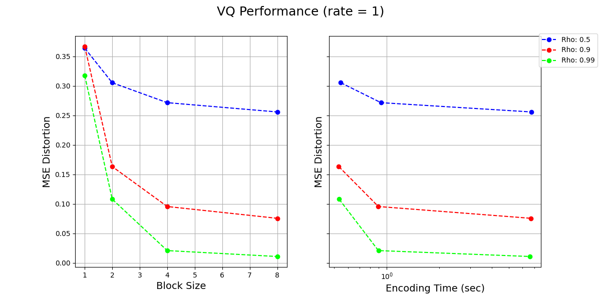

# EE274 (Fall 23): Homework-4

- **Focus area:** Lossy compression
- **Due Date:** 12/04, *Mon*, midnight (11:59 PM)
- **Weightage:** 15%
- **Total Points:** 120
- **Submission Instructions:** Provided at the end of HW (ensure you read these!)
- **Submission link:** 
  - For written part: [HW4-Written](https://www.gradescope.com/courses/625620/assignments/3700718)
  - For programming part: [HW4-Code](https://www.gradescope.com/courses/625620/assignments/3700744)

*Please ensure that you follow the [Stanford Honor Code](https://communitystandards.stanford.edu/policies-guidance/honor-code) while doing the homework. You are encouraged to discuss the homework with your classmates, but you should write your own solutions and code. You are also encouraged to use the internet to look up the syntax of the programming language, but you should not copy-paste code from the internet. If you are unsure about what is allowed, please ask the instructors.* 

**Note for the coding part**<br>
Before starting the coding related questions ensure following instructions from HW1 are followed:
- Ensure you are using the latest version of the SCL `EE274/HWs` GitHub branch. To ensure run the following command in the SCL repository you cloned from HW1:
   ```sh
   git status
   ```   
  You should get an output saying `On branch EE274_Fall23/HWs`. If not, run the following command to switch to the correct branch:
   ```sh
   git checkout EE274_Fall23/HWs
   ```
  Finally ensure you are on the latest commit by running:
   ```sh
   git pull
   ```
  You should see a `HW4` folder in the `HWs` folder.
- Ensure you are in the right conda environment you created in `HW1`. To ensure run the following command:
   ```sh
   conda activate ee274_env
   ```
- Before starting, ensure the previous tests are passing as expected. To do so, run following from `stanford_compression_library` folder:
   ```sh
   find scl -name "*.py" -exec py.test -s -v {} +
   ```
  and ensure tests except in HW folders pass.

### Q1: Mutual Information and Rate Distortion *(20 points)*
1. [5 points] Consider random variables $X$ and $Y$ and let $f$ be an arbitrary function applied to $Y$. Show that
$$I(X; Y) \geq I(X; f(Y))$$
When does equality hold?

  **Note**: This is a special case of the **data-processing inequality**, which more generally holds whenever $X-Y-Z$ form a Markov chain (i.e., $X$ and $Z$ are conditionally independent given $Y$) and says that $I(X; Y) \geq I(X; Z)$. Intuitively, this says that no processing of $Y$, deterministic or random, can increase the information that $Y$ contains about $X$. You can't boost information about $X$ contained in $Y$ just by processing it further!

2. [15 points] Consider a source $X \sim \mathrm{i.i.d.}\ Ber({1\over 2})$ which we wish to lossily compress. The reconstruction $Y$ is allowed to take values in $\{0,1,e\}$ where $e$ represents an erasure symbol. The distortion function is given by

$$
d(x,y)=
\begin{cases}
0, \ \ y=x\\
1, \ \ y=e\\
\infty, \ \mathrm{otherwise}
\end{cases}
$$

In words, erasures incur a distortion of $1$, but making a mistake is not allowed (infinite distortion).

  a. [10 points] Show that $R(D) = \min_{E[d(x,y)]\leq D} I(X;Y) = 1-D$ for $D\in [0,1]$.

  **Hint:** You can first show that $I(X;Y) = H(X) - P(Y=e)H(X|Y=e)$. Can you relate $P(Y=e)$ to $E[d(X,Y)]$?

  b. [5 points] Suggest a simple and efficient scheme for some finite block size $k$ which achieves the optimal
  rate-distortion performance for this setting. You
  can assume that $D$ is rational.

  **Hint:** You can start working with a simple example where $D=\frac{1}{2}, k=2$ and the optimal rate is $\frac{1}{2}$, i.e. you encode two input bits into a single codeword bit.

### Q2: Vector Quantization *(20 points)*

We have studied vector quantization (VQ) in class. In this question we will first implement part of vector quantization and then study the performance of vector quantization for a correlated gaussian process. 

1. [10 points] Implement the `build_kmeans_codebook()` method in `vector_quantizer.py`. You cannot use the existing kmeans implementations for this part (e.g. `build_kmeans_codebook_scipy()` method) and must implement your own version. You can use the methods pre-implemented in `vector_quantizer` module. It will be instructive to look at the provided test cases in the module. Ensure that the test case `test_vector_quantization` passes on the provided data. You can use the following command to run the test cases:

    ```python
    py.test -s -v vector_quantizer.py -k test_vector_quantization               
    ```

2. [10 points] Now we use the VQ to encode a correlated source. Consider a simple gaussian process where $$X_n = \rho X_{n-1} + \sqrt{1 - \rho^2} \mathcal{N}(0, \sigma^2) $$
the second term is independent of $X_0,\dots,X_{n-1}$, and $$X_0 \sim \mathcal{N}(0, \sigma^2)$$ 

   Below we visualize the Rate-Distortion performance as well as encoding complexity for different values of $k$ (block sizes) and $\rho$ (parameter in the gaussian process), for a given rate of `1 bits per symbol`. Based on these plots and what we have learnt in the class, answer following questions:

  

  1. [2 points] What is the theoretical distortion limit for $\rho=0$ at rate of `1 bits per symbol`?
  2. [4 points] What do you observe as $k$ increases for a given $\rho$? Comment on the performance and complexity of the encoder as $k$ increases. Justify your observations in a few lines.
  3. [4 points] What do you observe as $\rho$ increases? Comment on how the change in performance of the encoder with increasing $k$ depends on the value of $\rho$. Justify your observations in a few lines.

### Q3: Lower Bounds via Information Theory *(35 points)*
At the annual *Claude Shannon rowing contest*, there are $n$ participants, with $n-1$ out of them having exactly same strength but one of the rowers is exceptionally strong. The contest aims at finding that one strongest rower. The competition organizers are unfortunately limited on the funds, and so want to minimize the number of rounds to declare the winner. 

As a world renowned information theorist and compression expert, you have been roped in as a consultant, and have been tasked with deciding the match fixtures so that the exceptionally strong rower can be figured out in minimal number of matches. You have the following information:
  - The matches can be between any two teams, where both team consists of an equal number of rowers. E.g. you can decide to have match between Rower 1 and Rower 2, or between (Rower 1, Rower 5) and (Rower 3, Rower 4) or between (Rower 1, Rower 4, Rower 5) and (Rower 2, Rower 3, Rower 6), etc.
  - Each match can result in 3 outcomes: either the first team wins, or the second team wins, or it results in a draw. The team with the exceptionally strong rower always wins the match. If both the teams don't contain the strong rower, then the result is always a draw. Thus, the outcome of a fixture is deterministic given the team composition. 
  - Note that you are allowed to decide the teams in the second match based on the outcome of the first match, i.e. your match-deciding scheme can be *adaptive*. 
  - The teams in the matches should be chosen deterministically. They can depend on the outcome of previous matches, but not on any other random variable (e.g., you can't toss a coin to choose the teams!).


1. [10 points] Let the number of players be $n=9$. Show that you can determine the strongest rower using just 2 matches. 

2. [5 points] Generalize your strategy to $n$ rowers. Show that you can find one strongest rower in $\lceil \log_3 n \rceil$ matches. 

To get your full fees, you have also been asked to *prove* that your strategy is indeed the optimal. Let $X$ be the random variable representing which player is the stronger rower. $X$ is uniformly distributed in the set of all participants $\{1, 2, \ldots, n\}$
$$P_X(x=i) = 1/n, \forall i = \{1, 2, \ldots, n\}$$

Let $Y_1, Y_2, \ldots, Y_k$ be the random variable representing the outcome of the $k$ matches you organize. 

3. [5 points] Show the following sub-problems. For each of the sub-problems, also intuitively explain in a single sentence why the inequalities are true.
   - Show that $H(X) = \log_2 n$, and $H(Y_i) \leq log_2 3$ for each $i$. When is equality achieved? 
   - Show that $H(Y_1,Y_2,\ldots,Y_k|X) = 0$.

4. [10 points] We want to show that we will at least need $\log_3 n$ matches to determine the strongest rower. 
   - Show that we can determine the strongest rower from $k$ matches, if and only if $H(X|Y_1, Y_2, \ldots, Y_k) = 0$. 
   - Using the sub-problem above, show that $k \geq \log_3 n$ matches are required to determine the strongest rower. Thus, proving that the scheme in Q4.1 is indeed optimal! 
   (*HINT: think about using $I(X; Y_1, \ldots, Y_k)$, and its properties*).

5. [5 points] Let's get back to the $n=9$ rowers scenario. To simplify the logistics, the organizers wanted to pre-decide what the matches are going to be, even before the contest began. That is, the teams for the $i$th match are pre-decided, and do not depend upon the outcome of the first $i-1$ matches. In other words the match deciding strategy is *non-adaptive*. Show that even in this *non-adaptive* case, you can find the strongest rower using the outcome of 2 pre-decided matches! 


### Q4: Image Compression *(40 points)*

This question is about image compression. We will implement the transform coding ideas and use it to build a simple image compression scheme. Here are the instructions for this question:
- We have provided the code for this question both in the SCL HW repo as `EE274_HW4_ImageCompressor.ipynb` as well as a [Google Colab notebook](https://colab.research.google.com/drive/1YRy6-2cj73a1gPdrVm2L2PUNiwag3FaV?usp=sharing). 
- We have tested the code on the Colab notebook, and we recommend working on the Colab notebook for this question. You should make a copy of the Colab notebook and work on the copy. 
- The question has both coding and written parts. The written parts should be answered in the Colab notebook itself. You will need to run this notebook on Google Colab to answer some of the written parts.
- After working on the Colab notebook, you should download the notebook as a `.ipynb` file and submit it on Gradescope by replacing the existing `EE274_HW4_ImageCompressor.ipynb` file. This will be graded manually.


### Q5: HW4 Feedback *(5 points)* 
Please answer the following questions, so that we can adjust the difficulty/nature of the problems for the next HWs.

1. How much time did you spent on the HW in total?
2. Which question(s) did you enjoy the most? 
3. Are the programming components in the HWs helping you understand the concepts better?
4. Did the HW4 questions complement the lectures?
5. Any other comments?

### Submission Instructions
Please submit both the written part and your code on Gradescope in their respective submission links. **We will be using both autograder and manual code evaluation for evaluating the coding parts of the assignments.** You can see the scores of the autograded part of the submissions immediately. For code submission ensure following steps are followed for autograder to work correctly:

- As with HW1, you only need to submit the modified files as mentioned in the problem statement.
  - Compress the `HW` folder into a zip file. One way to obtain this zip file is by running the following zip command in the `HWs` folder, i.e.
    ```sh
    cd HWs
    zip -r HW4.zip HW4
    ```
    Note: To avoid autograder errors, ensure that the directory structure is maintained and that you have compressed `HW4` folder containing the relevant files and not `HWs` folder, or files inside or something else. Ensure the name of the files inside the folder are exactly as provided in the starter code, i.e. `vector_quantizer.py`, etc. In summary, your zip file should be uncompressed to following directory structure (with same names):
    ```
    HW4
    └── vector_quantizer.py
    └── EE274_HW4_ImageCompressor.ipynb
    ```
  
- Submit the zip file (`HW4.zip` obtained above) on Gradescope Programming Part Submission Link. Ensure that the autograded parts runs and give you correct scores. 

**Before submitting the programming part on Gradescope, we strongly recommend ensuring that the code runs correctly locally.**