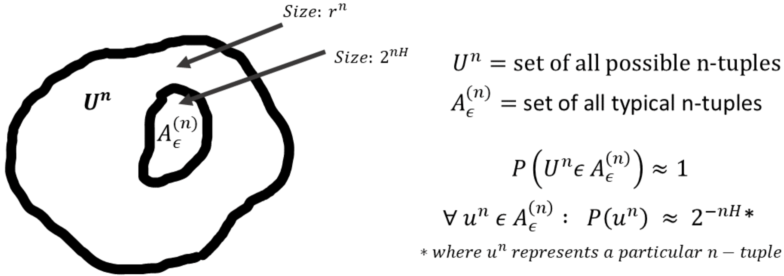

# Asymptotic Equipartition Property

We have been looking at the problem of data compression, algorithms for the same as well as fundamental limits on the compression rate. In this chapter we will approach the problem of data compression in a very different way. The basic idea of asymptotic equipartition property is to consider the space of all possible sequences produced by a stochastic (random) source, and focusing attention on the "typical" ones. The theory is asymptotic in the sense that many of the results focus on the regime of large source sequences. This technique allows us to recover many of the results for compression but in a non-constructive manner. Beyond compression, the same concept has allowed researchers to obtain powerful achievability and impossibility results even before a practical algorithm was developed. Our presentation here will focus on the main concepts, and present the mathematical intuition behind the results. We refer the reader to Chapter 3 in Cover and Thomas and to Information Theory lecture notes (available [here](https://web.stanford.edu/class/ee376a/files/2017-18/lecture_4.pdf)) for some details and proofs.

Before we get started, we define the notation used throughout this chapter:
1. **Alphabet**: $\mathcal{U} = \{1,2,\dots,r\}$ specifies the possible values that the random variable of interest can take. 
2. **iid source**: An independent and identically distributed (iid) source produces a sequence of random variables that are independent of each other and have the same distribution, e.g. a sequence of tosses of a coin. We use $U_1, U_2, \dots \mathrm{iid} \sim U$ notation for iid random variables from distribution $U$.
3. **Source sequence**: $U^n = (U_1,\dots,U_n)$ denotes the $n$-tuple representing $n$ source symbols, and $\mathcal{U}^n$ represents the set of all possible $U^n$. Note that we use lowercase $u^n$ for a particular realization of $U^n$.
4. **Probability**: Under the iid source model, we simply have $P(U^n) = \Pi_{i=1}^n P(U_i)$ where we slightly abuse the notation by using $P$ to represent both the probability function of the $n$-tuple $U^n$ and that for a given symbol $U_i$.

As an example, we could have alphabet $\mathcal{U} = {0, 1}$ and a source distributed iid according to $P(U_i = 0) = 0.3 = 1- P(U_i = 1)$. Then the source sequence $u^3 = (1,0,0)$ has probability $0.7\times0.3\times0.3=0.063$.

Before we start the discussion of asymptotic equipartition property and typical sequences, let us recall the (weak) law of large numbers (LLN) that says the empirical average of a sequence of random variables converges towards their expectation (to understand the different types of convergence of random variables and the strong LLN, please refer to a probability textbook).

~~~admonish example title="Theorem-1: Weak Law of Large Numbers"
For $U_1, U_2, \dots \mathrm{iid} \sim U$ with alphabet $\mathcal{U} = \{1,2,\dots,r\}$, we have the following for any $\epsilon > 0$:
$$\lim_{n\rightarrow \infty} \mathrm{P}\left(\left|\frac{1}{n}\sum_{i=1}^n {U_i} - E[U]\right| < \epsilon \right) = 1$$
~~~

That is for arbitarily small $\epsilon > 0$, as $n$ becomes large, the probability that the empirical average is within $\epsilon$ of the expectation is $1$.

With this background, we are ready to jump in!

## The $\epsilon$-typical set
~~~admonish example title="Definition-1"
For some $\epsilon > 0$, the source sequence $U^n$ is **$\epsilon$-typical** if 
$$\left|-\frac{1}{n}\log P(U^n) - H(U)\right| \leq \epsilon$$
~~~
Recall that $H(U)$ is the entropy of the random variable $U$. It is easy to see that the condition is equivalent to saying that $2^{-n(H(U)+\epsilon)} \leq P(U^n) \leq 2^{-n(H(U)-\epsilon)}$. The set of all **$\epsilon$-typical** sequences is called the **$\epsilon$-typical set** denoted as $A_{\epsilon}^{(n)}$. Put in words, the **$\epsilon$-typical set** contains all $n$-length sequences whose probability is close to $2^{-nH(U)}$. 

Next, we look at some probabilities of the typical set:
~~~admonish example title="Theorem-2: Properties of typical sets"
For any $\epsilon > 0$,
1. $\lim_{n\rightarrow \infty} P(U^n \in A_{\epsilon}^{(n)}) = 1$.
2. $\left|A_{\epsilon}^{(n)}\right| \leq 2^{n(H(U)+\epsilon)}$
3. For large enough $n$, $\left|A_{\epsilon}^{(n)}\right| \geq (1-\epsilon)2^{n(H(U)-\epsilon)}$

Simply put, this is saying that for large $n$, the typical set has probability close to $1$ and size roughly $2^{n(H(U)}$
~~~

### Proof sketch for Theorem-2
1. This follows directly from the Weak LLN by noting the definition of typical sequences and the following facts:
  (i) $-\frac{1}{n}\log P(U^n) = \frac{1}{n}\sum - \log P(U_i)$ (since this is iid).
  (ii) $H(U) = E[-\log P(U)]$ from the definition of entropy.
  Thus applying the LLN on $-\log P(U)$ instead of $U$ directly gives the desired result.

Both 2 & 3 follow from the definition of typical sequences (which roughly says the probability of each typical sequence is close to $2^{-nH(U)}$) and the fact that the typical set has probability close to $1$ (less than $1$ just because total probability is atmost $1$ and close to $1$ due to property 1).

### Intuition into the typical set

To gain intuition into the typical set and its properties, let $|\mathcal{U}| = r$ and consider the set of all $n$ length sequences $U^n$ with size $r^n$. Then the AEP says that (for $n$ sufficiently large), all the probability mass is concentrated in an exponentially smaller subset of size $2^{nH(U)}$. That is,
$$\frac{|A_{\epsilon}^{(n)}|}{|\mathcal{U}^n|} \approx \frac{2^{nH(U)}}{r^n} = 2^{-n(\log r - H(U))}$$

Furthermore, all the elements in the typical set $A_{\epsilon}^{(n)}$ are roughly equiprobable, each with probability $2^{-nH(U)}$. Thus, $\mathcal{U}^n$ contains within itself a subset that contains almost the entire probability mass, and within the subset the elements are roughly uniformly distributed. It is important to note that these properties hold only for large enough $n$ since ultimately these are derived from the law of large numbers. The intuition into typical sets is illustrated in the figure below.

~~~admonish question title="Quiz-1: Intuition into the typical set"
What does the elements of the typical set look like?

1. Consider a binary source with $P(0)=P(1)=0.5$. What is the size of the typical set $A_{\epsilon}^{(n)}$ (Hint: this doesn't depend on $\epsilon$!)? Which elements of $\{0,1\}^n$ are typical? After looking at this example, can you still claim the typical set is exponentially smaller than the set of all sequences _in all cases_?
2. Now consider a binary source with $P(0)=1-P(1)=0.2$. Recalling the fact that typical elements have probability around $2^{-nH(U)}$, what can you say about the elements of the typical set? (Hint: what fraction of zeros and ones would you expect a _typical_ sequence to have? Check if your intuition matches with the $2^{-nH(U)}$ expression.) 
3. In part 2, you can easily verify that the most probable sequence is the sequence consisting of all $1$s. Is that sequence typical (for small $\epsilon$)? If not, how do you square that off with the fact that the typical set contains almost all of the probability mass?
~~~

Before we discuss the ramifications of the above for compressibility of sequences, we introduce one further property of subsets of $\mathcal{U}^n$. This property says that any set substantially smaller than the typical set has negligible probability mass. Intuitively this holds because all elements in the typical set have roughly the same probability, and hence removing a large fraction of them leaves very little probability mass remaining. In other words, very roughly the property says that the typical set is the smallest set containing most of the probability. This property will be very useful below when we link typical sets to compression. Here we just state the theorem and leave the proof to the references.

~~~admonish example title="Theorem-2: Sets exponentially smaller than the typical set"
Fix $\delta > 0$ and $B^{(n)} \subseteq \mathcal{U}^n$ such that $|B^{(n)}| \leq 2^{n(H(U)-\delta)}$. Then
$$\lim_{n\rightarrow \infty} P(U^n \in B^{(n)}) = 0$$
~~~

## Compression based on typical sets

Suppose you were tasked with developing a compressor for a source with $2^k$ possible values, each of them equally likely to occur. It is easy to verify that a simple fixed-length code that encodes each of the value with $k$ bits is optimal for this source. But, if you think about the AEP property above, as $n$ grows, almost all the probability in the set of $n$-length sequences over alphabet $\mathcal{U}$ is contained in the typical set with roughly $2^k$ elements (where $k=nH(U)$). And the elements within the typical set are (roughly) equally likely to occur. Ignoring the non-typical elements for a moment, we can encode the typical elements with $nH(U)$ bits using the simple logic mentioned earlier. We have encoded $n$ input symbols with $nH(U)$ bits, effectively using $H(U)$ bits/symbol! This was not truly lossless because we fail to represent the non-typical sequences. But this can be considered near-lossless since the non-typical sequences have probability close to $0$, and hence this code is lossless for a given input with very high probability. Note that we ignored the $\epsilon$'s and $\delta$'s in the treatment above, but that shouldn't take away from the main conclusions that become truer and truer as $n$ grows.

On the flip side, suppose we wanted to encode the elements in $\mathcal{U}$ with $n(H(U)-\delta)$ bits for some $\delta > 0$. Now, $n(H(U)-\delta)$ bits can represent $2^{n(H(U)-\delta)}$ elements. But according to theorem 2 above, the set of elements correctly represented by such a code has negligible probability as $n$ grows. This means a fixed-length code using less than $H(U)$ bits per symbol is unable to losslessly represent an input sequence with very high probability. Thus, using AEP we can prove the fact that any fixed-length _near-lossless_ compression scheme must use at least $H(U)$ bits per symbol.

### Lossless compression scheme
Let us now develop a lossless compression algorithm based on the AEP, this time being very precise. As before, we focus on encoding sequences of length $n$. Note that a lossless compression algorithm aiming to achieve entropy must be variable length (unless the source itself is uniformly distributed). And the AEP teaches us that elements in the typical set should ideally be represented using $\approx nH(U)$ bits. With this in mind, consider the following scheme:

~~~admonish info title="Lossless compression using typical sets"
Fix $\epsilon > 0$, and assign index $idx$ ranging from $1,\dots,|A_{\epsilon}^{(n)}|$ to the elements in $A_{\epsilon}^{(n)}$ (the order doesn't matter). In addition, define a fixed length code $fixed$ for $\mathcal{U}^n$ that uses $n\log_2 |\mathcal{U}|$ bits to encode any input sequence. Now the encoding of $u^n$ is simply:
- if $u^n \in A_{\epsilon}^{(n)}$, encode as $0$ followed by $idx(u^n)$
- else, encode as $1$ followed by $fixed(u^n)$
~~~

Let's calculate the expected code length (in bits per symbol) used by the above scheme. For $n$ large enough, we can safely assume that $P(U^n \in A_{\epsilon}^{(n)}) \geq 1-\epsilon$ by the AEP. Furthermore, we know that $idx(u^n)$ needs at most $H(U) + \epsilon$ bits to represent (theorem-1 part 2). Thus, denoting the code length by $l$, we have
$$E[l(U^n)] \leq (1-\epsilon)(1+n(H(U) + \epsilon)) + \epsilon (1+n\log_2 |\mathcal{U}|)$$
where the first term corresponds to the typical sequences and the second term to everything else (not that we use the simplest possible encoding for non-typical sequences since they don't really matter in terms of their probability). Also note that we add $1$ to each of the lengths to account for the $0$ or $1$ we prefix in the scheme above. Simplifying the above, we have
$$\frac{E[l(U^n)]}{n} = (1-\epsilon)(H(U) + \epsilon) + \epsilon \log_2 |\mathcal{U}| + \frac{1}{n}$$
$$\frac{E[l(U^n)]}{n} = H(U) + O(\epsilon) + \frac{1}{n}$$
where $O(\epsilon)$ represents terms bounded by $c\epsilon$ for some constant $c$ when $\epsilon$ is small. Thus we can achieve code lengths arbitrary close to $H(U)$ bits/symbol by selecting $\epsilon$ and $n$ appropriately!

~~~admonish question title="Quiz-2: Lossless compression based on typical sets"
1. Describe the decoding algorithm for the above scheme and verify that the scheme is indeed lossless.
2. What is the complexity of the encoding and decoding procedure as a function of $n$? Consider both the time and memory usage. Is this a practical scheme for large values of $n$?
~~~
