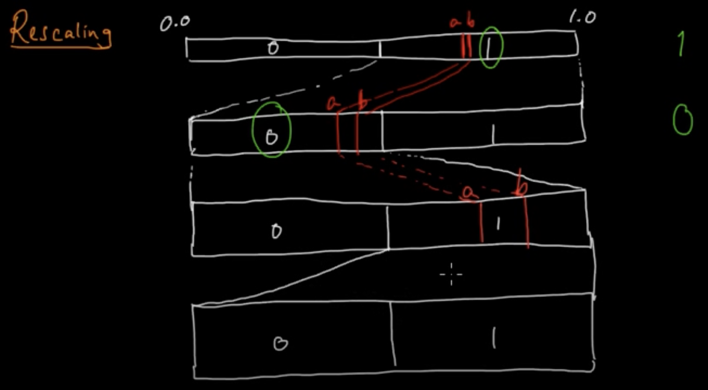

# Arithmetic coding

In this chapter, we discuss arithmetic coding, which is a major step in the direction of achieving entropy without sacrificing efficiency. While here we will discuss the case of data from known iid distributions, arithmetic coding is versatile and is most useful in cases of complex adaptive data distributions (to be discussed in the following chapters). In addition, as we will see later, arithmetic coding plays a crucial role in understanding the link between compression and prediction.

## Recap -> Issues with symbol codes: 

Lets consider the simple distribution below and think about what designing prefix-free codes for the same
```py
P = {A: 0.1, B: 0.9}
H(P) = 0.47
```

It is clear that as there are just two symbols, the only reasonable prefix-free code design here is: 
```
A -> 0, B -> 1
Huffman code (or any other prefix-free code) = 1 bit
```
So the average codelength for huffman code for this data is 1 bit. If we compare it with the entropy $H(P) = 0.47$ of the distribution,
our average codelength (`1 bit`) is quite off. Ideally for a symbol $s$, ideally we want to use $l(s) = \log_2 \frac{1}{P(s)}$ bits (to achieve $H(P)$). But, as we are using a symbol code, we can't use fractional bits.
Thus, there is always going to an overhead of up to  `~1 bit` per symbol with symbol codes. This is consistent with the guarantees on the expected codelength $L \leq H(P) + 1$ with Huffman codes. 

One solution to this problem is to use considering block codes. i.e. we consider tuples of symbols from the alphabet as a new "symbol" and construct a Huffman code using that. 
For example, we can consider blocks of size 2: `P = {AA: 0.01, AB: 0.09, BA: 0.09, BB: 0.81}`. Here is the Huffman tree:

```py
block_size: 1, entropy: 0.47, avg_codelen: 1.00 bits/symbol

  |--A
·-|  
  |--B
block_size: 2, entropy: 0.47, avg_codelen: 0.65 bits/symbol

       |--BA
  |--·-|  
  |    |    |--AA
  |    |--·-|  
  |         |--AB
·-|  
  |--BB
```

We see that `BB` has probability `0.81`, so it receives the shortest codelength of `1 bit`. The average codelength in this case is `0.65 bits/symbol` which is definitely an improvement over the `1 bit/symbol`. 
The idea here is that, as we are using fixed codes per "symbol", as now the symbols are tuples of size 2, the overhead gets amortized to 2 symbols from the alphabet. 

We can continue doing this by considering larger blocks of data. For example, with blocks of size $k$, the new alphabet size is $2^k$, and the overhead due to Huffman coding should be `~1/k` (or lower). 
Here is an example of applying the Huffman coding on blocks of size 3,4,5: 

```py
block_size: 3, entropy: 0.47, avg_codelen: 0.53 bits/symbol

                      |--AAA
                 |--·-|  
                 |    |--BAA
            |--·-|  
            |    |    |--ABA
            |    |--·-|  
            |         |--AAB
       |--·-|  
       |    |--ABB
  |--·-|  
  |    |    |--BBA
  |    |--·-|  
  |         |--BAB
·-|  
  |--BBB

```

```py
## Huffman code for blocks
block_size: 1, entropy: 0.47, avg_codelen: 1.00 bits/symbol
block_size: 2, entropy: 0.47, avg_codelen: 0.65 bits/symbol
block_size: 3, entropy: 0.47, avg_codelen: 0.53 bits/symbol
block_size: 4, entropy: 0.47, avg_codelen: 0.49 bits/symbol
block_size: 5, entropy: 0.47, avg_codelen: 0.48 bits/symbol
```

We already see that the with block size `4` we are already quite close to the entropy of `0.47`. So, this is quite great, and should help us solve our problem of reaching the entropy limit.
In general the convergence of Huffman codes on blocks goes as:

1. Huffman codes

$$ H(X) \leq \mathbb{E}[l(X)] \leq H(X) + 1 $$

2. Huffman codes on blocks of size B

$$ H(X) \leq \frac{\mathbb{E}[l(X_1^B)]}{B} \leq H(X) + \frac{1}{B}$$


However there is a practical issue. Do you see it? As a hint (and also because it looks cool!) here is the huffman tree for block size `5`: 


```py
block_size: 5, entropy: 0.47, avg_codelen: 0.48 bits/symbol

            |--BABBB
       |--·-|  
       |    |              |--BBABA
       |    |         |--·-|  
       |    |         |    |--ABBBA
       |    |    |--·-|  
       |    |    |    |    |--BABBA
       |    |    |    |--·-|  
       |    |    |         |--AABBB
       |    |--·-|  
       |         |                        |--BBAAA
       |         |                   |--·-|  
       |         |                   |    |--AABAB
       |         |              |--·-|  
       |         |              |    |    |--AAABB
       |         |              |    |--·-|  
       |         |              |         |--ABBAA
       |         |         |--·-|  
       |         |         |    |         |--AABBA
       |         |         |    |    |--·-|  
       |         |         |    |    |    |              |--AAAAB
       |         |         |    |    |    |         |--·-|  
       |         |         |    |    |    |         |    |--AABAA
       |         |         |    |    |    |    |--·-|  
       |         |         |    |    |    |    |    |         |--AAAAA
       |         |         |    |    |    |    |    |    |--·-|  
       |         |         |    |    |    |    |    |    |    |--BAAAA
       |         |         |    |    |    |    |    |--·-|  
       |         |         |    |    |    |    |         |    |--ABAAA
       |         |         |    |    |    |    |         |--·-|  
       |         |         |    |    |    |    |              |--AAABA
       |         |         |    |    |    |--·-|  
       |         |         |    |    |         |--BAAAB
       |         |         |    |--·-|  
       |         |         |         |         |--BABAA
       |         |         |         |    |--·-|  
       |         |         |         |    |    |--ABABA
       |         |         |         |--·-|  
       |         |         |              |    |--BAABA
       |         |         |              |--·-|  
       |         |         |                   |--ABAAB
       |         |    |--·-|  
       |         |    |    |    |--ABBAB
       |         |    |    |--·-|  
       |         |    |         |--BABAB
       |         |--·-|  
       |              |         |--BBAAB
       |              |    |--·-|  
       |              |    |    |--BAABB
       |              |--·-|  
       |                   |    |--ABABB
       |                   |--·-|  
       |                        |--BBBAA
  |--·-|  
  |    |         |--BBBAB
  |    |    |--·-|  
  |    |    |    |--BBBBA
  |    |--·-|  
  |         |    |--BBABB
  |         |--·-|  
  |              |--ABBBB
·-|  
  |--BBBBB

```

The issue is that, as we increase the block size $B$, our codebook size increases exponentially as $|\mathcal{X}|^B$.
The larger the codebook size the more complicated the encoding/decoding becomes, the more memory we need, the higher the latency etc. For example, if we look at the tree above, the codebook size is $2^5 = 32$. This is quite manageable. 
However, this wouldn't have been the case if our alphabet size was $256$ for a byte coder instead of $2$. In that case, block code of size `5` has a codebook = $2^{40}$, which is definitely unmanageable.


Thus, even though with block size $B$, we obtain compression as close as `1/B bits/symbol` to entropy $H(X)$, the idea doesn't hold ground practically. 
That is, in fact the problem which Arithmetic coding solves.

## Arithmetic coding: Introduction

Arithmetic coding solves the problems we discussed with the block-based Huffman coder: 

1. **Entire data as a single block**: Arithmetic coding encodes entire data as a single block: For data $x_1^n$, the `block_size = n` 
i.e. the entire data is a single block!

2. **codewords are computed on a fly**: As the block size for arithmetic coding is the entire data, the codebook size would have been massive ($|\mathcal{X}|^n$). The codeword is computed on *on the fly*. 
No need to pre-compute the codebook beforehand!

3. **compression efficiency**: Arithmetic coding is optimal in terms of compression. ->  *theoretically* the performance can be shown to be:  
$$H(X) \leq \frac{\mathbb{E}[l(X_1^n)]}{n} \leq H(X) + \frac{2}{n}$$
i.e. `~2 bits` of overhead for the *entire* sequence


Thus, we see that Arithmetic coding solves our problem of achieving average compression equal to $H(X)$, at the same time being practical. 

## How does Arithmetic coding work? 

### Primer: the number line (in binary)

Before we get to Arithmetic coding, lets take a brief detour towards revisiting the number line, as that will be helpful for the later discussions. 

We are familiar with the unit interval `[0,1)` in decimal floating point. A decimal floating point number can also be represented in the binary alphabet. 


For example: 
1. `0.5 = 2^{-1} = b0.1`
2. `0.75 = 2^{-1} + 2^{-2} = b0.11`

In fact this is similar to how computers represent floating point values. Here are some more examples below: 

```py
# floating point values in binary
from utils.bitarray_utils import float_to_bitarrays
_, binary_exp = float_to_bitarrays(0.3333333, 20)

0.3333.. = b0.010101...
0.6666.. = b0.101010...
```

As you can see, like the decimal case, the binary floating point representations need not be finite (or even repetitive). Getting familiar with thinking about floating point values in binary will be useful to us for Arithmetic coding discussion.


### Arithmetic Encoding (theoretical)

Okay, we are all set to discuss Arithmetic encoding. Lets consider a specific running example, as that will make it much easier: 

We want to encode the sequence $x_1^n = BACB$ sampled from the distribution $P$. 

```py
P = ProbabilityDist({A: 0.3, B: 0.5, C: 0.2})
x_input = BACB
```

The Arithmetic encoding works in the following two steps:

1. **STEP I**: Find an *interval* (or a *range*) `[L,H)`, corresponding to the *entire sequence* $x_1^n$ 

```py
        x_input -> |------------------[.....)------------|
                   0               low     high          1 
```

2. **STEP II**: Communicate the *interval* `[L,H)` *efficiently*
(i.e. using less number of bits)
```py
         x_input -> [L,H) -> 011010
```

Before we discuss the steps in detail, let's discuss some desirable properties to gain further intuition. Consider the range `[0,1)` divided up into subintervals (known to both encoder and decoder). You want to convey a particular subinterval to a friend. For example you wanted to convey the interval `[0.3, 0.8)`. One way to do this is to just send over any point within this interval, for example `0.5`. As you can see, this can be done quite cheaply. Whereas if you wanted to convey the interval `[0.3, 0.30001)`, you would need to send over a much more precise value, for example `0.300005`. Thus the first piece of intuition is that: 
- **Intuition 1: Bigger intervals need fewer bits to communicate**.

But recall from previous chatpers that a good coding scheme should assign shorter codewords to more probable sequences. Thus we would like to have the following property:
- **Intuition 2: More probable sequences should correspond to bigger intervals**.

The simplest logic is to have the size of the interval be proportional to the probability of the sequence, which is surprisingly what we will do!

With these combined intuitions, we get:
- More probable sequences => Bigger interval => Fewer bits to communicate

With this in mind, let's study the steps and see how they satisfy this basic intuition.

#### STEP-I: finding the interval `[L,H)`

Lets see how the **STEP I** (finding the interval `[L,H)`) works. 
We start with `[L,H) = [0,1)`, and the subdivide the interval as we see each symbol. 

1. `x_input[0] = B`


After we process the symbol `B`, our interval shrinks from `[0,1)` to `[0.3,0.8)`. Can you guess the shrinking rule? 

The main idea is to find the cumulative probability values for the symbols, and then for symbol with index `i`, assign it the interval `[L,H) = [C(i), C(i+1))`

```py
alphabet = [A,B,C]
prob_array = [0.3, 0.5, 0.2]
cumul_array = [0.0, 0.3, 0.8, 1.0]
```


One comment on the interval size is that the interval size is proportional to the probability of the symbol. (i.e. `C(i+1) - C(i) = P(i)`). We will see that a similar relationship holds as we encode more symbols.

2. `x_input[1] = A` 
Let's now see how the interval updates as we encode the second symbol. As you can see from the image below, we continue subdiving the interval `L,H`, based on the cumulative probability of the next symbol. 


Notice that the new interval `[L', H')` can be described as: 

```py
j -> index of the next symbol
P(j), C(j) -> prob and cumulative_prob of j

# update rule
L' = L + C(j)*[H-L]
H' = L' + P(j)*[H-L]
```

We can continue this way for the entire input. 


```py
prob = ProbabilityDist({A: 0.3, B: 0.5, C: 0.2})
x_input = BACB

# find interval corresp to BACB
ENCODE: B -> [L,H) = [0.30000,0.80000)
ENCODE: A -> [L,H) = [0.30000,0.45000)
ENCODE: C -> [L,H) = [0.42000,0.45000)
ENCODE: B -> [L,H) = [0.42900,0.44400)
```
Thus, the final interval is: `x_input -> [0.429, 0.444)`

For completeness, here is a pesudo-code of the **STEP I** or Arithmetic coding. Note that in the literature *interval* and *range* are terms used interchangeably to describe `[L,H)`. 

```py
class ArithmeticEncoder:
    ...

    def shrink_range(self, L, H, s):
        rng = H - L
        new_L = L + (rng * self.P.cumul[s])
        new_H = new_L + (rng * self.P.probs(s))
        return new_L, new_H

    def find_interval(self, x_input):
        L,H = 0.0, 1.0
        for s in x_input:
            L,H = self.shrink_range(L,H,s)
        return L,H

    def encode_block(self, x_input):
        # STEP1
        L,H = self.find_interval(x_input)

        # STEP-II
        ...
```

**Observation:** Notice that each time we encode symbol $s$, we shrink the interval size by $P(s)$. For example: we started with interval `[L,H) = [0,1)` of size `1`. We continued shrinking this interval to `[0.3,0.8)` which has size `0.5 = P(B)`. 

<span style="color:purple;"> **Quiz-1**: What is the size of the interval (`H-L`) for the input $x_1^n$?</span>

**Ans:** It is easy to see that the interval size is equal to the probability of the input parsed until then. For example, when we see the first symbol `B`, the interval size is `0.8 - 0.3 = 0.5 = P(B)`, when we see the next symbol, the interval size is: 
`0.45 - 0.3 = 0.15 = P(A)*P(B) = P(AB)`. This can be generalized to the entire sequence.  

$$
\begin{align*} 
(H - L) &= p(x_1)*p(x_2)...p(x_n) \\
        &= \prod_{i=1}^n p(x_i) \\
        & = p(x_1^n)
\end{align*}$$

This is consistent with the intuition presented above!


#### STEP-II communicating the interval `[L,H)`

Until this point, we discussed the **STEP I** of the Arithmetic encoding, given the input `x_input`, find an interval corresponding to the input. 

```py
P = {A: 0.3, B: 0.5, C: 0.2}
x_input = BACB
L = [0.429, 0.444)
```

The **STEP-II** is logically quite simple. We want to communicate the interval $[L,H)$. We do this by communicating a value $Z \in [L,H)$. 

For example: $Z = \frac{(L+H)}{2}$, i.e. the midpoint of the range/interval. 
(in our example `Z = 0.4365`)

<span style="color:purple;">**Quiz-2:**</span> If the decoder knows:
- `n=4` 
- `P = {A: 0.3, B: 0.5, C: 0.2}`
- `Z = 0.4365` 

<span style="color:purple;">How can it decode the entire input sequence? $x_1^n$.</span>

### Arithmetic decoding (theoretical)

Let's try to answer the quiz question above. Let's start by plotting out what all we know. We know the value of $Z=0.4365$, the midpoint of the final interval. 


How can we use $Z$ to decode the entire input `x_input`? Lets start by asking a simpler question: how can we decode the first symbol `x_input[0]` of the input? 

1. **Decoding `x_input[0]`**

The answer is quite simple: 

```py
alphabet = [A,B,C]
prob_array = [0.3, 0.5, 0.2]
cumul_array = [0.0, 0.3, 0.8, 1.0]
```
As the decoder knows the probability distribution, cumulative distribution etc, the decoder can form bins using the cumulative distribution values: 
```py
# cumulative bits:
bin_0 -> [C(0), C(1)) = [0.0, 0.3) #A
bin_1 -> [C(1), C(2)) = [0.3, 0.8) #B
bin_2 -> [C(2), C(3)) = [0.8, 1.0) #C
```

As during the encoding the successive intervals (on encoding each symbol) are subsets of the original intervals, we can see decode the first symbol by checking which interval $Z$ lies in. 


In our case `Z = 0.4365` lies in the bin corresponding to symbol `B`, so the first input symbol is `B`. 


2. **Decoding `x_input[1]`**
Having decoded the first symbol `B`, let's now see how we can decode the second symbol. 

The logic here is again similar, if you recall, during the encoding, we divided the current range further into sub-intervals, and then picked one of them based on the next symbol. For example in this case the sub=intervals are: 

```py
# sub-intervals of [0.3, 0.8)
bin_0 -> = [0.3, 0.45) #BA
bin_1 -> = [0.45, 0.7) #BB
bin_2 -> = [0.7, 0.8) #BC
```
We can again find which bin does $Z$ belong do, and that will correspond to our next symbol. In our case, the next symbol is `A`. 


We can continue this recursive process until we have decoded `n=4` symbols. 

1. Notice that the intervals are in exact sync during the encoding and decoding, and that is the key to the lossless-ness of the decoding algorithm.

2. Also note that we do need to mention what the number of encoded symbols is (`n=4` in our example), as the decoder can potentially decode infinite sequence using a single $Z$. So, we need to tell it when to stop the recursive process. In practice we can inform the decoder about when to stop in two common ways:
    1. Prepend the length `n` at the start of the bitstream using a fixed length encoding
    2. Use a special `EOF` symbol in the alphabet, and inform the decoder to stop when it sees the `EOF` symbol. In this case, the `EOF` symbol should have a non-zero but typically small probability in the distribution.

```py
Z = 0.4365
ENCODE: B -> [L,H) = [0.30000,0.80000)
ENCODE: A -> [L,H) = [0.30000,0.45000)
ENCODE: C -> [L,H) = [0.42000,0.45000)
ENCODE: B -> [L,H) = [0.42900,0.44400)
------------------------------
DECODE: B -> [L,H) = [0.30000,0.80000)
DECODE: A -> [L,H) = [0.30000,0.45000)
DECODE: C -> [L,H) = [0.42000,0.45000)
DECODE: B -> [L,H) = [0.42900,0.44400)
```

For completeness, the decoding algorithm given the $Z$ is described below. 


```py
class ArithmeticDecoder:
    ...
    def shrink_range(self, L, H, s):
        # same as the encoder
        ...
        return new_L, new_H

    def decode_symbol(self, L, H, Z):
        rng = H - L
        search_list = L + (self.P.cumul * rng)
        symbol_ind = np.searchsorted(search_list, Z)
        return self.P.alphabet[symbol_ind]

    def decode_block(self, Z, n):
        L,H = 0.0, 1.0
        for _ in range(n): #main decoding loop
            s = self.decode_symbol(L, H, Z)
            L,H = self.shrink_range(L,H,s)
```

### Communicating $Z$

To recap, the Arithmetic encoder we have does the following: 

1. **STEP-I**: Find an *interval* (or a *range*) `[L,H)`
corresponding to the *entire sequence* $x_1^n$ (`[0.429, 0.444]`)

2. **STEP-II**: Find the midpoint of the interval $[L,H)$, $Z = \frac{(L+H)}{2}$.  (`Z =0.4365`), and communicate $Z$ to the decoder. 

One simple way of communicating $Z$, is writing the binary expansion of $Z$ to the bitstream -> 
eg: `Z = 0.4365 = b0.01101111101...` 
then the final <span style="color:red;"> `encoded_bitstream = 01101111101...` </span> and then just writing the binary expansion to a file. 

However there is one problem: 

<span style="color:purple;"> **Quiz-3:** Although our method of writing the binary expansion of $Z$ to file is cute, it might not give us any compression as $Z$'s binary representation can be long, can also have infinite bits. 
How can we fix this? </span>

The solution to the problem is quite simple. Instead of communicating the entire binary expansion of $Z$, we truncate the expansion to $k$ bits and communicate this truncated binary string. Let's call the the floating point value corresponding to the truncated binary string as $\hat{Z}$. 

Note that we have to be careful regarding how we choose $k$, if $k$ is too small the $\hat{Z}$ might be steer out of the interval `[L,H)`, which will be a problem for the decoding. Also, choosing $k$ too large will hamper our compression performance. 


Thus, our full Arithmetic encoder can be described below:

~~~admonish note title="Arithmetic Encoder"

1. **STEP-I**: Find an *interval* (or a *range*) $[L,H)$
corresponding to the *entire sequence* $x_1^n$ (`[0.429, 0.444]`)

2. **STEP-II**: Find the midpoint of the interval $[L,H)$, $Z = \frac{(L+H)}{2}$.  (`Z =0.4365`) 

3. **STEP-III:** Truncate $Z$ to $k$ bits ($\hat{Z}$)
e.g: 
```
L,H = 0.429, 0.444
Z = 0.4365 = b0.01101111101...
Z_hat = b0.011011111 ~ 0.4296
```
Final Encoding = <span style="color:red;"> `encoded_bitstream = 011011111` </span> 

~~~

### Determining how many bits to truncate $Z$ to
Okay, we are almost done finalizing the Arithmetic encoder. The only final missing piece of the jigsaw puzzle is how do we determine $k$, the number of bits to truncate $Z$ to? 

There are in fact two conditions we need to satisfy when choosing $k$:

1. **Cond 1:** Truncate $Z$ to $\hat{Z}$ with $k$ bits, so that $ \hat{Z} \in [L,H)$

2. **Cond 2:** If $\hat{Z}$ has binary representation: `Z_hat = b0.011011111` for example, then we also need, any extension of it $Z_{ext} \in [L, H)$. 

For eg: 

```
Z_hat = b0.011011111
Z_ext = b0.01101111111011110101..
```


The **Cond-1** is somewhat obvious, we want the $\hat{Z}$ obtained on truncating $Z$ to $k$ bits, we still lie inside the interval `[L,H)`. Lets now see why the  **Cond 2** is imposed: Lets say Arithmetic coding leads to `Z_hat = b0.011011111`, and thus the final encoded bitarray is `011011111`. Now, in practice arithmetic coded bitstream is always going to be followed by some other bitstream, and so the decoder is going to see this stream like: `01101111111011110101..`. the second condition ensures that, even if the decoder reads in some bits not part of the arithmetic encoding, the resultant floating point value $Z_{ext}$ will still lie inside the interval `[L, H)`. 

With some simple arithmetic, it can be shown that the two conditions together can be written as:

$$ [\hat{Z}, \hat{Z} + 2^{-k}) \in [L,H)$$

which gives us a simple bound on $k$:
$$ k \leq \left\lceil {log_2 \frac{1}{(H-L)}} \right \rceil + 1 $$

<span style="color:purple;"> **Quiz-4:** Explain where the condition $ [\hat{Z}, \hat{Z} + 2^{-k}) \in [L,H)$ comes from. As a hint, think about a $k$-bit binary value like $b = 0.b_1b_2b_3\dots b_k$ - what can you say about a value $c=0.b_1b_2b_3\dots b_k c_1c_2\dots$? What is the maximum possible value of $c-b$? </span>


The key observation here is that shorter the interval, $|H-L|$, the larger $k$ we need to use to truncate $Z$ (consistent with the basic intuition we presented at the very beginning!). Using the $k$ computation above, we finally have got our complete Arithmetic coder pseudocode: 


```py
# Arithmetic Encoding pseudo-code
class ArithmeticEncoder:
    def shrink_range(self, L, H, s):
        ...
    def find_interval(self, x_input):
        L,H = 0.0, 1.0
        for s in x_input:
            L,H = self.shrink_range(L,H,s)
        return L,H

    def encode_block(self, x_input):
        # STEP-1 find interval
        L,H = self.find_interval(x_input)

        # STEP-II,III communicate interval
        Z = (L+H)/2 
        num_bits = ceil(log2(1/(H-L))) + 1
        _, code = float_to_bitarray(Z, num_bits)
        return code

# Arithmetic decoding-pseudocode
class ArithmeticDecoder:
    ...
    def shrink_range(self, L, H, s):
        ...

    def decode_symbol(self, L, H, Z):
        ...

    def decode_block(self, code, n):
        Z = bitarray_to_float(code)

        # start decoding
        L,H = 0.0, 1.0
        for _ in range(n): #main decoding loop
            s = self.decode_symbol(L, H, Z)
            L,H = self.shrink_range(L,H,s)

        # add code to remove additional bits read
```

One point to note in the decoding is that, as the decoder might have read in more bits that what the encoder wrote, after decoding all the symbols, the decoder needs to backtrack a bit (otherwise the program processing the next stream is going to falter!). Since the decoder will know the decoded sequence and hence the value of $k$, it can easily backtrack the extra bits read.

### Arithmetic coding compression performance: 

Now that we have discussed the full Arithmetic encoder/decoder, lets try to understand the compression performance of Arithmetic coder. 

Let us start by summarizing what we know:
- Size of interval $H-L = p(x_1^n)$
- $k \leq \log_2 {\frac{1}{H-L}} + 2$

Based on these two properties, it is quite straightforward to see that the codelength for encoding an entire sequence $x_1^n$ using Arithmetic coding is:

$$ codelen = k \leq \log_2 \frac{1}{p(x_1^n)} + 2 $$

As the optimal number of bits to encode a sequence $x_1^n$ using a distribution $p(.)$ are $\log_2 \frac{1}{p(x_1^n)}$, we see that arithmetic coding is in fact within `2` bits of the optimal on the *ENTIRE* sequence! Thus, we can summarize by saying that:

~~~admonish note title="Arithmetic coder compression performance"

Given any model/distribution $p(x)$ for a sequence $x_1^n$, arithmetic coding achieves codelength of 
$$ l(x_1^n) = k \leq \log_2 \frac{1}{p(x_1^n)} + 2 $$

Also, the average codelength achieved by Arithmetic coding is within $2/n$ bits of the entropy $H(X)$. 

$$ H(X) \leq \frac{\mathbb{E}[l(X_1^n)]}{n} \leq H(X) + \frac{2}{n}$$

~~~

It is quite incredible that Arithmetic coding is basically optimal for *any* given distribution $P$. This in a way shifts the complexity in designing compression algorithms from designing codes to finding a distribution/model $P$ which matches the data! This property of Arithmetic coding is also called the **model, entropy coding separation**. This means we can just focus on building good probability models, which could even be adaptive (i.e., the distribution changes as we see more data), and then use Arithmetic coding as a black-box to convert the probabilities to bits efficiently. We will revisit this idea in the upcoming chapters.

## Arithmetic coding in practice

Now that we have concluded our discussion of the (theoretical) Arithmetic coding algorithm, lets think about implementing the pseudo-code in practice and what challenges we might face. 

There is one clear practical issue which you might be able to spot from the hint below!

<span style="color:purple;"> **Quiz-5**: What are the practical issues with our Arithmetic encoding/decoding?</span>

Hint -> 
```py
prob = ProbabilityDist({A: 0.3, B: 0.5, C: 0.2})
x_input = BACBBCCBA

# find interval corresp to BACB
ENCODE: B -> [L,H) = [0.30000,0.80000)
ENCODE: A -> [L,H) = [0.30000,0.45000)
ENCODE: C -> [L,H) = [0.42000,0.45000)
ENCODE: B -> [L,H) = [0.42900,0.44400)
ENCODE: C -> [L,H) = [0.44100,0.44400)
ENCODE: C -> [L,H) = [0.44340,0.44400)
ENCODE: B -> [L,H) = [0.44358,0.44388)
ENCODE: A -> [L,H) = [0.44358,0.44367)
```

The key idea is that every time we encode a symbol `s`, we are shrinking the interval `[L,H)`, by the probability of the symbol `P(s)`. Thus, we see that very quickly the interval becomes quite small. For example in the hint above, on encoding `8` symbols, we are already at a place where out interval is `[0.44358,0.44367)`. We quickly see that due to finite bit arithmetic, we are going to run out of bits to represent this interval. So we need to find a way to avoid the interval `[L,H)` from getting too small:


<span style="color:purple;"> **Quiz-6**: What can we do to avoid the interval `[L,H)` from getting too small?</span>

Hint -> 
```py
L = 0.429 = b0.0110110...
H = 0.444 = b0.01110001...
```

The core idea is quite simple. Notice that in the example above both `L`, `H` start with `011`. Then, $Z$, or any value lying inside the interval also will start with `011`! Thus, we can pre-emptively output `011`, and then *rescale* the intervals `L,H`. For example:

```py
L = 0.429 = b0.0110110...
H = 0.444 = b0.01110001...

Rescaled: L=0.8580, H=0.8880, bitarray='0'
Rescaled: L=0.7160, H=0.7760, bitarray='01'
Rescaled: L=0.4320, H=0.5520, bitarray='011'
```

Notice that after rescaling our intervals are `L=0.4320, H=0.5520` are much larger that what we started with: `0.429, 0.444`. This can be understood from the fact that, flushing out a `0` is equivalent to setting `L,H` as: `L,H = 2*L,2*H`; while flushing out a `1` is equivalend to `L,H = (L - 0.5)*2, (H - 0.5)*2`. i.e. we are expanding out either the left half (`[0,0.5)`) of the number line or the right half (`[0.5, 1)`) of the number line by `2x`. This is also illustrated in the figure below (credit: [YouTube](https://www.youtube.com/watch?v=t8_198HHSfI)):



Thus, our rescaling operation can be summarized below. 
```py
# Arithmetic encoding with rescaling of the range
class ArithmeticEncoder:
    def shrink_range(self, L, H, s):
        ...
    def rescale_range(self, L, H):
        bitarray = ""
        while (L >= 0.5) or (H < 0.5):
            if (L < 0.5) and (H < 0.5):
                bitarray+= "0"
                L,H = L*2, H*2
            elif ((L >= 0.5) and (H >= 0.5)):
                bitarray += "1"
                L,H = (L - 0.5)*2, (H - 0.5)*2    
        return L, H, bitarray
    def find_interval(self, x_input):
        L,H, bitarray = 0.0, 1.0, Bitarray("")
        for s in x_input:
            L,H = self.shrink_range(L,H,s)
            L,H, bits = self.rescale_range(L,H)
            bitarray += bits
        return L,H, bitarray
```

This largely mitigates the problem. However, it is possible that `L,H` are extremely close, but don't start with the same bits. For example: 
```py
L = 0.499 = 0.111..b, 
H = 0.501 = 0.100..b
```

In this case, we cannot premptively flush-out bits and rescale the range `[L,H)`. This *mid-range rescaling* issues is handled in different ways, by either:

1. If `L=0.499, H = 0.501`, we can setting`H = 0.4999999...` for example, and then apply the usual re-scaling. In this case, we are losing a bit of compression, as we are reducing the interval size when it is not needed. The [range coder variant](https://github.com/kedartatwawadi/stanford_compression_library/blob/main/scl/compressors/range_coder.py) implemented in the SCL uses this simple approach.

2. An optimal way to handle the *mid-range rescaling* is to expand the middle interval `[0.25, 0.75)` by 2x `L,H <- 2L - 0.5, 2H - 0.5`. This is a bit non-trivial, but is well explained in [this YouTube series](https://www.youtube.com/playlist?list=PLE125425EC837021F) of lectures on Arithmetic coding. Note that this optimal rescaling is also implemented as part of the [Arithmetic coder in the SCL](https://github.com/kedartatwawadi/stanford_compression_library/blob/main/scl/compressors/arithmetic_coding.py)

3. In practice, it is more efficient to flush out bytes or even words instead of bits. i.e if `L,H` start with the same 8 bits, only then those 8 bits are flushed out. These variants of Arithmetic coding are traditional called *range coding*. One variant of the *range coder* is impplemented in the SCL and can be [accessed here](https://github.com/kedartatwawadi/stanford_compression_library/blob/main/compressors/range_coder.py). 

We encourage the reader to study the implementations of both the Arithmetic coder and the Range coder in the SCL to get a better understanding of these practical issues. The implementations are written in a simple and clear manner, and are well commented to enable easy understanding. The code also links to various resources which can be used to understand the implementation better.

### Arithmetic coding computational performance

Let's start with some basic points:
1. The encoding/decoding complexity is linear in the number of symbols.
2. We do not need to store any codebook, the codewords are computed on the fly. Hence the memory requirements are quite low. In fact observe we never even need to compute the probability table for the entire sequence $p(x_1^n)$, we can just work with the symbol probabilities $p(x_i)$.

While this all sounds great, there are a few caveats to consider:
1. The encoding/decoding as presented above involves floating point operations, which can be slow. In practice, integer arithmetic is used to speed up the operations but it is still significantly slower than the table lookup based implementations of Huffman coding.
2. For larger alphabet size, there is dependency on the alphabet size $|\mathcal{X}|$ especially during decoding since we need to identify the interval. In practice, this can be mitigated by using data structures like Fenwick trees or binary search, which can reduce the complexity to $O(\log |\mathcal{X}|)$ per symbol.
3. Another complication happens with large alphabet sizes and finite precision arithmetic, which can lead to underflows. This can be mitigated by using techniques like scaling or renormalization (discussed above) which further complicate the implementation. This is the reason many uses of arithmetic coding in practice (e.g., in image and video codecs) are limited to binary alphabets, such as [CABAC](https://en.wikipedia.org/wiki/Context-adaptive_binary_arithmetic_coding) in H.264 and H.265 video coding standards. Of course, the actual alphabet needs to be mapped to binary symbols before encoding which can done in various ways.
4. As discussed above, in many cases byte-level flushing (range coder) is used instead of bit-level flushing, which can lead to some loss in compression performance while being faster.

## Summary

To summarize, Arithmetic encoding has had a profound impact on the compression world due to its optimality, and made it possible to work on much more complex models such as adaptive i.i.d models, and even non-iid k-markov models (as we will see in future lectures). 

The only drawback of Arithmetic coding is its speed (especially when compared with Huffman coding)

| Codec       | Encode speed | Decode speed | compression | 
| ----------- | -----------  | ------------ | ----------- |
| Huffman coding     |  252 Mb/s    |    300 Mb/s    |  1.66  | 
| Arithmetic coding  | 120 Mb/s     |     69 Mb/s    |  1.24 |


NOTE -> Speed numbers from: [Charles Bloom's blog](http://cbloomrants.blogspot.com/2014/02/02-01-14-understanding-ans-3.html)


In the next lecture we see how we can achieve compression performance similar to Arithmetic coding, but speeds closer to that of Huffman coding. 

