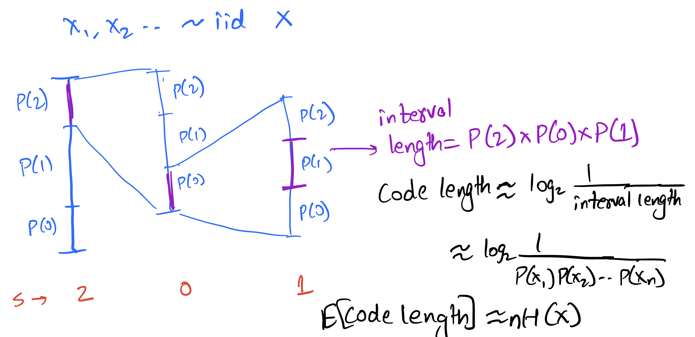
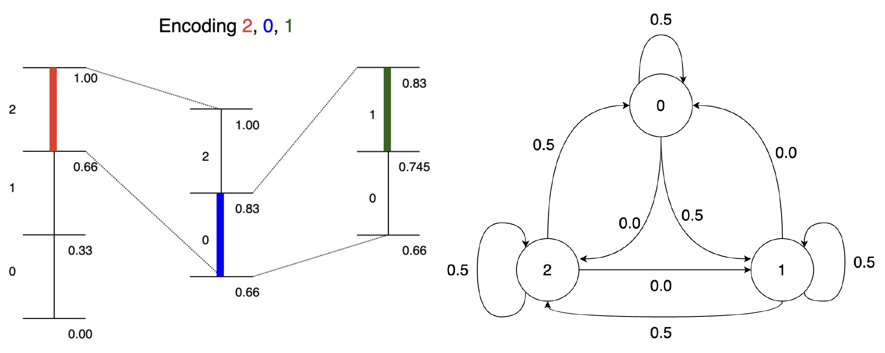
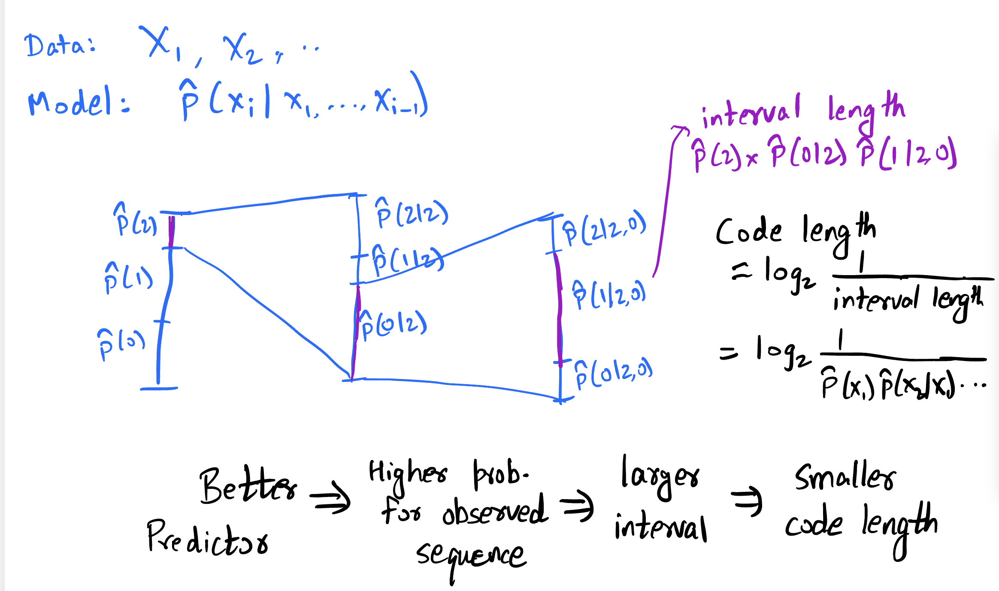
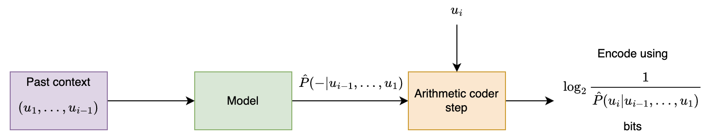
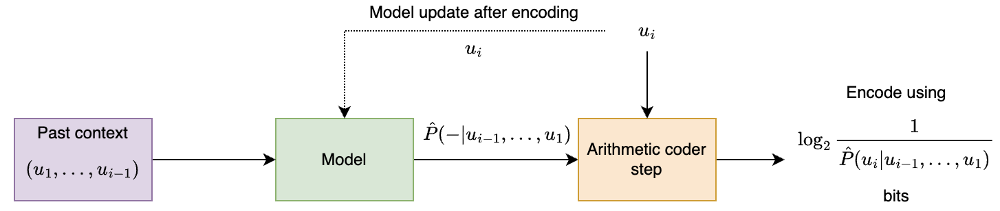
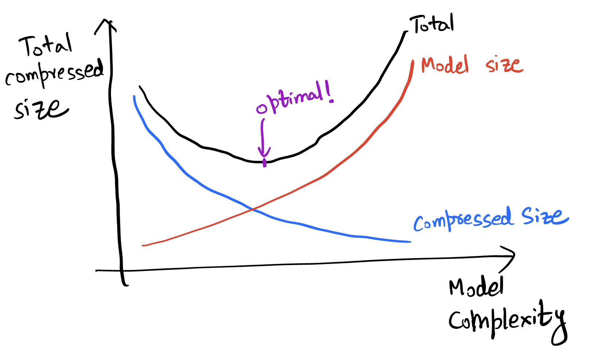
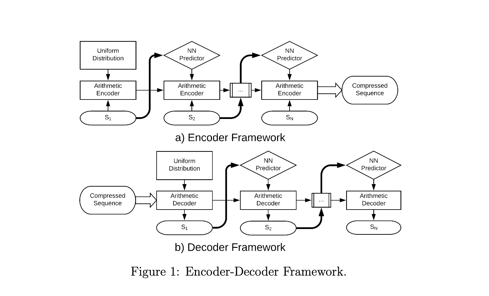
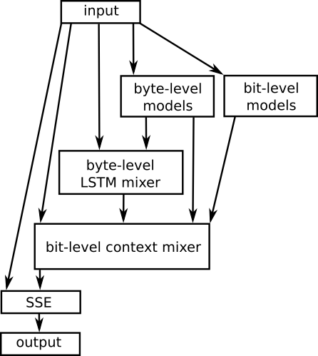
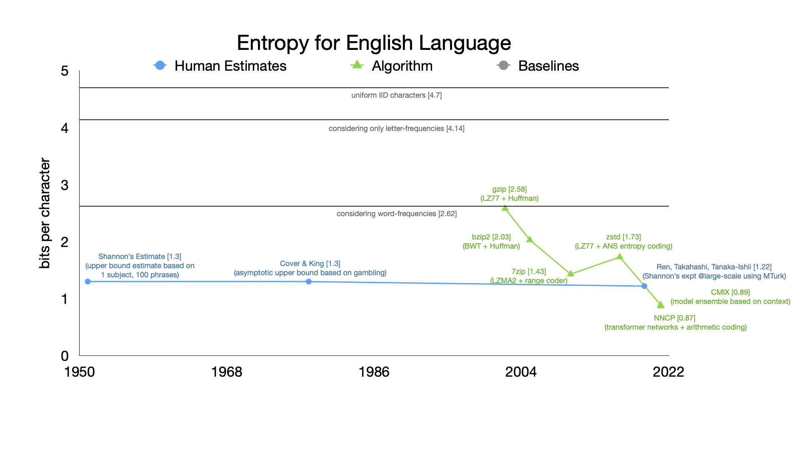
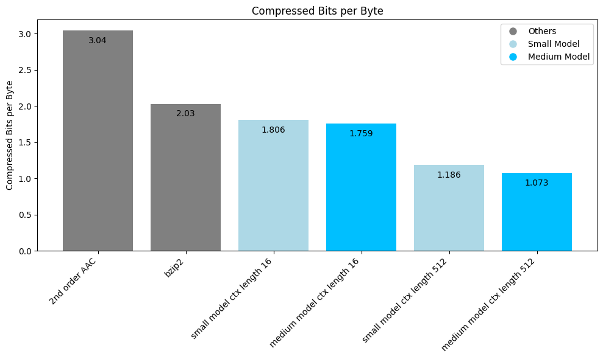

# Context based arithmetic coding

Recall that we studied stationary process, Markov chains, conditional entropy, and entropy rate in the last lecture. 

Conditional entropy was defined as 

$$H(U|V) \triangleq E\left[\log \frac{1}{P(U|V)}\right] = \sum_{v \in \mathcal{V}} P(v) \sum_{u\in \mathcal{U}} H(U|V=v)$$

Entropy rate was defined as
$$H(\mathbf{U}) = \lim_{n\rightarrow\infty} H(U_{n+1}|U_1,U_2,\dots,U_n) = \lim_{n\rightarrow\infty} \frac{H(U_1,U_2,\dots,U_n)}{n}$$

Recall also that entropy rate is the fundamental limit of lossless compression for stationary sources.

This lectures asks the question - how do we compress a Markov/stationary source? We will study one technique for doing so - context based arithmetic coding.

## Achieving the entropy rate for a first order Markov source

Let's start simple. How do we achieve the entropy rate for a first order Markov source with known probability distribution?

Recall entropy rate 
$H(\mathbf{U}) = \lim_{n\rightarrow\infty} \frac{H(U_1,U_2,\dots,U_n)}{n} = \lim_{n\rightarrow\infty} H(U_{n+1}|U_1,U_2,\dots,U_n)$

For a first-order Markov source this is simply
$H(\mathbf{U}) = \lim_{n\rightarrow\infty} \frac{H(U_1,U_2,\dots,U_n)}{n} = H(U_2|U_1)$

This suggests two ways:
1. Coding in bigger and bigger blocks (to achieve $\lim_{n\rightarrow\infty} \frac{H(U_1,U_2,\dots,U_n)}{n}$)
2. Coding incrementally (to achieve $H(U_2|U_1)$)

We already saw an example of the first idea with Huffman coding at the end of the previous chapter. That suffers from complexity as the block size grows. Let us now focus on the second idea.

Recall arithmetic coding for iid sources:


The above is for an iid source, but the basic idea of reducing the interval according to the probability of the symbol can be easily applied to the Markov case! Instead of reducing the interval by a factor of $P(U_i)$, we reduce it by $P(U_i|U_{i-1})$. This is illustrated below for the given Markov source:



The general idea is simple: at every step, split interval by $P(-|u_{i-1})$ [more generally by $P(-|\textrm{entire past})$]. To see how this performs, consider the length of interval after encoding $u_1,u_2,u_3,\dots,u_n = P(u_1)P(u_2|u_1)\dots P(u_n|u_{n-1})$.

Thus the bits for encoding $u_1,u_2,u_3,\dots,u_n$ is given by $\log_2 \frac{1}{\mathrm{interval\ length}}$ which is 

$$\approx \log_2 \frac{1}{P(u_1)P(u_2|u_1)\dots P(u_n|u_{n-1})}$$

Thus the expected bits per symbol 
$$\begin{align*}
&\approx \frac{1}{n}E\left[\log_2 \frac{1}{P(U_1)P(U_2|U_1)\dots P(U_n|U_{n-1})}\right] \\
&= \frac{1}{n}E\left[\log_2 \frac{1}{P(U_1)}\right]+\frac{1}{n}\sum_{i=2}^{n} E\left[\log_2 \frac{1}{P(U_i|U_{i-1})}\right] \\
&= \frac{1}{n}H(U_1)+\frac{n-1}{n} H(U_2|U_1)\\
&\sim H(U_2|U_1) 
\end{align*}
$$

Thus we can achieve the entropy rate for a first-order Markov source using arithmetic coding. 

## Context based arithmetic coding

Generalizing this further, we get



So as long as we can estimate the probability distribution of the next symbol given some context, we can use arithmetic coding to encode the data. The bits used to encode $u_n$ is simply $\log_2 \frac{1}{P(u_n|past)}$. Higher the probability of the actually observed symbol, lower the bits you pay!


For a $k$th order model, the previous $k$ symbols are sufficient to predict the next symbol. But in general, the more past context you can use, the better the prediction. As an example let us consider using an LLM to predict the next token given some past:
```
>>> predict_next_token("than")
Token: x, Probability: 18.6%
Token: e, Probability: 8.5%
Token: , Probability: 5.2%
Token: the, Probability: 5.2%
Token: king, Probability: 4.3%
```
```
>>> predict_next_token("louder than")
Token: words, Probability: 30.4%
Token: love, Probability: 11.9%
Token: a, Probability: 11.2%
Token: the, Probability: 5.8%
Token: bombs, Probability: 4.7%
```
```
>>> predict_next_token("speak louder than")
Token: words, Probability: 47.8%
Token: money, Probability: 7.8%
Token: a, Probability: 4.7%
Token: the, Probability: 3.2%
Token: actions, Probability: 2.5%
```

```
>>> predict_next_token("Actions speak louder than")
Token: words, Probability: 96.5%
Token: the, Probability: 0.2%
Token: a, Probability: 0.1%
Token: any, Probability: 0.1%
Token: Words, Probability: 0.1%
```

We see that the prediction gets better as we use more context, and the probability of the actual token is higher. This is the basic idea behind context based arithmetic coding.

Before we look at some specific prediction models, let's look at the general framework for context-based arithmetic coding.



Total bits for encoding:
$$\sum_{i=1}^n \log_2 \frac{1}{\hat{P}(u_i|u_1,\dots,u_{i-1})}$$

Let us think about how decoding would work. The idea is simple: the decoder uses same model, at step $i$ it has access to $u_1,\dots,u_{i-1}$ already decoded and so can generate the $\hat{P}$ for the arithmetic coding step!

Now let us generalize this one more step: what if you don't already know the model? There are two common approaches:

**Option 1:** Two pass: first build ("train") model from data, then encode using it. 

**Option 2:** Adaptive: build ("train") model from data as we see it.

These approaches have their pros and cons, some of which are listed below:
### Two-pass vs. adaptive

#### Two-pass approach
✅ learn model from entire data, leading to potentially better compression

✅ more suited for parallelization

❌ need to store model in compressed file

❌ need two passes over data, not suitable for streaming

❌ might not work well with changing statistics

#### Adaptive approach
✅ no need to store the model 

✅ suitable for streaming

❌ adaptively learning model leads to inefficiency for initial samples

✅ works pretty well in practice!

For the most part, we will focus on the adaptive approach, which is shown the figure below:



A few notes on this approach:

⚠️ It is important for encoder and decoder to share exactly the same model state at every step (including at initialization). Otherwise the models go out of sync and arithmetic decoding fails to recover the original data. This is especially important for neural net based models where there are sources of randomness such as GPUs. Note that this point affects both the adaptive and pretrained approaches.

⚠️ Be careful about updating the model with $u_i$ only after you perform the encoding for $u_i$. As a general thumb rule, always think whether the decoder has the knowledge needed to perform the next step!

⚠️ Try not to provide $0$ probability to any symbol, otherwise arithmetic coding will not be able to produce a bounded output. The trick is to assign small but non-zero probability to all symbols, however unlikely they might be.

### Compression and prediction

All of this discussion suggests a close relation between compression and prediction. In fact the cross-entropy loss for prediction (classes $\mathcal{C}$, predicted probabilities $\hat{P}$, ground truth class: $y$):
$$\sum_{c\in\mathcal{C}} \mathbf{1}_{y_i=c} \log_2\frac{1}{\hat{P}(c|y_1,\dots,y_{i-1})}$$

Loss incurred when ground truth is $y_i$ is $\log_2\frac{1}{\hat{P}(y_i|y_1,\dots,y_{i-1})}$

Exactly matches the number of bits used for encoding with arithmetic coding!

Prediction implies compression:
- Good prediction => Good compression
- Compression = having a good model for the data
- Need not always explicitly model the data 
- Possible to use rANS instead of arithmetic coding in some settings 

This also goes the other way:
- Each compressor induces a predictor!
- Recall relation between code length and induced probability model $p \sim 2^{-l}$
- Generalizes to prediction setting
- Explicitly obtaining the prediction probabilities easier with some compressors than others. For compressors that explicitly model the data it is easier, but for others (such as LZ77) it is much harder to describe the probability model in a computationally efficient way. One can brute force compute the model by compressing all possible choices and then calculating the probabilities according to the code lengths, but this is computationally infeasible in many scenarios. 

You can read more about this relationship in the recent perprint by DeepMind titled "Language Modeling Is Compression": https://aps.arxiv.org/abs/2309.10668.

## Prediction models used for context based arithmetic coding

### $k$th order adaptive arithmetic coding

- Start with a frequency of 1 for each symbol in the $(k+1)$th order alphabet (to avoid zero probabilities)
- As you see symbols, update the frequency counts
- At each step you have a probability distribution over the alphabet induced by the counts

Remember to update the counts with a symbol after you encode a symbol!

Example: if you saw BANA in past followed by N 90% of times and by L 10% of times, then predict N with probability 0.9 and L with probability 0.1 given a context of BANA. 

### Example: 1st order adaptive arithmetic coding

Consider the data sequence: 101011

We initialize the counts like 
$$c(0,0) = 1$$
$$c(0,1) = 1$$
$$c(1,0) = 1$$
$$c(1,1) = 1$$

and assume the past is padded with 0s (to handle the initial condition).

For the first input **1**01011:
`Current symbol: 1
Previous symbol: 0 (padding)`

Predicted probability: $P(1|0) = \frac{c(0,1)}{c(0,0)+c(0,1)} = \frac{1}{2}$

Counts:
$$c(0,0) = 1$$
$$c(0,1) = 1 \rightarrow 2$$ 
(this got updated)
$$c(1,0) = 1$$
$$c(1,1) = 1$$

For the second input 1**0**1011:
`Current symbol: 0
Previous symbol: 1`

Predicted probability: $P(0|1) = \frac{c(1,0)}{c(1,0)+c(1,1)} = \frac{1}{2}$

Counts:
$$c(0,0) = 1$$
$$c(0,1) = 2$$
$$c(1,0) = 1 \rightarrow 2$$ 
(this got updated)
$$c(1,1) = 1$$

For the third input 10**1**011:
`Current symbol: 1
Previous symbol: 0`

Predicted probability: $P(1|0) = \frac{c(0,1)}{c(0,1)+c(1,1)} = \frac{2}{3}$

Counts:
$$c(0,0) = 1$$
$$c(0,1) = 2 \rightarrow 3$$
$$c(1,0) = 2$$
$$c(1,1) = 1$$

and so on...

We observe a few things here:
- Over time this will learn the empirical distribution of the data
- We initially start off with uniform distribution in this example, but we can change prior to enforce some prior knowledge [of course both the encoder and the decoder need to know!]
- You can do this for $k=0$ (iid data with unknown distribution)!

### $k$th order adaptive arithmetic coding (AAC)
Let's test this out!

```py
    def freqs_current(self):
        """Calculate the current freqs. We use the past k symbols to pick out
        the corresponding frequencies for the (k+1)th.
        """
            freqs_given_context = np.ravel(self.freqs_kplus1_tuple[tuple(self.past_k)])
```

```py
    def update_model(self, s):
        """function to update the probability model. This basically involves update the count
        for the most recently seen (k+1) tuple.

        Args:
            s (Symbol): the next symbol
        """
        # updates the model based on the new symbol
        # index self.freqs_kplus1_tuple using (past_k, s) [need to map s to index]
        self.freqs_kplus1_tuple[(*self.past_k, s)] += 1

        self.past_k = self.past_k[1:] + [s]
```

On `sherlock.txt`:

```py
>>> with open("sherlock.txt") as f:
>>>     data = f.read()
>>> 
>>> data_block = DataBlock(data)
>>> alphabet = list(data_block.get_alphabet())
>>> aec_params = AECParams()
>>> encoder = ArithmeticEncoder(aec_params, AdaptiveOrderKFreqModel(alphabet, k, aec_params.MAX_ALLOWED_TOTAL_FREQ))
>>> encoded_bitarray = encoder.encode_block(data_block)
>>> print(len(encoded_bitarray)//8) # convert to bytes
```

|Compressor|compressed bits/byte|
|--------|--------|
|$0$th order|4.26|
|$1$st order|3.34|
|$2$nd order|**2.87**|
|$3$rd order|3.10|
|gzip|2.78|
|bzip2|**2.05**|

We observe that the compression improves as we increase the order of the model, but only up to a point. The reason is due to the counts becoming sparse as we increase the order. This is a common problem with higher order models. The issues with this can be summarized as below:
- slow, memory complexity grows exponentially in $k$
- counts become very sparse for large $k$, leading to worse performance
- unable to exploit similarities in prediction for *similar* contexts. Each $k$ context is considered independent of each other, even if they are similar and hence the probability conditioned on them is likely to be similar.

These issues can be overcome with smarter modeling as discussed later. Also note that despite their performance limitations, context based models are still employed as the entropy coding stage after suitably preprocessing the data (LZ, BWT, etc.).


We also observe that $k$th order AAC performs close to gzip, but not as well as bzip2. In the next chapters we will understand how gzip and bzip2 are able to achieve better compression by effectively making use of larger contexts.

### Two-pass approach and Minimum Description Length (MDL) principle
What if we did a two-pass approach? In this case, we'll pay for the empirical conditional entropy for compression.

|order |adaptive| empirical conditional entropy|
|--------|--------|----|
|$0$th order|4.26|4.26|
|$1$st order|3.34|3.27|
|$2$nd order|2.87|2.44|
|$3$rd order|3.10|1.86|

We see that there is an increasing gap between adaptive coding performance and empirical entropy as we increase the order. The reason is that we are not taking into account the model size. As the order increases, knowing the empirical distribution becomes closer to just storing the data itself in the model. At the extreme, you just have a single $|data_size|$ long context and the model is just the data itself! In practice, adaptive models are often preferred due to their simplicity and not requiring two passes over the data.

This can be thought of in terms of the Minimum Description Length (MDL) principle, which considers minimizing the sum of model size and compressed size given model. This is shown in the figure below. As the model complexity grows, we can compress the data better but the model takes more bits to describe. Thus, there is a tradeoff and an optimum model size.



### Other prediction models used for compression

We will not go very deep into the other prediction models used for compression, but will briefly mention them here. 

- $k$th order adaptive (in SCL): https://github.com/kedartatwawadi/stanford_compression_library/blob/main/scl/compressors/probability_models.py
- Solving the sparse count problem: These try to solve the sparse count problem by not forcing a particular $k$ but instead using a mixture of models of different orders. If you have seen a longer context several times, you use that to predict, but if not you can use the shorter context based prediction. These can do pretty well and are often used for heavy-duty entropy coding.
  - [Context Tree Weighting (CTW)](https://ieeexplore.ieee.org/document/382012)
  - [Prediction by Partial Matching (PPM)](https://en.wikipedia.org/wiki/Prediction_by_partial_matching)
- Advanced prediction models:
  - Neural net based (use a neural network as the predictor): [NNCP](https://bellard.org/nncp/), [Tensorflow-compress](https://github.com/byronknoll/tensorflow-compress), [DZip](https://arxiv.org/abs/1911.03572)
  - Ensemble methods: [CMIX](https://www.byronknoll.com/cmix.html), [CMIX talk](https://www.youtube.com/watch?v=NxzlrF5z5_Y&ab_channel=StanfordResearchTalks)
- Resources: https://mattmahoney.net/dc/dce.html#Section_4

These are some of the most powerful compressors around, but often too slow for many applications!

We can quickly look at the advanced prediction models here.

 

Both DeepZip and NNCP use a neural net to predict the next character based on the context. They differ in how they train the neural net. DeepZip uses a two-pass approach, where it first trains the neural net on the data and then uses the trained model to compress the data. The trained model needs to be stored in the compressed file. NNCP on the other hand, starts with a random model (with the pseudorandom seed known to the decoder) and keeps updating the neural net as it sees more data.



CMIX uses several contexts (last byte, second-last byte, same bit in last byte, last word and so on) and maintains counts for all of them. A neural network and other techniques are then used to mix the prediction according to all the contexts and produce the final prediction. As time goes on the mixer is trained to focus more on models that predict the next symbol well. 

### Text compression over the years
To wrap up the context based compression discussion, let us look at how text compression has evolved over the years. The figure below shows the compression ratio for text compression over the years. We see how CMIX and NNCP have now beaten Shannon's entropy estimates for text compression!



## LLM based compression - going beyond the MDL principle

We now consider a different setting where the model size doesn't matter, we just want to get the best compression possible. So we just throw our most powerful predictor at the problem, a model that would take gigabytes to describe, and use that to compress the data. In a traditional setting, the size of the model would be prohibitive to store as part of the compressed file (also painstakingly slow to compress and decompress). But this can still be relevant in a few cases:
- For understanding limits of compressibility/entropy rate estimation
- When there is a large amount of data of the same type and you can afford to deploy the model separately on each decompression node 
- To demonstrate concepts in a compression course!

We will now look at using LLMs for compression. Note that LLMs are trained as predictors, and their loss function is simply the cross-entropy loss (or perplexity = $2^{\textrm{cross-entropy}}$). Thus they are in-effect being trained for compression! We will use [ts_zip: Text Compression using Large Language Models](https://bellard.org/ts_server/ts_zip.html) to use LLMs for compression, specifically the rwkv_169M and rwkv_430M models.

Let's look at some results for a 2023 novel (848 KB English text).



We see how LLM beats the other compressors by a wide margin, and how larger context helps a lot for LLMs. The bigger model does marginally better for both context lengths given that it is a more powerful predictor.

Now let us look at the compression ratio for an ancient Pali text (transcribed in Roman script):

|Compressor|compressed bits/byte|
|--------|--------|
|$2$nd order AAC|2.66|
|gzip|2.11|
|bzip2|1.71|
|small LLM model|2.41|
|medium LLM model|2.19|

Why do the LLMs no longer do so well compared to bzip2? Because this is not similar to anything it saw in the training dataset. Thus, our usual compressors that don't assume much about the data (gzip, bzip2) can do much better than LLMs in this case.

What if we took an even more powerful model. See below the results for Llama-13B (4 bit quantized) (using code [here](https://gist.github.com/chachachaudhary274/707eeed868167b2e8c30000d747316d9))

|Dataset|Context length|compressed bits/byte|
|-------|-------|-------|
|2023 short story|10|1.228|
|2023 short story|50|1.027|
|2023 short story|512|0.874|

Again we see how this gets amazing compression, even better than the smaller models above. Larger context length also helps, although with diminishing returns beyond a point. Now let's repeat this on a Sherlock Holmes novel:

|Dataset|Context length|compressed bits/byte|
|-------|-------|-------|
|Sherlock|10|1.433|
|Sherlock|50|0.542|
|Sherlock|512|0.200|

This one is way too good! What's going on?

The reason is that the LLM is able to memorize a lot of its training dataset and thus achieve amazing compression. This is a common problem in machine learning, and therefore the evaluation needs to be done on a held-out dataset. 

To summarize the LLM based compression results:
- Remarkable results, far beyond the commonly used compressors and even better than the state-of-the-art compressors like CMIX and NNCP (see the results on the [ts_zip](ts_https://bellard.org/ts_server/ts_zip.htmlzip) page)
- Be careful about model-data mismatch (e.g., Pali text) and overfitting to training data (e.g., Sherlock)
- Very slow and compute intensive today, but they might become practical with hardware acceleration in future (at least for some applications)
- Resources for futher reading:
  - ts_zip: [https://bellard.org/ts_server/ts_zip.html](https://bellard.org/ts_server/ts_zip.html)
  - DeepMind paper: [https://aps.arxiv.org/abs/2309.10668](https://aps.arxiv.org/abs/2309.10668)

## Summary
We studied context based arithmetic coding, and looked at various models ranging from simple $k$th order adaptive models to advanced neural net based models. We also looked at LLM based compression, and saw how it can achieve amazing compression shining a light on the lower bounds for compression. In the next lecture we will look at a different class of compressors: universal compressors and dive into the realm of practical compressors that are ubiquitous today.