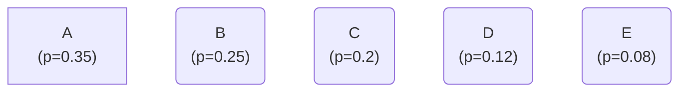
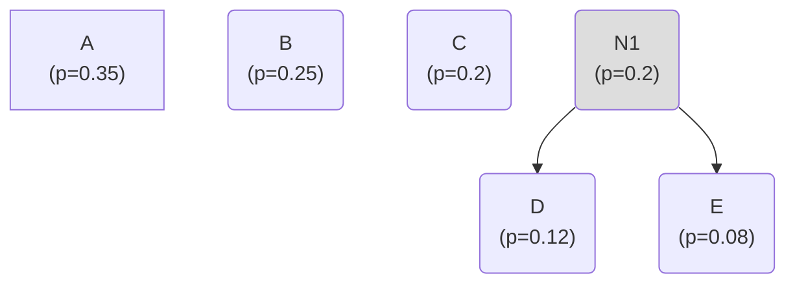
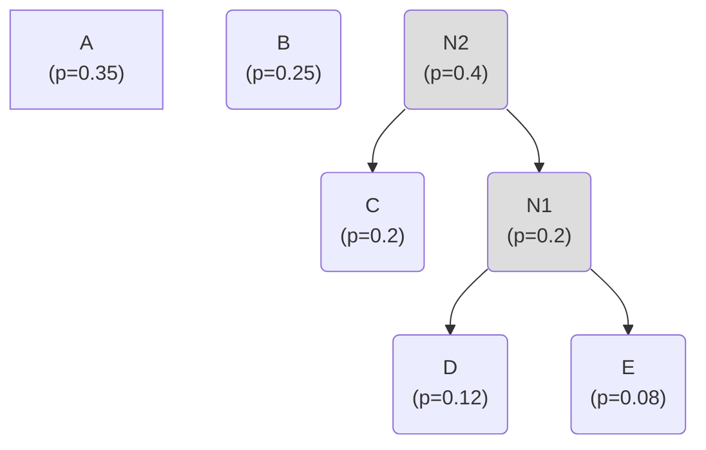
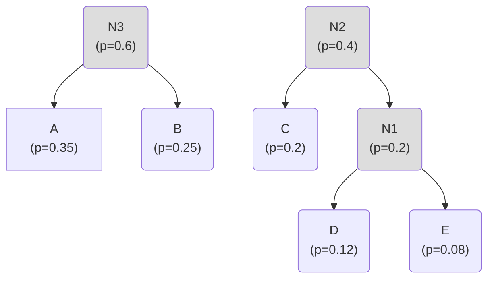
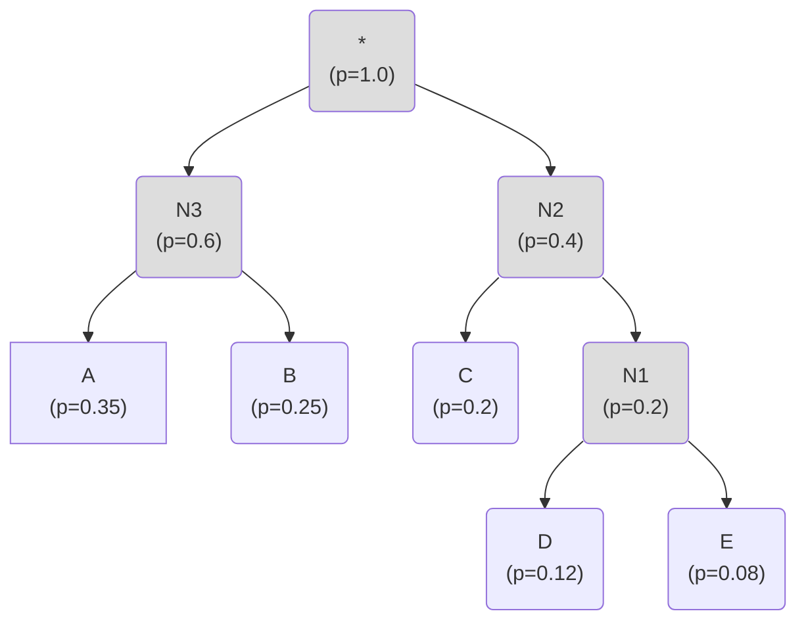

# Huffman Code
## Introduction
As a recap, in the last lecture we formulated the problem of finding the *optimal prefix-free code* given a probability distribution $p_1, p_2, \ldots, p_k$ as a concrete optimization problem as follows:

~~~admonish note title="Optimal prefix-free code"
The problem of finding *optimal prefix-free code* given a probability distribution $p_1, p_2, \ldots, p_k$ can be formulated as: 

Given probabilities $p_1, p_2, \ldots, p_k$, solve for code-lengths $l_i \in \mathbb{N}$, such that: 
$$ \begin{aligned}
\text{minimize   } &L(p) = \sum_{i=1}^k p_i l_i \\
\text{under the constraint } &\sum_{i=1}^k 2^{-l_i} \leq 1
\end{aligned} $$
~~~

We also showed that the optimal average codelength $L(p)$ is lower bounded by $H(p)$, the entropy corresponding to source $p$. (i.e. $L(p) \geq H(p)$). In this lecture we are going to discuss the famous **Huffman codes**, which is in fact (one of) the solutions to the optimization problem above!

---

The problem of finding optimal prefix-free codes eluded researchers for quite some time; until David Huffman, then a mere graduate student in the EE dept at MIT solved it as his course project! Here is an anecdote about the discovery of Huffman codes, borrowed from the [maa webpage](https://www.maa.org/press/periodicals/convergence/discovery-of-huffman-codes).

> *"The story of the invention of Huffman codes is a great story that demonstrates that students can do better than professors. David Huffman (1925-1999) was a student in an electrical engineering course in 1951. His professor, Robert Fano, offered students a choice of taking a final exam or writing a term paper. Huffman did not want to take the final so he started working on the term paper. The topic of the paper was to find the most efficient (optimal) code. What Professor Fano did not tell his students was the fact that it was an open problem and that he was working on the problem himself. Huffman spent a lot of time on the problem and was ready to give up when the solution suddenly came to him. The code he discovered was optimal, that is, it had the lowest possible average message length. The method that Fano had developed for this problem did not always produce an optimal code. Therefore, Huffman did better than his professor. Later Huffman said that likely he would not have even attempted the problem if he had known that his professor was struggling with it."*

## Huffman code construction
Even before we get started, it is important to note that **Huffman codes** are *one of the* optimal prefix-free codes for a given distribution, and that there are multiple of those. It is easy to see why: for example, given codewords `0, 10, 110, ...` from **Huffman code**, we can just switch `0` with `1` and that is another legit optimal prefix-free code  (`1, 01, 001, ...`). So, we are going to discuss one of the many possible optimal prefix free constructions. 

Let's first discuss the construction of the Huffman codes, and then we will discuss the optimality. 
Let's start with an example probability distribution:
```python
probs_dict = {"A": 0.35, "B": 0.25, "C": 0.2, "D": 0.12, "E": 0.08}
```

**STEP 0:** The initial step is to first build singleton nodes from these probabilities. 



Note that each Node has the following structure. 

```
class Node:
    str symbol_name
    float prob
    Node left = None
    Node right = None
```
Each node has a `symbol_name` and a `prob` fields.
The node also has `left` and `right` fields, which are pointers to its children. 

```python
node_list = [Node(A, 0.35), Node(B, 0.25), Node(C, 0.2), Node(D, 0.12), Node(E, 0.08)]
```

Essentially we now have 5 nodes (or binary trees with a single node). The Huffman tree construction works by joining these nodes in a recursive fashion using the next 2 steps, to construct a single tree.

**Step 1:** We pop out the two nodes with the smallest probability from the `node_list`.
In our example, these are `Node(D, 0.12)` and `Node(E, 0.08)`

Thus, the `node_list` now looks like: 

```python
node_1, node_2 = Node(D, 0.12), Node(E, 0.08)
node_list = [Node(A, 0.35), Node(B, 0.25), Node(C, 0.2)]
```

**Step 2:** In the next step, we join the two popped nodes and create a new node as a parent of these two nodes. The probability of the new node is equal to the sum of the two children nodes.  In our example, the new node is node `N1` and has `prob = 0.12 + 0.08 = 0.2`. 

This new node is  re-added to the `node_list`.  
So, now our node list is:

```python
## Iter 1
node_list = [Node(A, 0.35), Node(B, 0.25), Node(C, 0.2), Node(N1, 0.2)]
```



Let's pause and see what the two steps above did: Step 1,2 reduced the length of `node_list` by `1` (as we removed 2 nodes and added 1). We can thus apply **Step 1**, **Step 2** recursively, to obtain a single node/tree. The resulting final tree is our Huffman tree!


```python
## Iter 2
node_list = [Node(A, 0.35), Node(B, 0.25), Node(N2, 0.4)]
```


```python
## Iter 3
node_list = [Node(N2, 0.4), Node(N3, 0.6)]
```




```python
## Iter 4
node_list = [Node("*", 1.0)]
```




Thus, our procedure for constructing the Huffman tree can be described in pseudo-code as follows:
```python

# Input -> given prob distribution
probs_dict = {A1: p_1, A2: p_2, ..., Ak: p_k} # p_1, .. are some floating point values

class Node:
    str symbol_name
    float prob
    Node left = None
    Node right = None

    
def build_huffman_tree(probs_array):
    ## STEP 0: initialize the node_list with singleton nodes
    node_list = [Node(s,prob) for s,prob in probs_array.items()]

    # NOTE: at each iter, we are reducing length of node_list by 1
    while len(node_list) > 1:
        ## STEP 1: sort node list based on probability,
        # and pop the two smallest nodes 
        node_list = sort(node_list) # based on node.prob
        node_0, node_1 = node_list.pop(0, 1) # remove the smallest and second smallest elements

        ## STEP 2: Merge the two nodes into a single node
        new_node_prob = node_0.prob + node_1.prob
        new_node = Node(symbol_name="", prob=new_node_prob, left=node_0, right=node_1)
        node_list.append(new_merged_node)
    
    # finally we will have a single node/tree.. return the node as it points to the 
    # root node of our Huffman tree
    return node_list[0] 
```

Quite cool! We are essentially constructing the tree in by stitching one node at a time, until we have a single tree. Nodes with smaller probabilities join into a sub-tree earlier and thus, they will likely have higher depth in the final tree (and thus longer codelength). As we will see this greedy approach is in fact optimal!

Once the Huffman tree is constructed, we can use this tree as a prefix-free code for encoding/decoding data.
For example, in our case the table we get is: 

| Symbol | Codewords |
| -- | -- |
| A | 00|
| B | 01 |
| C | 10 |
| D | 110 |
| E | 111 |

Here is another example below of the Huffman code constructed on a typical text of english language. Notice that vowels, punctuations have much shorter length as they occur quite frequently.  


### Optimizing the tree construction

There are certain optimizations which can be performed in the Huffman tree construction:

For example, `STEP 1` in the pseudocode can be replaced with a priority queue, as we mainly need top two elements and nothing more. Here is the full code implementation in the Stanford Compression Library: [https://github.com/kedartatwawadi/stanford_compression_library/blob/main/compressors/huffman_coder.py](https://github.com/kedartatwawadi/stanford_compression_library/blob/main/compressors/huffman_coder.py).


## Optimality of Huffman codes

To get some intuition into the Huffman code optimality, let's think about what are the necessary conditions for a prefix-free code to be optimal? Let me list a couple of conditions, and we will see why they are true: 

~~~admonish example title="Theorem-8: Necessary conditions for prefix-free code optimality"
Any optimal prefix free code for a distribution $P= \{ p_1, p_2, \ldots, p_k \}$ must satisfy the following conditions: <br>
**Condition 1** The code-lengths are ordered in inverse order of the probabilities, i.e.
$$ p_i > p_j \Rightarrow l_i \leq l_j$$
**Condition 2** The two longest codewords have the same code-lengths
~~~

#### **Condition 1** proof
**Condition 1** is quite obvious but fundamental: it just says that if the probability of a symbol is higher than it necessarily has to have a shorter codelength. We have seen condition **Condition 1** before, as a thumb-rule. But, lets show that it is explicitly true in this case. Let's assume that our code $\mathcal{C}$ is optimal but for  $p_i > p_j$ has $l_i > l_j$. 
Let the average codelength of code $\mathcal{C}$ be $L_1$. Now, lets consider a prefix-free code $\hat{\mathcal{C}}$ where we exchange the codewords corresponding to `i` and `j`. Thus, the new code-lengths $\hat{l}_i$ are:
$$ 
\begin{aligned}
\hat{l}_r &= l_r, \text{ if } r \neq i \text{ and } r \neq j \\
\hat{l}_i &= l_j \\
\hat{l}_j &= l_i
\end{aligned} 
$$

The new average codelength $L_2$ is: 
$$ 
\begin{aligned}
L_2 &= \sum_{i=1}^k p_r \hat{l}_r \\
    &= L_1 + p_i (\hat{l}_i - l_i)  + p_j (\hat{l}_j - l_j) \\
    &= L_1 + p_i (l_j - l_i)  + p_j (l_i - l_j) \\
    &= L_1 - (l_i - l_j)(p_i - p_j) \\
\end{aligned} 
$$

As $(l_i - l_j)(p_i - p_j) > 0$, it implies that $L_2 < L_1$, which is in contradiction to our assumption that code $\mathcal{C}$ is optimal. This proves the **Condition 1**. 

#### **Condition 2** proof

The **Condition 2** is also equally simple to prove. Let's show it by contradiction again. For example, let $c_k = 0110101$ be the unique longest codeword. Then, as there is no other codeword of length $7$, we can be sure that we can drop one bit from $c_k$, and the resulting code will still be a valid prefix-free code. Thus, we can assign $\hat{c}_k = 011010$, and we get a shorter average codelength!  


As we can see, these two properties are satisfied by the construction procedure of Huffman coding. 
1. The symbols with higher probability are chosen later, so their code-lengths are lower.
2. We always choose the two symbols with the smallest probability and combine them, so the **Condition 2** is also satisfied. 

Note that these are just observations about Huffman construction and don't prove its optimality. The optimality proof is a bit more technical, and we refer you to the [Cover, Thomas text, section 5.8](http://staff.ustc.edu.cn/~cgong821/Wiley.Interscience.Elements.of.Information.Theory.Jul.2006.eBook-DDU.pdf). 

The main property is that after the *merge* step of merging two smallest probability nodes of probability distribution $(p_1, p_2, \ldots, p_k)$, the remaining tree is still optimal for the distribution $(p_1, p_2, \ldots, p_{k-1} + p_k)$. 

## Practical prefix-free coding

Huffman codes are actually used in practice due to their optimality and relatively convenient construction! Here are some examples:

- http/2 header compression: [https://www.rfc-editor.org/rfc/rfc7541#appendix-B](https://www.rfc-editor.org/rfc/rfc7541#appendix-B)

- ZLIB, DEFLATE, GZIP, PNG compression: [https://www.ietf.org/rfc/rfc1951.txt](https://www.ietf.org/rfc/rfc1951.txt)

- JPEG huffman coding tables: [https://www.w3.org/Graphics/JPEG/itu-t81.pdf](https://www.w3.org/Graphics/JPEG/itu-t81.pdf)

A lot of times in practice, the data is split into streams and after multiple transformations needs to be losslessly compressed. This is the place where Huffman codes are used typically. 

### Fast Prefix-free decoding

In practice, Huffman coders lie at the end of any compression pipeline and need to be extremely fast. Let's look at the typical encoding/decoding and see how we can speed it up. 

For simplicity and clarity we will work with a small exmaple. Let's say this is our given code: 
```py
encoding_table = {"A": 0, "B": 10, "C": 110, "D": 111}
```


1. The encoding itself is quite simple and involves looking at a lookup table. 
```py

## Prefix-free code encoding
encoding_table = {"A": 0, "B": 10, "C": 110, "D": 111}
def encode_symbol(s):
    bitarray = encoding_table[s]
    return bitarray, len(bitarray)
```

The typical prefix-free code decoding works by parsing through the prefix-free tree, until we reach a leaf node, e.g. see the code in SCL: [https://github.com/kedartatwawadi/stanford_compression_library/blob/main/compressors/prefix_free_compressors.py](https://github.com/kedartatwawadi/stanford_compression_library/blob/main/compressors/prefix_free_compressors.py). Here is a pseudo-code for the decoding algorithm: 

```py
## Prefix-free code decoding: 
prefix_free_tree = ... # construct a tree from the encoding_table
def decode_symbol_tree(encoded_bitarray):
    # initialize num_bits_consumed
    num_bits_consumed = 0

    # continue decoding until we reach leaf node
    curr_node = prefix_free_tree.root_node
    while not curr_node.is_leaf_node:
        bit = encoded_bitarray[num_bits_consumed]
        if bit == 0:
            curr_node = curr_node.left_child
        else:
            curr_node = curr_node.right_child
        num_bits_consumed += 1

    # as we reach the leaf node, the decoded symbol is the id of the node
    decoded_symbol = curr_node.id
    return decoded_symbol, num_bits_consumed
```

Although this is quite simple, there are a lot of branching instructions (e.g. `if, else` conditions). These instructions are not the fastest instructions on modern architectures. So, here is an alternative decoding procedure for this example: 


```py
## faster decoding
state_size = 3
decode_state = {
    000: "A",
    001: "A",
    010: "A",
    011: "A",
    100: "B",
    101: "B",
    110: "C",
    111: "D",
}
codelen_table = {
    "A": 1,
    "B": 2,
    "C": 3,
    "D": 3,
}
def decode_symbol_tree(encoded_bitarray):
    state = encoded_bitarray[:state_size] 
    decoded_symbol = decode_state[state]
    num_bits_consumed = codelen_table[decoded_symbol]
    return decoded_symbol, num_bits_consumed
```

Looking at the new decoding pseudo-code, we see following observations:
1. The `state_size=3` corresponds to the maximum depth of the prefix-free tree.
2. The `state` is the first `3` bits of the `encoded_bitarray`. We use the `state` as an index to query thr `decode_state` lookup table to obtain the `decoded_symbol`.
3. As the `state` is sometimes reading in more bits that what we wrote, we need to output the `num_bits_consumed` correctly to be `codelen_table[decoded_symbol]`. 

One natural question is why should the `decoded_symbol = decode_state[state]` operation output the correct state? The reason is because of the prefix-free nature of the codes. So, if we look at the entries in `decode_state` table corresponding to `B`, we see that these are `100, 101` both of which start with `10` which is the codeword corresponding to `B`. 

Based on first look, the decoding is indeed simpler with this new decoding procedure, but we do have to pay some cost. The cost is in terms of memory consumption. For example, we now need to maintain a table `decode_state` which has size $2^{|maxdepth|}$. This is clearly more memory than a typical prefix-free tree. In a way we are doing some caching. But for caching to work properly, the table sizes need to be small. The bigger the lookup table, the slower the table lookup is. So, practically the maximum leaf depth needs to be kept in check.  


Thus, practically we want to get a Huffman tree with a maximum leaf depth constraint. Typically, the depth is also set to be `16` or `24` so that it is a byte multiple. For more details on efficient Huffman Coding, we encourage the reader to have a look at this blog entry by Fabian Giesen on Huffman coding: [https://fgiesen.wordpress.com/2021/08/30/entropy-coding-in-oodle-data-huffman-coding/?hmsr=joyk.com&utm_source=joyk.com&utm_medium=referral](https://fgiesen.wordpress.com/2021/08/30/entropy-coding-in-oodle-data-huffman-coding/?hmsr=joyk.com&utm_source=joyk.com&utm_medium=referral).


