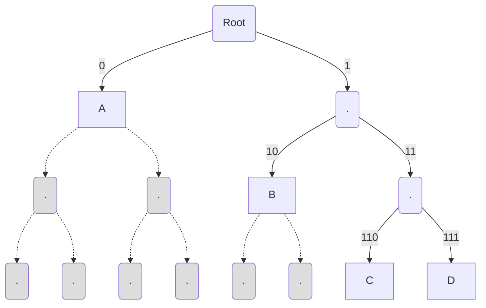

# Designing prefix-free codes

As a recap, in the previous lecture we discussed how to design a prefix free code given the code lengths. We discussed
a simple procedure which constructs a *prefix-free tree* given the code-lengths.

We also saw a simple thumb rule $l_{optimal}(symbol) \approx \log_2 \frac{1}{p(symbol)}$ which tells us what the
code-lengths of the prefix-free code should be. In this lecture we are going to discuss two things:

1. Justify that *correctness* of our prefix-free tree construction with lengths $ l(symbol) = \left\lceil \log_2
   \frac{1}{p(symbol)} \right\rceil $
2. Look at a few more prefix-free code constructions

## Kraft Inequality & converse

With the goal of proving the *correctness* of the *prefx-free tree* construction, we will first look at a simple but
fundamental property of binary trees, called the *Kraft-Mcmillan Inequality* (or simply the *Kraft Inequality*)

~~~admonish example title="Theorem-1: Kraft Inequality"
Consider a binary tree, where the leaf nodes $n_1,n_2,\ldots,n_k$ are at depths $l_1,l_2,\ldots,l_k$ from the root node respectively. 

Then the node depths $l_1,l_2,\ldots,l_k$ satisfy the inequality:

$$ \sum_{i=1}^k 2^{-l_i} \leq 1$$
~~~

The inequality is quite elegant, and so is its proof. Any thoughts on how the proof might proceed? Here is a hint:

**Hint**: Let $l_{max} = \max_{i=1}^k l_i$. Then, the Kraft inequality can be written as: $$ \sum_{i=1}^k 2^{l_
{max}-l_i} \leq 2^{l_{max}} $$ All we have done here is multiply both sides by $2^{l_{max}}$, but this simple
transformation will help make the inequality more interpretable! Can you see the proof now? Here is a proof sketch:

- Let's try to interpret the RHS, $2^{l_{max}}$ are the number of nodes of the binary tree at depth $l_{max}$.
- The LHS also has a natural interpretation: Given a leaf node at depth $l_i$, one can imagine that it corresponds to
  $2^{l_{max} - l_i}$ nodes at depth $l_{max}$.

For example in the tree example above, node $A$ has `4` nodes corresponding to it at `depth = 3`, while node $B$ has `2`
nodes.

- It is clear that the nodes at depth $l_{max}$ are distinct for each of the leaf nodes $n_i$ (Think why?). As the "total number of nodes at depth $l_{max}$", is larger than "the sum of nodes at depth $l_{max}$ corresponding to leaf nodes
  $n_i$`, we get the inequality

$$ \sum_{i=1}^k 2^{l_{max}-l_i} \leq 2^{l_{max}} $$

- This completes the proof sketch for the Kraft Inequality:

$$ \sum_{i=1}^k 2^{-l_i} \leq 1$$

Well, that was a short and simple proof! It is also clear that the equality is true, if and only if there is no leaf
node left unaccounted for.

We can use the Kraft inequality to now show the *correctness* of the prefix-free tree construction with code-lengths $l_i$, as we discussed in last lecture.

## Prefix-tree construction *correctness*

To recap, our *prefix-free tree* construction proceeds as follows:

1. We are given probability distribution $p_1, p_2, \ldots, p_k$ for symbols $s_1, s_2, \ldots,
   s_k$. [WLOG](https://en.wikipedia.org/wiki/Without_loss_of_generality) assume that: $$ p_1 \geq p_2 \geq ... \geq
   p_k$$ Now, compute code-lengths $l_1, l_2, \ldots, l_k$ such that: $$ l_i = \left\lceil \log_2 \frac{1}{p_i}
   \right\rceil $$ Thus, the lengths, $l_1, l_2, \ldots, l_k$ satisfy $$ l_1 \leq l_2 \leq ... \leq l_k$$

2. The *prefix-free tree* construction follows by starting with an empty binary tree, and then recursively adding a leaf
   node at depth $l_i$ to the binary tree.

We want to argue the *correctness* of the tree construction at each step, i.e. we want to show that when we are adding node $n_k$, there will always be a node available for us to do so.

Let's proceed towards showing this inductively.

- In the beginning, we just have the root node, so we can safely add the node $n_1$ with length $l_1$. To do so, we need
  to create a binary tree with $2^{l_1}$ leaf nodes, and just assign one of the leaf nodes to node $n_1$
- Now, let's assume that we already have a binary tree $\mathcal{T}_{r-1}$ with nodes $n_1, n_2, \ldots, n_{r-1}$ and
  that we want to add node $n_r$. We want to argue that there will always be a leaf node available with depth $l_r$ in
  the binary tree $\mathcal{T}_{r-1}$. Let's see how can we show that:
- If we look at the code-lengths, i.e. the depths of the nodes $l_i$, we see that they follow the Kraft inequality $$
  \begin{aligned}
  \sum_{i=1}^k 2^{-l_i} &= \sum_{i=1}^k 2^{-\left\lceil \log_2 \frac{1}{p_i} \right\rceil} \\
  &= \sum_{i=1}^k 2^{\left\lfloor \log_2 p_i \right\rfloor} \\
  &\leq \sum_{i=1}^k 2^{ \log_2 p_i} \\
  &\leq \sum_{i=1}^k p_i \\
  &= 1
  \end{aligned} $$ Now as $\sum_{i=1}^k 2^{-l_i} \leq 1$ it implies that the node depths of the tree $\mathcal{T}_{r-1}$
  satisfies $\sum_{i=1}^{r-1} 2^{-l_i} < 1$ (for $r <= k$)
- We know from the Kraft inequality that if the inequality is not tight, then there will be a leaf node available at $\max_{i=1}^{r-1}
  l_i = l_{r-1}$ depth. Now, as $l_r \geq l_{r-1}$, we can safely say that the node $n_k$ can be added to the binary
  tree $\mathcal{T}_{r-1}$.
- This completes the *correctness* proof.

In fact if you look at the proof, all we have used is the fact that $\sum_{i=1}^k 2^{-l_i} \leq 1$. Thus, the same proof
also gives us the following *converse theorem* of the Kraft inequality:

~~~admonish example title="Theorem-2: Converse of Kraft Inequality"
Let $l_i \in \mathbb{N}$ such that: 
$$ \sum_{i=1}^k 2^{-l_i} \leq 1$$

then, we can always construct a binary tree with $k$ leaf nodes at depths $l_i$ from the root node for $i \in \{1,\dots, k\}$.
~~~

## Kraft inequality and the thumb rule
In the last chapter we introduced the thumb rule $l_{optimal}(symbol) \approx \log_2 \frac{1}{p(symbol)}$ without any justification. Since then
we have seen a code construction that gets close to this thumb rule. Here we briefly sketch how Kraft inequality can be shown to justify the thumb rule. Details can be found in section 5.3 of extremely popular book by Cover and Thomas "[Elements of Information Theory](https://searchworks.stanford.edu/?search_field=search&q=elements+of+information+theory)". The idea is to consider the optimization problem
$$
\min \sum_{i=1}^k p_i l_i \\
\mathrm{subject\  to}  \sum_{i=1}^k 2^{-l_i} \leq 1
$$
This is simply the optimization problem to minimize the expected code lengths for a prefix code (Kraft's inequality gives a mathematical way to express the constraint). While this is a integer optimization problem (due to the code lengths being integral) and hence is hard to solve, we can relax the integer constraint and try to solve this for any positive $l_i$. Then the method of Lagrange multipliers from convex optimization can be used to sovle this problem and obtain the optimal code lengths $l_i = - \log p_i$. In the next chapter, we will look again into this and derive the thumb rule in a different way (though the Kraft inequality still plays a crucial role).
