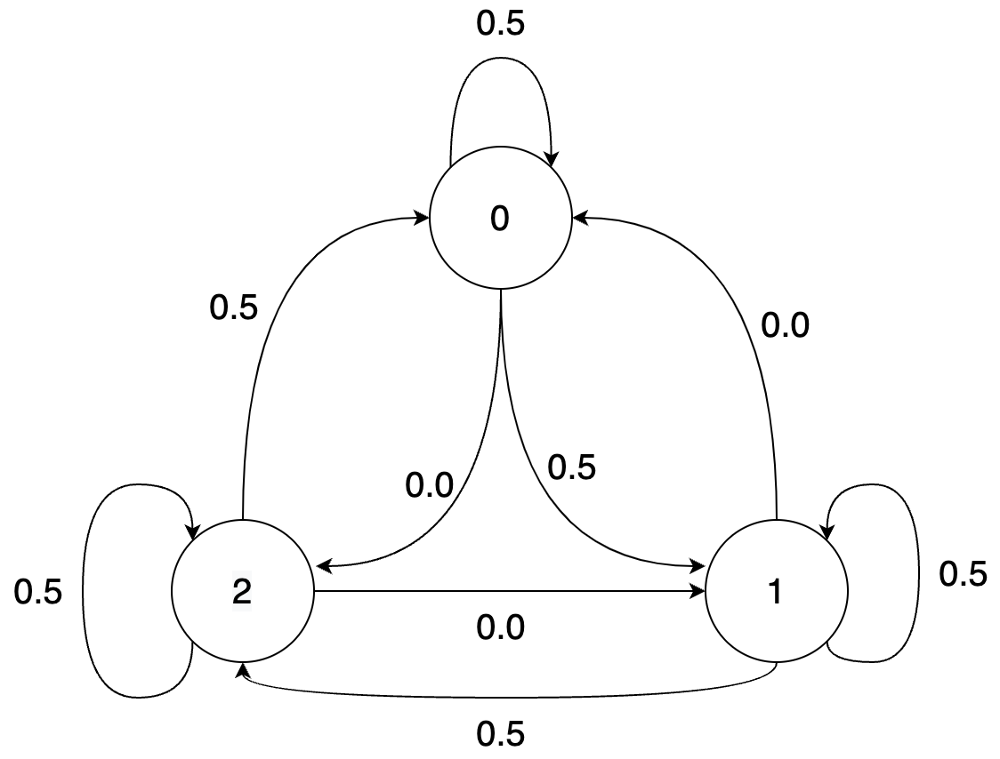
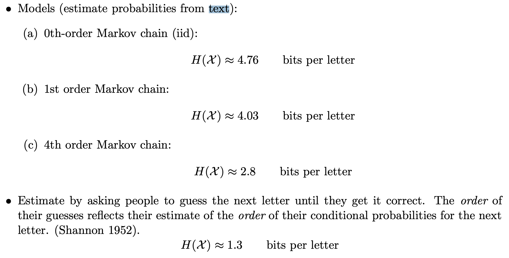

# Non IID sources and entropy rate

## Recap

In the previous chapters, we focused on various entropy coding techniques like Huffman codes, arithmetic codes and rANS/tANS. We can roughly summarize these as shown below.

- Huffman Coding
  - very fast
  - optimal symbol coder
  - achieves entropy when working with larger blocks - exponential complexity 
- Arithmetic Coding
  - achieves entropy efficiently by treating entire input as a block
  - division operations are expensive
  - easily extends to complex and adaptive probability models
- ANS (Asymmetric Numeral Systems)
  - achieves entropy efficiently by treating entire input as a block
  - small compression overhead over arithmetic coding 
  - two variants: rANS and tANS
  - faster than arithmetic coding
  - can modify base algorithm to use modern instructions like SIMD

Various implementation details of the above coders is beyond the scope here, but you can refer to the following resources to learn about these:
- Further reading on entropy coders, particularly ANS
  - [Kedar's lecture notes](https://stanforddatacompressionclass.github.io/notes/lossless_iid/ans.html)
  - [Paper by inventor (Jarek Duda)](https://arxiv.org/abs/1311.2540): "Asymmetric numeral systems: entropy coding combining speed of Huffman coding with compression rate of arithmetic coding" 
  - [Yann Collet's blog](https://fastcompression.blogspot.com/2013/12/finite-state-entropy-new-breed-of.html) - creator of FSE (tANS), LZ4 and zstd compression libraries
  - [Charles Bloom's blog](https://cbloomrants.blogspot.com/2014/02/02-18-14-understanding-ans-conclusion.html)
  - Fabian Giesen's [blog](https://fgiesen.wordpress.com/2015/12/21/rans-in-practice/) and [paper on rANS with SIMD](https://arxiv.org/abs/1311.2540)
  - https://encode.su/forums/2-Data-Compression - compression forum

To summarize their performance metrics on some data set which is roughly representative of their performance:

| Codec       | Encode speed | Decode speed | compression | 
| ----------- | -----------  | ------------ | ----------- |
| Huffman coding (1950s)    |  252 Mb/s    |    300 Mb/s    |  1.66  | 
| Arithmetic coding (1970s)  | 120 Mb/s     |     69 Mb/s    |  1.24 |
| rANS (2010s)              | 76 Mb/s     |     140 Mb/s    |  1.24  |
| tANS (2010s) |  163 Mb/s    |     284 Mb/s    |   1.25  |

Source: [Charles Bloom's blog](http://cbloomrants.blogspot.com/2014/02/02-01-14-understanding-ans-3.html)


As you can see, all of these entropy coders are used in practice due to their unique strengths (and sometimes for legacy reasons). We will keep revisiting these as components of various compression methods.

## Non-IID sources

Let us do a simple experiment on a real text file, a Sherlock Holmes novel!

```
$ cat sherlock.txt
    ...
      In mere size and strength it was a terrible creature which was
      lying stretched before us. It was not a pure bloodhound and it
      was not a pure mastiff; but it appeared to be a combination of
      the two—gaunt, savage, and as large as a small lioness. Even now
      in the stillness of death, the huge jaws seemed to be dripping
      with a bluish flame and the small, deep-set, cruel eyes were
      ringed with fire. I placed my hand upon the glowing muzzle, and
      as I held them up my own fingers smouldered and gleamed in the
      darkness.

      “Phosphorus,” I said.

      “A cunning preparation of it,” said Holmes, sniffing at the dead
    ...
```

Let's try and compress this 387 KB book.

```py
>>> from core.data_block import DataBlock
>>> 
>>> with open("sherlock.txt") as f:
>>>     data = f.read()
>>> 
>>> print(DataBlock(data).get_entropy()*len(data)/8, "bytes")

199833 bytes
```


```
$ gzip < sherlock.txt | wc -c
134718

$ bzip2 < sherlock.txt | wc -c
99679
```

How can compressors like gzip and bzip2 do better than entropy? Recall that our entropy bound only applied to iid sources. In fact, our focus till now has exclusively been on iid data, i.e., we assumed that the random variables comprising our source were independent and identically distributed. Recall that for an iid source, if we have a sequence $U^n = (U_1,\dots,U_n)$, then it's probability can be decomposed like $P(U^n) = \Pi_{i=1}^n P(U_i)$. As you might have seen in your probability class, this is hardly the only class of probabilistic sources. In general the chain rule of probability gives us
$$P(U^n) = \Pi_{i=1}^n P(U_i|U^{i-1})$$
which tells us that the conditional probability of the $i$th symbol depends on the sequence of symbols seen before. In contrast, for iid sources, knowing the history tells us nothing about the distribution of the next symbol. Let's consider some of the most common data sources and see how they have strong dependence across the sequence of symbols.
- **Text**: In English (or any other common language), knowing the past few letters/words/sentences helps predict the upcoming text. For example, if the last letter was "Q", there is a high probability that the next letter is a "U". In contrast, if the last letter was a "U", it is very unlikely that the next letter is also a "U".
- **Images**: In a typical image, nearby pixels are very likely to have similar brightness and color (except at sharp edges).
- **Videos**: Consecutive video frames are usually very similar with a small shift or rotation.

In this and the next chapter, we will study the theory behind compression of non-IID data and look at algorithmic techniques to achieve the optimal compression. The previous techniques focusing on IID data compression play a critical role even in this setting, as will become clear shortly.

## Definitions and examples
Given alphabet $\mathcal{X}$, a _stochastic process_ $(U_1,U_2,\dots)$ can have arbitrary dependence across the elements and is characterized by $P((U_1,U_2,\dots,U_n)= (u_1,u_2,\dots,u_n))$ for $n=1,2,\dots$ and $(u_1,u_2,\dots,u_n)\in \mathcal{U}^n$. This is way too general to develop useful theory or algorithms (need to separately define joint distribution for every $n$), so we mostly restrict our attention to time-invariant or stationary processes. 

### Stationary process
~~~admonish example title="Definition: Stationary process"
A stationary process is a stochastic process that is time-invariant, i.e., the probability distribution doesn't change with time (here time refers to the index in the sequence). More precisely, we have
$$P(U_1=u_1,U_2=u_2,\dots,U_n=u_n)=P(U_{l+1}=u_1,U_{l+2}=u_2,\dots,U_{l+n}=u_n)$$
for every $n$, every shift $l$ and all $(u_1,u_2,\dots,u_n)\in \mathcal{U}^n$.
~~~

In particular, statistical properties such as mean and variance (and entropy for that matter) do not change with time. Most real data sources are either close to stationary or can be invertibly transformed into a stationary source. Before we look at a few examples of stationary and non-stationary sources, let us first define an important subcategory of stationary sources.

#### $k$th order Markov sources
In a stationary source, there can be arbitrarily long time dependence between symbols in the sequence (also referred to as "memory"). In practice, however, this is typically not true as the dependence is strongest between nearby elements and rapidly gets weaker. Furthermore, it is impossible to accurately describe a general stationary distribution with finite memory. Therefore, in many cases, we like to focus in further on source with finite memory $k$. Most practical stationary sources can be approximated well with a finite memory $k$th order Markov source with higher values of $k$ typically providing a better approximation (with diminishing returns).

~~~admonish example title="Definition: $k$th order Markov source"
A $k$th order Markov source is defined by the condition
$$P(U_n|U_{n-1}U_{n-2}\dots) = P(U_n|U_{n-1}U_{n-2}\dots U_{n-k})$$
for every $n$. In words, the conditional probability of $U_n$ given the entire past depends only on the past $k$ symbols. Or more precisely, $U_n$ is independent of the past older than $k$ symbols given the last $k$ symbols.

We will restrict attention to stationary Markov sources meaning that the distribution above doesn't change with a time-shift.
~~~

You might have already studied first order Markov sources (often called just Markov sources) in a probability class. We will not go into the extensive properties of Markov sources here, and we refer the reader to any probability text. In closing, we ask the reader to convince themselves that a stationary $0$th order Markov source is simply an iid source! 

### Conditional entropy and entropy rate
~~~admonish example title="Definition: Conditional entropy"
The conditional entropy of $U$ given $V$ is defined as 
$$H(U|V) \triangleq E\left[\log \frac{1}{P(U|V)}\right]$$
This can also be written as 
$$
\begin{aligned}

H(U|V) &= \sum_{u\in \mathcal{U},v \in \mathcal{V}} P(u,v) \log \frac{1}{P(u|v)}\\
&= \sum_{v \in \mathcal{V}} P(v) \sum_{u\in \mathcal{U}} P(u|v) \log \frac{1}{P(u|v)}\\
&= \sum_{v \in \mathcal{V}} P(v) H(U| V=v)
\end{aligned}
$$
~~~

Using the properties of entropy and KL-Divergence, it is easy to show the following properties of conditional entropy:

~~~admonish question title="Quiz: Properties of conditional entropy"
Show the following:
1. Conditioning reduces entropy: $$H(U|V) \leq H(U)$$ with equality iff $U$ and $V$ are independent. In words, this is saying that conditioning reduces entropy on average - which is expected because entropy is a measure of uncertainty and additional information should help reduce the uncertainty unless the information ($V$) is independent of $U$. Note that this is true in average, but that $H(U|V=v)$ may be greater than or less than or equal to $H(U)$. Citing an example from Cover and Thomas, in a court case, specific new evidence might increase uncertainty, but on the average evidence decreases uncertainty.
2. Chain rule of entropy: 
$$H(U,V) = H(U) + H(V|U) = H(V) + H(U|V)$$
_Hint_: Use the chain rule of probability.
3. Joint entropy vs. sum of entropies:
$$H(U,V) \leq H(U) + H(V)$$
with equality holding iff $U$ and $V$ are independent.
~~~

Thus conditional entropy $H(U|V)$ can be thought of as the remaining uncertainty in $U$ once $V$ is known, and the conditional entropy $H(U|V=v)$ can be thought of as the remaining uncertainty in $U$ if $V$ is known to be $v$. Intuitively one can expect that if $V$ is known to both the encoder and decoder, then compressing $U$ should take $H(U|V)$ bits (which is less than or equal to $H(U)$ with equality when $V$ is independent of $U$ and hence shouldn't help with compression). This is also apparent from $H(U,V) = H(V) + H(U|V)$ which says that after $V$ is stored with $H(V)$ bits only an additional $H(U|V)$ bits are needed to represent $U$.

The above can be generalized to conditioning $U_{n+1}$ on $(U_1,U_2,\dots,U_n)$: 
$$H(U_{n+1}|U_1,U_2,\dots,U_n)$$

Let us now define the entropy rate for a stationary process. Before we do that, let us list some desired properties:
- works for arbitrarily long dependency so $H(U_{n+1}|U_1,U_2,\dots,U_n)$ for any finite $n$ won't do
- has *operational* meaning in compression just like entropy
- is well-defined for any stationary process

~~~admonish example title="Definition: Entropy rate"
$$H_1(\mathbf{U}) = \lim_{n\rightarrow\infty} H(U_{n+1}|U_1,U_2,\dots,U_n)$$
$$H_2(\mathbf{U}) = \lim_{n\rightarrow\infty} \frac{H(U_1,U_2,\dots,U_n)}{n}$$

**C&T Thm 4.2.1**
For a stationary stochastic process, the two limits above are equal. We represent the limit as $H(\mathbf{U})$ (entropy rate of the process, also denoted as $H(\mathcal{U})$).
~~~

We end this discussion with the operational significance of the entropy rate, where it plays the same role for stationary sources as entropy does for iid sources. This is based on the following theorem (see Cover and Thomas for proof):

~~~admonish example title="Theorem: Shannon–McMillan–Breiman theorem (Asymptotic equipartition property (AEP) for stationary sources)"
$$-\frac{1}{n}\log_2 P(U_1,U_2,\dots,U_n) \rightarrow H(\mathbf{U}) \textrm{ almost surely}$$
under technical conditions (ergodicity).
~~~


### Examples

#### IID sources

For an iid source with distribution $U$, $H(U_n|U_{n-1},\dots,U_{n-k}) = H(U_n) = H(U)$ and therefore, the entropy rate according to either definition is simply $H(U)$. Thus the entropy rate of an iid source is simply the entropy of the source.

#### Markov sources
For a $k$th order stationary Markov source, $H(U_n|U_{n-1},\dots,U_{1}) = H(U_n | U_{n-1},\dots,U_{n-k}) = H(U_{k+1}|U_k, \dots, U_1)$ (first equality is by the Markov property and the second is by stationarity). Thus the entropy rate is simply $H(U_{k+1}|U_k, \dots, U_1)$. 

Let us look at an example of a 1st order Markov source. Consider the following Markov chain, represented as a set of equations, as a transition matrix and as a state diagram:

$$U_1 \sim Unif(\{0,1,2\})$$
$$U_{i+1} = (U_i + Z_i) \ \textrm{mod}\  3$$
$$Z_i \sim Ber\left(\frac{1}{2}\right)$$

```
Transition matrix
   U_{i+1} 0   1   2
U_i 
0         0.5 0.5 0.0
1         0.0 0.5 0.5 
2         0.5 0.0 0.5
```



In the chain, given the previous symbol, the next symbol can only take one of two values with equal probability. Thus the entropy rate is $H(U_2|U_1) = 1$ bit. This is also apparent from the transition matrix which has only two non-zero entries in each row.

Note that the condition that $P(U_1)$ be uniformly distributed is crucial to ensure that the process is stationary (otherwise the distribution of $U_i$ would change with time). For a time-invariant Markov chain (i.e., a chain where the transition matrix doesn't change with time), checking stationarity is as simple as checking that the distribution of $U_i$ is the same for all $i$, or even more simply that $U_1$ and $U_2$ have the same distribution.

Final note on the above source: note that if you define a process $Z_i = X_{i+1} - X_{i} \textrm{ mod}\  3$ then the process $Z$ is a lossless transformation of the process $X$, and in fact the process $Z$ is an iid process. Given all our knowledge about entropy coding for lossless processes, we now have an easy way to optimally compress the Markov process. While such a simple transformation is not always possible, we can often apply simple transforms to the data to make it more amenable to compression with simpler techniques.

#### Bus arrival times

Consider arrival times for buses at a bus stop: $U_1, U_2, U_3, U_4, \dots$ which look something like 4:16 pm, 4:28 pm, 4:46 pm, 5:02 pm (the expected gap between buses is 15 minutes here). This is not a stationary process because the actual arrival times keep increasing. However the difference process obtained by subtracting the previous arrival time from the current arrival time can be modeled as iid. Again, we see that simple transformations can make a process into a simpler process that can be compressed easily with our entropy coders.


#### Entropy rate of English text



The figure above from http://reeves.ee.duke.edu/information_theory/lecture4-Entropy_Rates.pdf shows the $k$th order entropy of English text based on a large corpus. We see the conditional entropies reduce (and will eventually converge to the entropy rate). The final figure is based on a "human prediction" experiment done by Shannon where he asked humans to predict the next character based on the past and used that as a probability model to estimate the entropy rate of text! We will look much more at how text compression has evolved over the years in the next chapter.

## How to achieve the entropy rate?

Let's start small and try to achieve 1st order entropy $H(U_{k+1}|U_k)$ (note that this is indeed the entropy rate for a first-order Markov chain). Assume we have a known stationary distribution $P(U_1)$ and transition probability $P(U_2|U_1)$. Support we want to compress a block of length $n$ using 
$$E\left[\log_2 \frac{1}{P(U_1,\dots,U_n)}\right] \approx nH(U_2|U_1)$$
bits.

The first idea might be to use a Huffman code on block of length $n$. This would work but as usual we get unreasonable complexity. So we could consider working with smaller blocks. However, for non-iid sources, working on independent symbols is just plain suboptimal even discounting the effects of non-dyadic distributions. The reason is that we miss out on the dependence across the blocks. 

~~~admonish question title="Exercise: Small block suboptimality for Markov sources"

Compute $H(U_1)$ and $H(U_1,U_2)$ for 

$$U_1 \sim Unif(\{0,1,2\})$$
$$U_{i+1} = (U_i + Z_i) \ \textrm{mod}\  3$$
$$Z_i \sim Ber\left(\frac{1}{2}\right)$$
and compare to $H(\mathbf{U})$.
~~~

As you might guess, a better solution is based on arithmetic coding (the basic principles are recapped below):


The above is for an iid source, but the basic idea of reducing the interval according to the probability of the symbol can be easily applied to the Markov case! Instead of reducing the interval by a factor of $P(U_i)$, we reduce it by $P(U_i|U_{i-1})$. This is illustrated below for the given Markov source:


The general idea is simple: at every step, split interval by $P(-|u_{i-1})$ [more generally by $P(-|\textrm{entire past})$]. To see how this performs, consider the length of interval after encoding $u_1,u_2,u_3,\dots,u_n = P(u_1)P(u_2|u_1)\dots P(u_n|u_{n-1})$.

Thus the bits for encoding $u_1,u_2,u_3,\dots,u_n$ is given by $\log_2 \frac{1}{\mathrm{interval\ length}}$ which is 

$$\approx \log_2 \frac{1}{P(u_1)P(u_2|u_1)\dots P(u_n|u_{n-1})}$$

Thus the expected bits per symbol 
$$\begin{align*}
&\approx \frac{1}{n}E\left[\log_2 \frac{1}{P(U_1)P(U_2|U_1)\dots P(U_n|U_{n-1})}\right] \\
&= \frac{1}{n}E\left[\log_2 \frac{1}{P(U_1)}\right]+\frac{1}{n}\sum_{i=2}^{n} E\left[\log_2 \frac{1}{P(U_i|U_{i-1})}\right] \\
&= \frac{1}{n}H(U_1)+\frac{n-1}{n} H(U_2|U_1)\\
&\sim H(U_2|U_1) 
\end{align*}
$$

Thus we can achieve the entropy rate for a first-order Markov source using arithmetic coding. This can be generalized to higher order Markov sources as well. In the next lecture, we will see how this approach can be generalized to achieve compression with arbitrary prediction models using context-based arithmetic coding as well as context-based adaptive arithmetic coding.