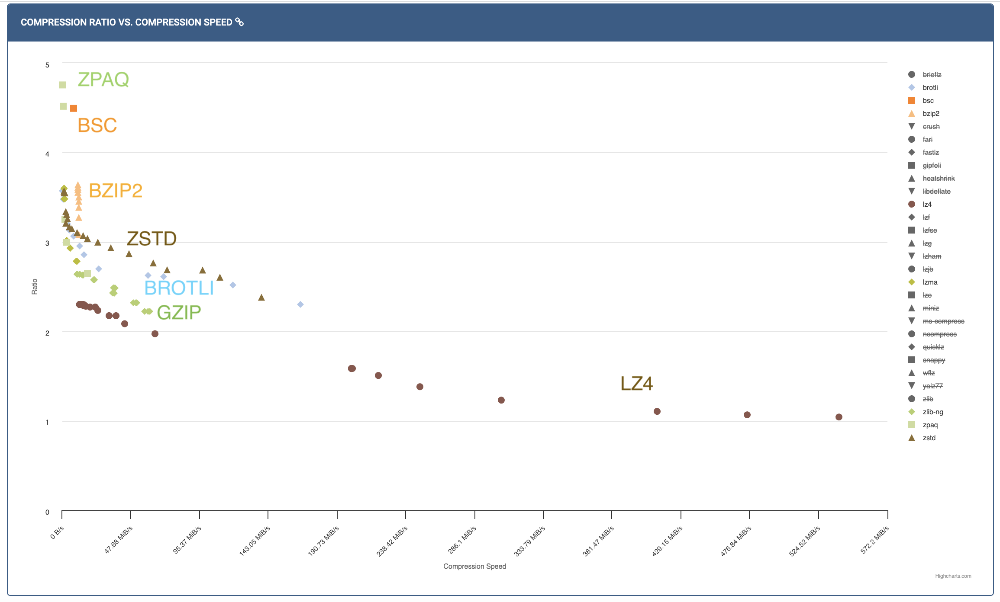
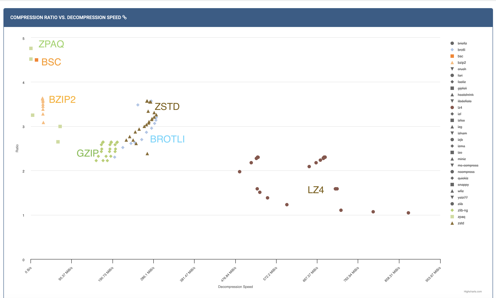

# Practical tips on lossless compression

Over the last several chapters, we have covered the theory and algorithms behind lossless compression. We understood the fundamental limits (entropy and entropy rate), looked at various prefix-free codes and entropy coders like Huffman coding, Arithmetic coding and ANS. We also saw how to deal with non-IID sources using context-based coding and universal compression algorithms like LZ77. Each of these ideas was optimal in some sense. In this chapter, we will look into how you could use this knowledge in practice when you are faced with a real world compression problem.

The first question you want to ask of yourself is: 
> Is compression the most pressing problem you are facing?

Try to think about the following: 
- Do you have a lot of data that needs to be stored/transmitted?
- Is the cost of storage/transmission significant enough to warrant investing time and resources into compression?
- Will compression just save on storage or will it also improve performance (e.g., faster data transfer, reduced latency)?

You want to make sure you are solving the right problem! Many times compression is a cost-saving measure, but maybe your business is not at the point where this is a priority.

Suppose you convinced yourself that you have too much data or it is indeed becoming a bottleneck in some way. The next question you want to ask is:

> Is it possible you don't need all this data? Can you eliminate the entire data or parts of it?

- Identify parts of data that are costing the most: 
  - Can you get rid of it or change the representation? Do you need the text-based logs at full fidelity? Can you sample the data?
    - Make sure you use your compression knowledge to understand what's really contributing to the size of the data. A long string will hardly take up any space it is repeated many times (e.g., the server host name in a log that repeats for every request). Whereas a short string of random characters (e.g., unique identifiers, hashes) will be incompressible and take up space after compression.
  - Does the identifier need to be so random? Is there a real security reason behind all the random incompressible strings in your data?
- Do you need to store the data for so long? Can you filter it down to fewer fields or aggregate it in some way?
  - Sometimes legal requirements and unavoidable to store.
- What is your data access pattern?
  - Backup/archive (cold storage) cheaper than hot storage.

Also: lossy compression is crucial for multimedia data - starting in the next chapter!

Remember that compression is not only about storage. It can have multiple benefits like:
- memory reduction
- bandwidth reduction
- faster querying

So we reached this point where we want to compress some data and need to compress it losslessly.

> You definitely need to store this data losslessly! Now what?

There can be so many approaches, and sadly many of the suboptimal ones are pretty commonly undertaken. Being a compression expert, it is very important to avoid the following **Things not to do**:

- Use your recently acquired compression knowledge and straightaway start spending a bunch of time developing your own compressor. Implement LZ77 and all the entropy coders on your own.
- Search online and purchase the license to a fancy looking compression solution.
- Use CMIX since your company deserves the best possible compression irrespective of the compute costs.
- Use gzip because LZ77 is an universal algorithm and so it has to be the best compressor for every occasion, and use it with the default settings since that's the popular thing.
- Make a statistically accurate model of your data, design a predictor, and then use a context-based arithmetic coder.

We are not saying these approaches can never make sense, but they are not the first step!

A much better approach is to:

> Understand the application requirements, try existing compressors like zstd and then evaluate whether there are benefits to create a domain specific compressor based on an approximate model for the data.

### Understand your application

- Resource requirements - compression/decompression speed/memory - this is the single most important factor in choosing a compressor in practice. Sometimes for write-once-read-many applications, decompression speed can be more important than compression speed. Whereas in some real-time applications, both compression and decompression speed are crucial.
- Where will compression and decompression happen?
  - Closed system owned by you? Deployed by customers? Open source library? Production use vs. research?
- How will compression and decompression happen?
  - CLI? Library in some programming language?
- Is the data homogenous? Is there a lot of the same kind of data? For example, you could have a lot of log files of the same format, or genomic data. On the other hand, you could be running a cloud storage service where users can upload arbitrary files.

All these would affect your choice of compressor (or your decision to build your own), as well as how to deploy it.
  

### Use compression benchmarks

Compression benchmarks are a great way to compare different compressors on a common ground. They provide standardized datasets, evaluation metrics and comparison plots. Let's look a popular benchmark available at [http://quixdb.github.io/squash-benchmark/unstable/](http://quixdb.github.io/squash-benchmark/unstable/). In general, you want to measure compression ratio as well as compression and decompression speed on your specific dataset or on a general corpus, and then find the most prefered operating point depending on your application requirements.

In the plot above, you see the compression ratio vs. compression speed for some corpus (for different levels of different compressors). You can see LZ4 handily wins on compression speed, while ZPAQ provides excellent compression ratio at the cost of speed. zstd seems to provide a good trade-off between the two. If you want to get slightly better compression ratio than zstd but not be extremely slow, you can try bsc or bzip2. Some compressors like gzip are not on the pareto frontier so you should ideally never use it (unless you only have KBs of memory). As you can see such benchmarks are a great way to quickly narrow down your choices. 

Similarly, the plot above shows compression ratio vs. decompression speed. Again, LZ4 is the fastest, while zstd provides a good trade-off. Most LZ77 based compressors (gzip, zstd, brotli) are pretty fast at decompression (since it's just entropy decoding followed by memcpy), while BWT based compressors (bzip2, bsc) are slower. 

### General rule of thumb

With the above understanding, here are some rules of thumb to guide your choice of compressor:

- zstd has very fast decompression, and a variety of compression levels - should be the first thing to try. Don't use gzip unless you have a very good reason (e.g., your readers can't consume zstd).
- To go even faster, try LZ4. LZ4 uses a very fast match-finder and doesn't use entropy coding making both compression and decompression fast.
- For slower but better compression (e.g., you want to store the data for archiving, and storage cost is your primary objective), you can try out:
  - LZMA based compressors (LZ77+arithmetic coding) (7-zip, xz)
  - BWT based compressors (bzip2, bsc) - faster compression (than LZMA), slower decompression. We didn't cover BWT in these notes, but it is a reversible transformation that makes the data compressible by creating repetitive patterns.
- For even more resource intensive - try context based arithmetic coding with $k$th order, PPMd, etc. (these don't always beat LZ/BWT - check for your data!)
- CMIX/NNCP/LLM - if you want to understand the limits, rarely useful in practice due to extreme resource requirements.

#### Using zstd and using it well
- Use the latest version
- Choose the right level (1-19, also negative and ultra levels)
  - sometimes makes sense to use custom advanced parameters (e.g., window size, hash length). Levels are just presets for these advanced parameters, and you can set them manually if you want more control (recall it doesn't affect the decompression).
- Use CLI/library in language of your choice - zstd also supports multithreaded compression
- Reuse zstd context objects if processing multiple files. There is some overhead in creating these objects and reusing them can significantly speed up compression/decompression if you are processing many files.
- For small files, consider using dictionary compression (check out the Small data section in the [zstd blog post](https://engineering.fb.com/2016/08/31/core-infra/smaller-and-faster-data-compression-with-zstandard/)). This is helpful when you have many small files with similar format or content. While you can't expect to find matches within a small file, you can find matches across files using a shared dictionary. zstd provides tools to build such dictionaries from sample data, and then you can use those dictionaries to compress small files as long as the same dictionary is used for decompression.

### Domain specific compressors

So we've seen that general-purpose compressors, and specifically zstd, are a great starting point for lossless compression. The question arises:

> When does a domain specific compressor make sense?

- You see noticeable gap between existing compressors and estimated entropy. Theory super useful here to meaningful estimates! 
- You can do well while being faster than existing compressors (using the structure of the data to "help out" zstd make smarter choices). An example could be that in a table you expect a column to only have matches within the column, whereas zstd would search for matches across the entire data.
- Easier if closed ecosystem since it's easier to deploy, maintain and make sure all consumers can decompress. 
- There is lots of data of the same type (homogenous data) making investment worth it - check out [the talk by Yann Collet](https://www.youtube.com/watch?v=G5n37deW3uw) to understand all these aspects that come after you build your compressor. Genomics is a great example of this where the vast amount of homogenous data and the huge storage costs make it worthwhile to build domain specific compressors. Other cases include a large company having there own proprietary data format that is used across the company, or a startup whose entire product is based on storing some specific kind of data (e.g., time series data).
  - design
  - implement
  - test
  - format and versioning (with compatibility guarantees)
  - monitoring and maintenance
  - portability and language support

The general approach to building a domain specific compressor is to parse (columnarize) your data, apply various transforms to the fields and make them compressible by general-purpose compressors like zstd. The idea is that we can make the job of zstd easier by removing redundancies and making patterns more explicit. [OpenZL: A Graph-Based Model for Compression](https://arxiv.org/abs/2510.03203) is a great paper that describes such a general approach to building domain-specific compressors.

That's all on lossless compression, and we hope you found these notes useful! Next up, we will start our journey into lossy compression, starting with the basics of quantization.