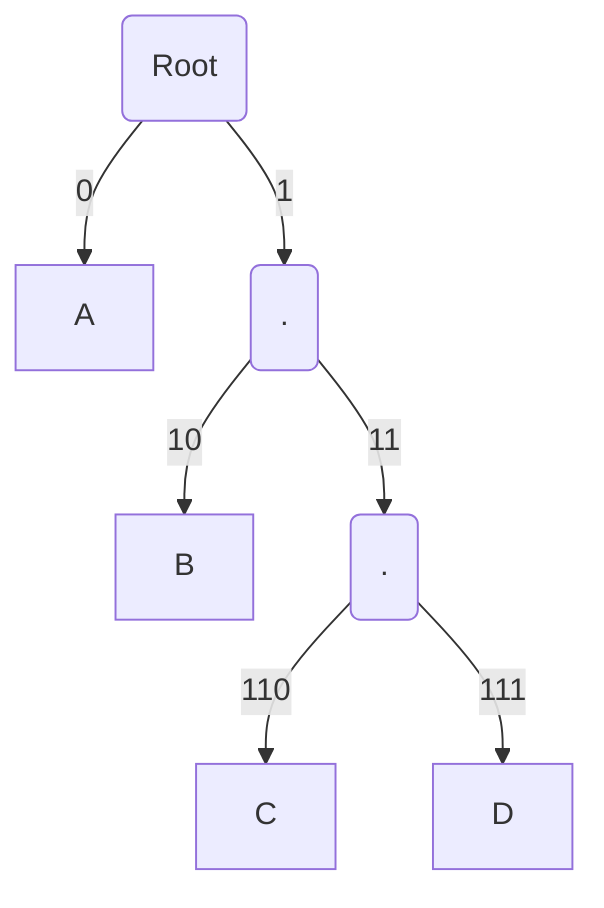

# Prefix(-Free) Codes

As a recap, in the previous lecture, we discussed a simple example of a prefix-free code. We also discussed a simple
procedure for decoding data encoded using the prefix-free code. In this lecture we will be thinking about how to
actually go about implementing the decoding, and also how to design prefix-free code itself.

Lets start by thinking about the decoding. As a recap, here is our prefix-free code and the decoding procedure

| Symbol | Codewords |
| -- | -- |
| A | 0|
| B | 10 |
| C | 110 |
| D | 111 |

```python
### Prefix-free decoding procedure
codewords_table = {A: 0, B: 10, C: 110, D: 111}

def decode_symbol(encoded_bitstring, codewords_table):
    temp_bits = ""

    # read until we find a match with a codeword in the codewords_table
    while not find_match(temp_bits, codewords_table):
        temp_bits += encoded_bitstring.read_next_bit()

    decoded_symbol = find_match(temp_bits, codewords_table)
    return decoded_symbol
```

The procedure is as follows:

- We start from the encoded bitstream, and try to find a match with either of the codewords. We stop when we get our
  first match
- Note that the decoding procedure above is "correct" because we have a *prefix-free* code, and so we can stop searching
  when `find_match` obtains its first match.

Let's think about how we can implement the `find_match` function.

**Idea-1: Hash-tables**: One simple way to implement the `find_match` function in the decoding is via a hash table. We
can just create a hash table using the `codewords_table`. We can then just query the hash table with the `temp_bits`,
until we get a match.

Can we think of a simple data-structure which will make this procedure faster?

## Prefix-free Tree

Another approach towards prefix-free code decoding is to construct a *prefix-free tree* and use this tree for decoding.
Lets get back to our `prefix-free` code example to see what I mean by that:

Given the codewords table, we can represent it as a binary tree follows:



1. The idea behind the *prefix-free tree* construction is simple. For each codeword, we add a node at depth `len(codeword)` from root node, taking the right path or the left path from previous node in the tree depending on whether the corresponding bit in the codeword is `1` or `0`. E.g. in our codewords table `B -> 10`. In this case we add a node to the binary tree at depth `2 = len(10)`, corresponding to the path `10 -> right, left` from the root node. Similarly, for `C -> 110`, we add a node at depth `3` corresponding to the path `110 -> right, right, left`.
2. Notice that for *prefix-free* codes, the codewords correspond to the leaf nodes. This can be shown using contradiction. If there was another node `n2`
   corresponding to codeword `c2` sprouting out of node `n1` (with codeword `c1`), then based on the construction of *prefix-free tree* defined in the previous step, `c1` is a prefix of `c2`. This is a contradiction because we're violating the `prefix-free` property of our code. In fact, the property that prefix-free codes correspond to the leaf nodes of *prefix-free tree* is another way to define *prefix-free codes*!

Okay, now that we have understood how to create the *prefix-free tree* data structure for any *prefix-free code*, can we
use this tree structure to improve the decoding algorithm? Take a look!

```python
## Prefix-free code decoding using a prefix-free tree

prefix_tree = ...  # construct the tree here using codewords

def decode_symbol(encoded_bitarray, prefix_tree):
    # start from the root node and read bits until you read a leaf node
    node = prefix_tree.root
    while not node.is_leaf_node:
        bit = encoded_bitarray.read_next_bit()
        node = node.right if bit else node.left
    # return the symbol corresponding to the node, once we reached a leaf node
    return node.symbol
```

Some observations:

1. This decoding scheme is similar in logic to the previous one, but quite a bit more efficient, as we are not querying
   the hash table multiple times.
2. The key idea is that for *prefix-free codes* the codewords correspond to leaf nodes. Hence, we just parse the tree
   with the bits from the output until we reach one of the leaf nodes.
3. Note that we need to create the *prefix-free tree* during the pre-processing step of our decoding as a one-time cost,
   which typically gets amortized if the data we are encoding is quite big.

As we will see later the *prefix-free tree* is not just useful for efficient decoding, but is a great way to think and
visualize *prefix-free codes*. We will in fact use the structure when we learn about how to design a good prefix-free
code.

## How to design good *prefix-free codes*?

Okay, now that we have convinced that prefix-free codes are indeed lossless and that they have an efficient decoding
scheme, lets revisit our code and think again about *why the scheme leads to better compression*

To recap: we wanted to design a code for the skewed non-uniform distribution: $$ P(A) = 0.49, P(B) = 0.49, P(C) = P(D) =
0.01$$

we started with the following *Fixed Bitwidth code*.

| Symbol | Codewords |
| -- | -- |
| A | 00|
| B | 01 |
| C | 10 |
| D | 11 |

Then we were able to construct a *variable-length code*, which is indeed lossless and improves the compression
from `2 bits/symbol` to `1.53 bits/symbol` on an average.

| Symbol | Codewords |
| -- | -- |
| A | 0|
| B | 10 |
| C | 110 |
| D | 111 |

How did this improvement come about?

1. The *Fixed Bitwidth code* is assigning equal importance to all the symbols $A, B, C, D$, as the code-lengths are the
   same ( `2 bits/symbol`). This seems all good, in case they are equiprobable. i.e. if the probabilities are:
   $$ p(A) = p(B) = p(C) = p(D) = 0.25 $$

2. But in case of the skewed probability distribution, clearly $A, B$ are more important as they occur much more
   frequently. So, we should try to assign a shorter codeword to $A, B$ and could afford to assign longer codewords to
   $C,D$ as they occur much less frequently.

Thus we have a simple and somewhat obvious thumb rule for a code:

~~~admonish info title="Key-Idea 2"
Given a distribution, it is better (in terms of compression) to assign shorter codewords to symbols with higher probability. 

$$ p(s_1) > p(s_2) => l(s_1) <= l(s_2)$$
~~~

Even though we want to assign shorter codes to symbols with higher probability, it is not clear what the proportionality
should be.

For example, the *prefix-free code* we have works well for distribution $$ \begin{aligned}
p(A) = p(B) = 0.49 \\ p(C) = p(D) = 0.01
\end{aligned} $$ and gives us the average codelength of `1.53 bits/symbol`. But, the same code doesn't work well for a less
skewed distribution like:

$$ \begin{aligned}
p(A) = p(B) = 0.3 \\ p(C) = p(D) = 0.2
\end{aligned} $$
as in this case the average codelength is `2.1 bits/symbol` (which is even higher than *Fixed Bitwidth code*!).

This problem, (and much more) was definitively analyzed in the brilliant work by Claude Shannon in his 1948 paper [A Mathematical theory of Communication](https://people.math.harvard.edu/~ctm/home/text/others/shannon/entropy/entropy.pdf). Shannon's work laid the theoretical foundations of not just the field of data compression, but more so of the area of
error-free data communication. (The paper remains surprisingly accessible and short for its legendary nature. Do take a look!)

We will definitely come back in the future lectures to understand the work in more detail, but here is another thumb rule from Shannon's work for the optimal code-lengths:

$$ l_{optimal}(symbol) \approx \log_2 \frac{1}{p(symbol)} $$

Note that this is still a thumb rule, until we *prove* it and show convincingly in which scenarios it holds true. But,
lets try to verify this rule in a couple of simple cases:

1. **Uniform Distribution**: Let's consider the case of $$P(A) = P(B) = P(C) = P(D) = 1/4$$
   We know that as we have 4 equiprobable symbols, we can encode data using `2 bits/symbol`. This matches the thumb rule
   above: $$
   \begin{aligned}
   l_{optimal}(symbol) &\approx \log_2 \frac{1}{p(symbol)} \\
   &= \log_2 4 \\
   &= 2
   \end{aligned} $$
   In general, we see that if the probability is $1/k$ for all the $k$ symbols of a distribution, then the optimal codelength is
   going to be $log_2 k$, according to the thumb rule. Now, in cases where $k$ is not a power of $2$, and if we have a
   single unique codeword per symbol, then the best we can achieve is $$ \lceil log_2 k \rceil \geq log_2 k $$

2. **Dyadic distribution**: Based on the thumb rule, we need $\log_2 \frac{1}{p(symbol)}$ to be an integer, which
   is only possible if $p(symbol)$ is a negative power of $2$ for all symbols. Such distributions are known as *dyadic
   distributions*

   > **Dyadic distribution** A distribution $P$ is called dyadic if $$ \exists l_i \in \mathbb{N}, P(s_i) = \frac{1}{2^{l_i}}, \forall s_i \in \mathcal{S}$$
   
   Based on the thumb rule, it is unambiguously clear that for dyadic distribution, the symbol $s_i$ should have codeword of length $l_i$. For
   example: for the following dyadic distribution $$P(A) = 1/2, p(B) = 1/4, P(C) = P(D) = 1/8$$ the code-lengths are going
   to be:
   
   | Symbol | Prob | Optimal codelength |
   | -- | -- | -- |
   | A | 1/2| 1 |
   | B | 1/4 | 2 |
   | C | 1/8 | 3 |
   | D | 1/8 | 3 |

3. **General Distributions**: For generic distributions, $l_{optimal}(symbol) = \log_2 \frac{1}{p(symbol)}$, might not
   be achievable in general. But, a good goal to aim for is: $$ l(symbol) = \left\lceil \log_2 \frac{1}{p(symbol)}
   \right\rceil $$ Is this possible? Lets look at this problem in the next section

## Designing prefix-free codes

Okay! So, now that we know that the code-lengths to shoot for are: $$ l(symbol) = \left\lceil \log_2 \frac{1}{p(symbol)}
\right\rceil $$ let's try to think how.

Let's take a simple example (see below) and see if we can try to come up with a prefix-free code with the prescribed lengths.

| Symbol | Prob | Optimal codelength |
| -- | -- | -- |
| A | 0.55 | 1 |
| B | 0.25 | 2 |
| C | 0.1 | 4 |
| D | 0.1 | 4 |

We know that all prefix-free codes have a corresponding *prefix-free tree*. So, essentially we want to come up with a
binary tree with the leaf nodes at a distance equal to the code-lengths from the root node. For example, in the above
example, we want to construct a binary tree with leaf nodes at distance `1, 2, 4, 4` from the root node. Note that there
can be some additional leaf nodes to the binary tree which are not assigned to any codeword.

1. Let's start with nodes at distance `1`. We know a binary tree has `2^1 = 2` nodes at distance `1` from the root node.
   These correspond to codewords `0` (left node) and `1` (right node). Let's make the left node a leaf node corresponding
   to symbol $A$ (with codelength = `1` as needed)

   ```mermaid
   graph TD
     *(Root) -->|0| A:::endnode
     *(Root) -->|1| n1(.)
   ```

2. Now we have the right node (corresponding to codeword `1`), which we can split further into two nodes corresponding
   to `10` and `11`. As we are needed to assign a codeword with length `2`, lets assign node corresponding to `10` to
   symbol $B$, and make it a leaf node.

   ```mermaid
   graph TD
     *(Root) -->|0| A:::endnode
     *(Root) -->|1| n1(.)
     n1 -->|10| B:::endnode
     n1 -->|11| n2(.)
   ```

3. We are now again left with the right node `11`, which we can split further into two nodes `110, 111` at distance
   = `3` from the root node. Now, looking at the table of code-lengths, we do not have any code to be assigned to
   length `3`, so lets split node `110` further into nodes corresponding to `1100` and `1101`. We can now assign these
   two nodes to symbols $C, D$ respectively.

   ```mermaid
   graph TD
     *(Root) -->|0| A:::endnode
     *(Root) -->|1| n1(.)
     n1 -->|10| B:::endnode
     n1 -->|11| n2(.)
     n2 --> |110| n3(.)
     n2 --> |111| n4(.)
     n3 --> |1100| C:::endnode
     n3 --> |1101| D:::endnode
   ```

Thus, our final codewords are:

| Symbol | Prob | Optimal codelength | codewords |
| -- | -- | -- | -- |
| A | 0.55 | 1 | 0 |
| B | 0.25 | 2 | 10 |
| C | 0.1 | 4 | 1100 |
| D | 0.1 | 4 | 1101 |

Notice that the leaf node corresponding to `111` was not linked to any symbol. That is absolutely ok! It just implies
that we could have squeezed in another symbol here with length `3`, and points to the slight inefficiency in using the
approximation $ l(symbol) = \left\lceil \log_2 \frac{1}{p(symbol)} \right\rceil $.

The procedure we followed seems general enough that we can follow it for any distribution:
1. Sort the distribution in descending order and compute codelengths as $ l(symbol) = \left\lceil \log_2 \frac{1}{p(symbol)} \right\rceil $
2. Assign the first lexicographically available codeword to the next symbol which is not a prefix of the previous ones and is of the stipulated length.

We still need to argue the
correctness of the procedure and that it will work in all cases! For example, how can we be sure that we will not run
out of nodes?

We will look at all these problems in the next lecture.

## Summary & Next Lecture

To summarize: here are the key takeaway's for this lecture:

1. **Prefix-free codes**: Among the symbol codes, *prefix-free* codes allow for efficient and convenient
   encoding/decoding. In fact as we will see, given any *uniquely-decodable* code (or *lossless* code), we can construct
   a *prefix-free* code with exact same code-lengths and thus the same compression performance. Thus, we restrict
   ourselves to the analysis of *prefix-free* codes among the symbol codes.

2. **Prefix-free tree**: Any prefix-free code has a *prefix-free binary tree* associated with it, which has the leaf
   nodes corresponding to the codewords.

3. **Compression thumb rule**: One, somewhat obvious thumb rule we learnt for symbol codes was that if $$ P(s_1) \geq P(
   s_2) \implies l(s_1)  \leq l(s_2)$$ else we could swap the codewords for symbols $s_1, s_2$ and achieve lower average
   codelength.

4. **Neg Log-likelihood**: Another thumb-rule we learnt was that the optimal code-lengths for a prefix-free code are $$l_
   {optimal}(symbol) \approx \log_2 \frac{1}{p(symbol)}$$
   We will understand why this rule is true in the next lecture.

5. **Prefix-free code construction**: We looked at a procedure for constructing *prefix-free codes* for any
   distribution. In the next lecture, we will justify the correctness of the procedure and also discuss a couple of more
   ideas of constructing prefix-free codes

