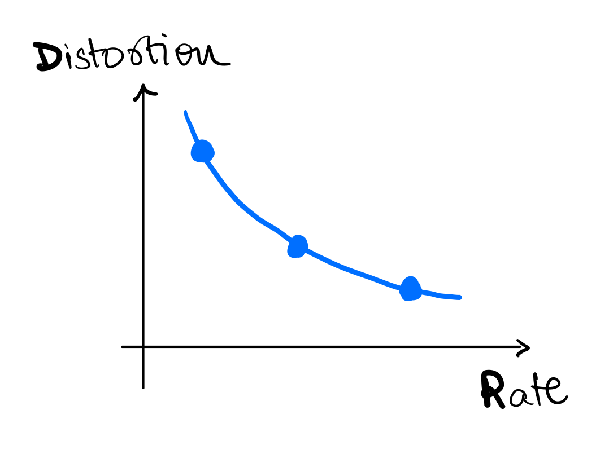
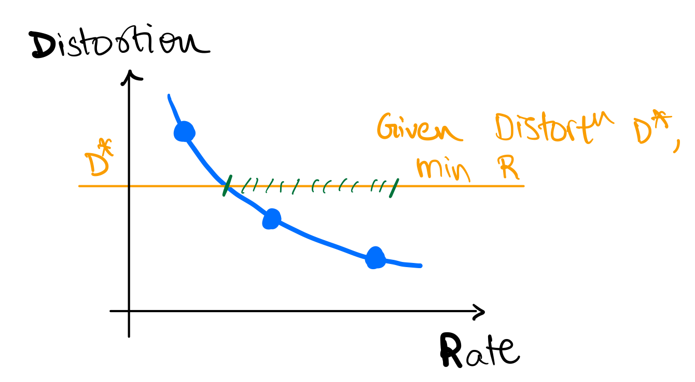
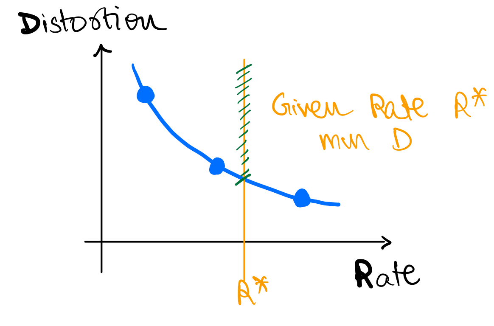
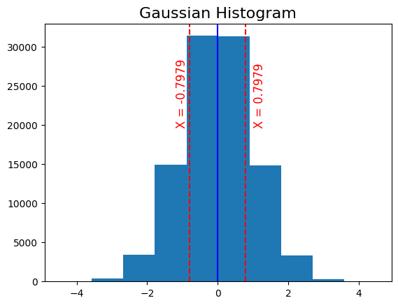
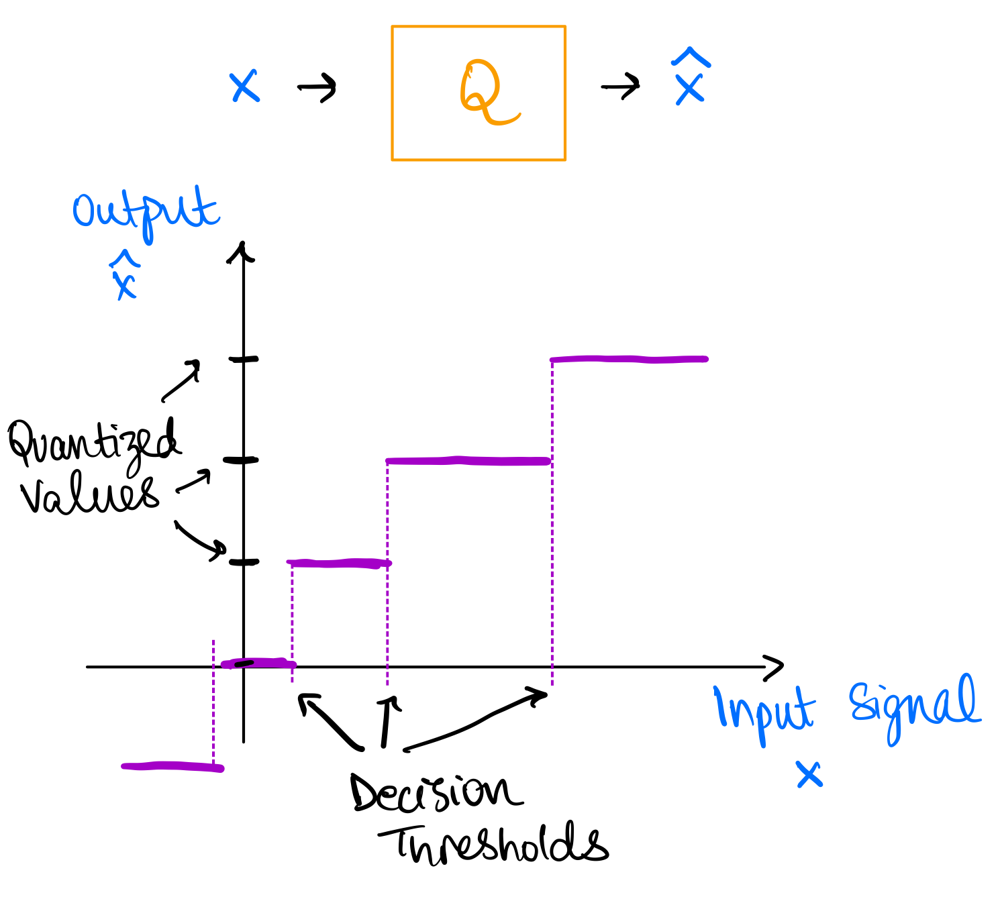
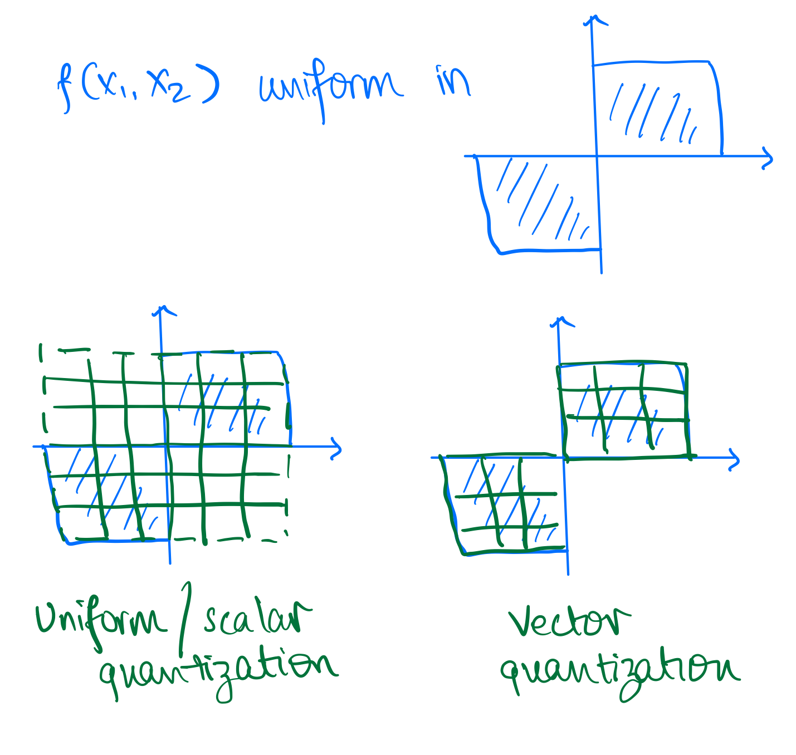
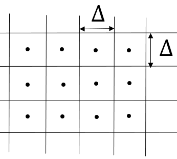
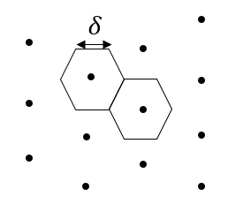
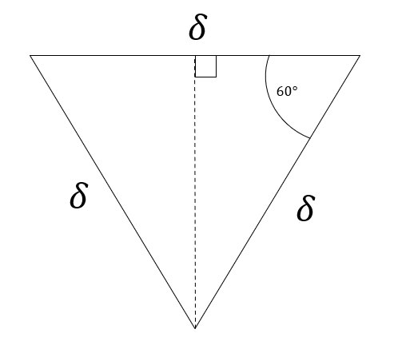
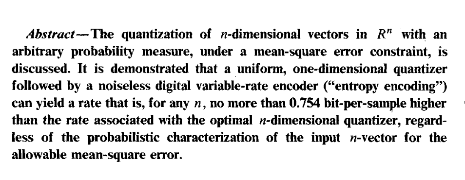

# Lossy Compression Basics and Quantization

## Recap

In the first half of this course, we learned about lossless compression techniques and the fundamental limits imposed by entropy. We also learnt about the tradeoffs for various *entropy coders*. Here is a summary:

- Learnt about fundamental limits on lossless compression: entropy, $H(p)$
- Thumb rule: $L(x) \propto \lceil log_2(1/p(x)) \rceil$
- Learn about various lossless compressors aka *entropy coders* and their implementations
  - Block codes: Shannon coding and Huffman coding
  - Streaming codes: Arithmetic coding and Asymmetric Numeral Systems
  - Universal (pattern) matching codes: LZ77
- Learnt about how to deal with non-IID sources
  - Context-based coding
  - Adaptive coding
  
## Introduction

However, today we want to discuss a different setting. Many real-world data sources such as audio, images, and video are continuous in nature rather than discrete. To represent these sources digitally, we need to approximate and quantize them, which inherently introduces some loss of information. Previously, we assumed a discrete information source $X$ that could be losslessly compressed by entropy coding techniques like Huffman or arithmetic coding. The discrete entropy $H(X)$ represented a hard limit on the best possible lossless compression. Let's think about a continuous source $X$ now. How much information does it contain?

<span style="color:purple;"> Quiz-1: How much information does a continuous source `X` contain? </span>  

A continuous source contains an infinite amount of information, so it cannot be represented digitally in a lossless manner. This is in-fact related to a fundamental property about real numbers: they are uncountable, i.e., there are infinite real numbers between any two real numbers. Instead, we need to approximate it by quantizing to a discrete representation. This quantization step will inevitably induce some loss or distortion. 

The key aspects of lossy compression are:
- It allows some loss of information or fidelity in order to achieve higher compression. The original source cannot be perfectly reconstructed.
- Lossless compression is a special case of lossy compression with zero distortion.
- Quantization is used to convert the continuous source into a discrete representation. This is a fundamental part of lossy compression.
- Entropy coding is still widely applicable and typically used as the final step after quantization.

## Lossy Compression Basics: Rate-Distortion Tradeoff

A continuous source contains infinite information, so we cannot represent it exactly. We need to approximate it, which implies some unavoidable loss of information. 

**Distortion (D)** is a quantitative measure of this loss of information introduced by the approximation/quantization process. Common distortion metrics include:
- Mean squared error (MSE): $D = \mathbb{E}[(X - \hat{X})^2]$
- Mean absolute error (MAE): $D = \mathbb{E}[|X - \hat{X}|]$

In lossy compression, we have a choice regarding the tradeoff between rate and distortion:
**Rate (R)** refers to the number of bits used per sample to represent the lossy approximation of the source.
Higher rate implies we can represent the source more accurately with lower distortion `D`.
Lower rate means we have to tolerate more distortion to achieve higher compression.

This inherent tradeoff between rate R and distortion D is fundamental to lossy compression and quantization. Figure below shows a cartoon of the rate-distortion tradeoff. Fundamental to this discussion is the fact that we always strive to achieve the best possible rate-distortion tradeoff, i.e. 
- given a distortion level ($D^{*}$), we want to achieve the lowest possible rate ($min~\text{R}$)
- given a rate ($R^{*}$), we want to achieve the lowest possible distortion ($min~\text{D}$)

In next set of notes, we will learn more about the *rate-distortion* theory which provides a theoretical framework for this tradeoff. 





### Example

Let's work through an example together.

`Example 1`  
- Let's say you are measuring temperature (`T`) in a room, say in Celsius, at an hourly interval.
  - Remember, physical `T` is a continuous source.
- Say your sensor is very sensitive and it records  `T = [38.110001, 36.150901, 37.122020, 37.110862, 35.827111]`

<span style="color:purple;"> Quiz-2: How many bits do we want to represent `T`? </span>

It depends on the application! If we are using it to control the AC, we might need more bits than if we are using it to decide whether to wear hoodie or T-shirt. In either case,
- we need to decide on the *distortion* we are OK with
- we can agree these many decimals are waste of bits

<span style="color:purple;"> Quiz-3: What are some reasonable values to encode? </span>

One reasonable way to encode is to round `T` to the nearest integer, i.e., `T_lossy = [38, 36, 37, 37, 35]`. This is similar to converting `T` to `int` from `float`.

## Quantization

What we did in the previous example is called *quantization* (or *binning*).
- Quantization is the process of mapping a continuous source to a discrete source.
- Quantization is a lossy process, i.e., it introduces distortion.
- Quantization is a fundamental operation in lossy compression!
- Quantized values are also sometimes called *symbols* or *codewords*, and the set of quantized values is called *codebook* or *dictionary*.
  - In previous example, *codebook* is `{35, 36, 37, 38}` and *codewords* for each symbol are `{35, 36, 37, 37, 35}`.

<span style="color:purple;"> Quiz-4: For a codebook of size `N`, what is the rate `R`? </span>

The rate $R = \log_2(N)$ because we have $N$ quantized symbols and we need $\log_2(N)$ bits to represent each symbol. Alternatively, we can say the quantized value for each symbol can take $2^R$ unique values.

### Quantization Example - Gaussian

`Example 2`
Now say, `X` is a Gaussian source with mean 0 and variance 1, i.e., $X \sim \mathcal{N}(0, 1)$. Say we want to represent X using just 1 bit per symbol.

<span style="color:purple;"> Quiz-5: What are some reasonable values to encode? </span>

We can decide to convey just the sign of X, i.e., $\hat{X} = \text{sign}(X)$ as the distribution is symmetric around 0. Say we get a positive value for $\hat{X}$, what should be the *quantized value* of the recovered symbol? For this, we need to decide on the *distortion* we are OK with. For today's discussion let's say we are concerned about MSE distortion.

<span style="color:purple;"> Quiz-6: What should be the codebook for this example? </span>

If you have taken signal processing, you know that the conditional expectation of `X` given the observation is the best linear estimator for MSE distortion. This is called Minimal Mean Square Estimator (MMSE). Mathematically, if we want to find 

If you have not seen this before, here are some resources:
- [Notes from Prof. Lall, Stanford](https://lall.stanford.edu/engr207b/lectures/mmse_estimation_2011_02_02_01.pdf)
- [Notes from Prof. Chan, Purdue](https://probability4datascience.com/slides/Slide_8_04.pdf)
- [Wikipedia page](https://en.wikipedia.org/wiki/Minimum_mean_square_error#:~:text=In%20statistics%20and%20signal%20processing,values%20of%20a%20dependent%20variable.)

Therefore, in our case, the codebook should be $\mathscr{C} = \left\{\mathbb{E}[(X | \hat{X} > 0)], \mathbb{E}[(X | \hat{X} < 0)]\right\}$.

For gaussian, this is $\mathscr{C} = \left\{\sqrt{\frac{2}{\pi}}, -\sqrt{\frac{2}{\pi}}\right\}$. We can work this out as follows:
$$
\begin{aligned}
\mathbb{E}[(X | \hat{X} > 0)] &= \int_{0}^{\infty} x \frac{2}{\sqrt{2\pi}} e^{-\frac{x^2}{2}} dx \\
&= \sqrt{\frac{2}{\pi}} \int_{0}^{\infty} x e^{-\frac{x^2}{2}} dx \\
&= \sqrt{\frac{2}{\pi}} \left[-e^{-\frac{x^2}{2}}\right]_{0}^{\infty} \\
&= \sqrt{\frac{2}{\pi}}
\end{aligned}
$$
where the first step follows from definition of conditional expectation and symmetry of gaussian distribution around 0. Similarly, we can show that $\mathbb{E}[(X | \hat{X} < 0)] = -\sqrt{\frac{2}{\pi}}$. 




### Scalar Quantization



This is an example of *scalar quantization*. In scalar quantization, we quantize each symbol independently. The figure above explains the process of scalar quantization. Quantization can be thought of as a function which maps continuous symbols $X$ to the reconstructed symbols $\hat{X}$. The quantization function is called *quantizer* and is denoted by $Q(\cdot)$. The quantizer is defined by the *codebook* $\mathscr{C}$, which is the set of quantized values. The quantizer maps each symbol $X$ to the nearest quantized value in the codebook, i.e., $\hat{X} = Q(X) = \text{argmin}_{y \in \mathscr{C}} d(X,y)$ where $d(\cdot, \cdot)$ is the distortion (or some other distance) metric. The process defines decision thresholds which are the regions where all values of $X$ are mapped to the same quantized value $\hat{X}$ in the codebook $\mathscr{C}$.

More formally, we can also think of a quantizer as a partition of the input space $\mathbb{R}$ into $N$ disjoint regions $S_i$ such that $\bigcup_{i=1}^N S_i = \mathbb{R}$ and $S_i \cap S_j = \emptyset$ for $i \neq j$ and a mapping from each region $S_i$ to a quantized value $y_i \in \mathscr{C}$.

## Vector Quantization
So far, we are quantizing each symbol independently. But can we do better? Maybe we can work with two (or more) symbols at a time?
Say we have $X = [X_1, X_2]$, where $X_1, X_2 \sim \mathcal{N}(0, 1)$
  - you can also think of it as you generated `2*N` samples from $\mathcal{N}(0, 1)$ and then split them into two groups of size `N` (similar to `block codes` in lossless compression)
  - or you can think of it as you have two sensors measuring the same source
  - or you can think of it as having two sensors measuring two different sources

<span style="color:purple;"> Quiz-7: We want to compare it with 1 bit/symbol scalar quantization. What's the size of codebook allowed? </span>

The size of the codebook will be $2^{{1~\text{bit}/\text{symbol}}~\times~{2~\text{symbol}/\text{code-vector}}} = 4$. Generalizing, we can have codebook of size $N=2^{R*k}$ for vectors (blocks) of size $k$ and $R$ bits/symbol. In other words, $R = (\log_2 N) / k$ bits/symbol since we are using $N$ quantized values to represent $k$ symbols.

More formally, generalizing what we have seen so far,
- A quantizer is a mapping $Q: \mathbb{R}^{k} \rightarrow \mathscr{C}$ where $\mathscr{C}=\left\{\underline{y}_{i}\right\}_{i=1}^{N}$ is the "codebook" or "dictionary" comprising of $N$ $k$-dimensional vectors.
- The mapping is defined by: $Q(\underline{x})=\underline{y}_{i} \text { if } \underline{x} \in S_{i}$ where $\left\{S_{i}\right\}_{i=1}^{N}$ is a partition of $\mathbb{R}^{k}$ <br> $\bigcup_{i=1}^{N} S_{i}=\mathbb{R}^{k}; \quad  S_{l} \cap S_{m}=\phi, l \neq m.$
- The rate is $R=\frac{\log N}{k} \frac{\text { bits }}{\text { sample }} ; N=2^{k R}$ 

[//]: # (**ToDo: add some example**)

Vector quantization provides following benefits over scalar quantization:

- We can exploit dependence between vector components
- We can have more general decision regions (than could be obtained via Scalar Quantization)

The image below shows a basic example where vector quantization provides advantage over scalar quantization. Assume you have two dimensional probability density $f(X_1, X_2)$ as shown and you want to quantize it. This represents a case where both $(X_1, X_2)$ are uniformly distributed with same sign.

You can either quantize each dimension independently (scalar quantization) or you can quantize both dimensions together (vector quantization). The figure below shows the decision regions for both cases. We take a specific example for vector quantization as shown in the figure. For scalar quantization we have $6\times6$ codewords, i.e. $N=36$ and therefore the rate is $log_2(6^2)/2 = log_2(6)$, whereas for the vector quantizer we only need a strict subset of the scalar quantize codewords requiring half of the codewords, i.e. $N=18$ and therefore the rate is $log_2((6^2/2)/2 = log_2(6) - 1/2$. It is obvious to see here that the distortion for both these quantizers will be same but the rate for vector quantizer is lower. 

This is also obvious intuitively! Vector quantization allows us to exploit the correlation between the two dimensions and therefore we can achieve the same distortion with lower rate. It takes advantage of the fact that both dimensions are uniformly distributed with same sign.
Therefore, vector quantization provides more flexibility in choosing the decision regions.



### Some additional comments on VQ

Optimal regions are generally not uniform (as in scalar quantization) even in simple uniform IID case! In the 2D case of uniform IID, a hexagonal lattice provides most optimal regions with respect to MSE distortion. This is called *lattice quantization* or *Voronoi diagram* and can accommodate more than 2 dimensions. In the case of uniform IID variables in 2D, $\frac{MSE_{lattice}}{MSE_{SQ}} \approx 0.962$. This conveys two points to us:
- VQ performs better than SQ even in simple uniform IID case. As seen previously it performs even better in correlated cases.
- This can be a lot of effort for little gain given the source distribution, e.g. in this case we only gain 3.8% in MSE distortion.

Here is a proof for the above result:

Scalar Quantization of each component separately would yield square decision regions of the form as shown in following figure, where $\Delta$ is the quantization step size.



The area of the decision region is $A_1 = \Delta^2$. Therefore, since we have uniform

$$
\begin{aligned}
\operatorname{MSE}_1=\int_{-\frac{\Delta}{2}}^{\frac{\Delta}{2}} \int_{-\frac{\Delta}{2}}^{\frac{\Delta}{2}}\left(x^2+y^2\right) d x d y &=\int_{-\frac{\Delta}{2}}^{\frac{\Delta}{2}}\left[\frac{x^3}{3}+\left.y^2 x\right|_{-\frac{\Delta}{2}} ^{\frac{\Delta}{2}}\right] d y 
&=\int_{-\frac{\Delta}{2}}^{\frac{\Delta}{2}}\left[\frac{\Delta^3}{12}+y^2 \Delta\right] d y 
&=\left[\frac{\Delta^3}{12}y+\frac{y^3}{3}\Delta\right]^{\frac{\Delta}{2}}_{\frac{-\Delta}{2}} \\
& =\frac{\Delta^4}{12}+\frac{\Delta^4}{12}=\frac{\Delta^4}{6}
\end{aligned}
$$


Alternatively, we could have chosen a vector quantizer with hexagonal decision regions as shown below:



For this case, using symmetry, the area of the decision region is six times a triangle shown below. Therefore, $A_2 = 6 \cdot (\frac{1}{2}) \cdot (\frac{\sqrt{3}}{2} \delta) \cdot \delta  = \frac{3 \sqrt{3}}{2} \delta^2$.

[//]: # (![Hexagonal decision region dimensions]&#40;./images/VQ_hexagonal_triangle.png "Triangles which make up the hexagons"&#41;)


Finding the MSE is left as an exercise to the reader, but it can be shown that
$$
\operatorname{MSE}_2 = \frac{5\sqrt{3}}{8}\delta^4
$$

For comparing these two schemes, we will compare them for $\Delta$ and $\delta$ such that $A_1=A_2$, so that we have same rate (same number of quantization points covering the same area). This gives us the desired result
$$\frac{\operatorname{MSE}_2}{\operatorname{MSE}_1}=0.962$$

**Conslusion**: Even for a simple uniform IID source, there is benefit in vector quantization over scalar quantization.



The above image is a paper abstract from [On universal quantization, Ziv](https://ieeexplore.ieee.org/document/1057034). As you can see under certain conditions, scalar quantization can be competitive with vector quantization. However, in general, vector quantization is better than scalar quantization. 

## Vector Quantization Algorithm

In general, optimal regions are not easy to compute, and we need to resort to iterative algorithms.
<span style="color:purple;"> Quiz-8: Have you seen this problem before in some other context? </span>

It's same as K-means clustering algorithm in ML! Also called as *Lloyd-Max* algorithm or *Generalized Lloyd* algorithm. We want to cluster data points into `N` clusters corresponding to codebook (`k` in k-means) such that the average distortion is minimized.
~~~admonish note title="Historical Note"
  - First proposed by Stuart Lloyd in 1957 (motivated by audio compression) at Bell Labs
  - Was widely circulated but formally published only in 1982
  - Independently developed and published by Joel Max in 1960, therefore sometimes referred to as the Lloyd-Max algorithm
  - Generalized Lloyd specialized to squared error is the Kmeans clustering algorithm widely used in Machine Learning
~~~

### K-means Algorithm
Given some data points, we can compute the optimal codebook and the corresponding partition of the data points. The main idea is to do each-step iteratively:
  - Given a codebook, compute the best partition of the data points
  - Given a partition of the data points, compute the optimal codebook
  - Repeat until convergence

Here is a pseudocode to illustrate the algorithm:

```py
def k_means(data, k, max_iterations=100):
    centroids = initialize_centroids(data, k) # some random initialization for centroids (codebook)
    for iteration in range(max_iterations): # some convergence criteria
        # Assign data points to the nearest centroid -- this is the partition step
        clusters = assign_data_to_centroids(data, centroids)
        # Calculate new centroids -- this is the codebook update step
        new_centroids = calculate_new_centroids(data, clusters)
        # Check for convergence
        if np.allclose(centroids, new_centroids):
            break
        centroids = new_centroids # update centroids
    return clusters, centroids

def initialize_centroids(data, k):
    # Randomly select k data points as initial centroids
    return data[np.random.choice(len(data), k, replace=False)]

def assign_data_to_centroids(data, centroids):
    # Assign each data point to the nearest centroid
    distances = np.linalg.norm(data[:, np.newaxis] - centroids, axis=2)
    clusters = np.argmin(distances, axis=1)
    return clusters

def calculate_new_centroids(data, clusters):
    # Calculate new centroids as the mean of data points in each cluster
    new_centroids = np.array([data[clusters == i].mean(axis=0) for i in range(len(np.unique(clusters)))])
    return new_centroids
```

## More resources
Following google colab notebook contains code and additional examples for vector quantization: [Notebook](https://colab.research.google.com/drive/16dYjBEc499HgHoZRxcyeg0YmNAb5AwAW?usp=sharing)

We only scratched the surface of quantization. There are many more advanced topics:
- Constrained vector quantization
- Predictive vector quantization
- Trellis coded quantization
- Generalized Lloyd algorithm

For more details, see following resources:
- [Fundamentals of Quantization: Gray](https://ee.stanford.edu/~gray/shortcourse.pdf)
- [Vector Quantization and Signal Compression: Gersho, Gray](https://link.springer.com/book/10.1007/978-1-4615-3626-0)

## Next time

We will look into the question of what is the fundamental limit on lossy compression, i.e. 
**what is the best possible rate-distortion tradeoff?**
