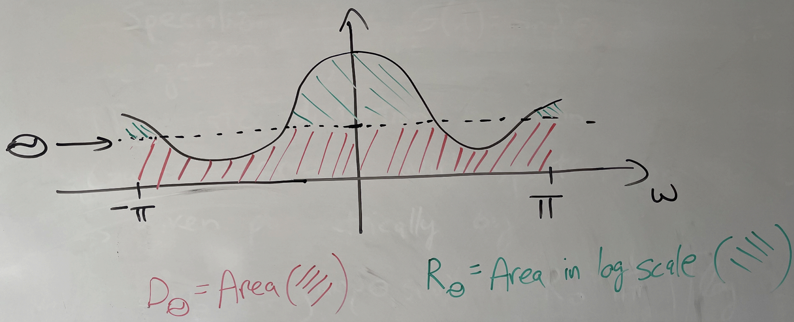

# Lossy compression theory

We continue with lossy compression and rate distortion function (Shannon's RD theory) and applications in current technologies. 

We'll start with things that seem unrelated but we'll bring it all together towards the end. We'll only touch on some of the topics, but you can learn more in the references listed below and in EE 276.

We'll start with the rate distortion function and see how it carries over to sources with memory. We'll also look into Gaussian sources with memory. Finally, we'll look at the implications to transform coding which is commonly used today.

## Reminder from linear algebra:
Consider $Y = A X$ (matrix vector product)

Then the square of the Euclidean norm (sum of square of components), also denoting the energy in the signal is 
$$||Y||^2 = Y^T Y = X^T A^T A X$$

In particular, if $U$ is a unitary transformation, i.e., all rows and columns orthonormal vectors $U^T U = U U^T = I$, then we have 
$$Y = U X => ||Y||^2 = ||X||^2$$
This is called the Parseval's theorem which you might have seen for Fourier transform. In words, this says that the energy in transform domain matches the energy in the original.

If $Y_1 = U X_1$ and $Y_2 = U X_2$, then $||Y_1 - Y_2||^2 = ||X_1-X_2||^2$. That is to say, unitary transformation preserves Euclidean distances between points.

## Lossy compression recap

Recall the setting of lossy compression where the information is lossily compressed into an index (equivalently a bit stream representing the index). The decoder attempts to produce a reconstruction of the original information.

The two metrics for lossy compression are:
- $rate = {{log N} \over k}$ bits/source component
- distortion $d(X^k, \hat{X}^k) = {1 \over k} \sum_{i=1}^k d(X_i,\hat{X}_i)$ [single letter distortion - distortion between k-tuples defined in terms of distortion between components]

## Transform coding

**Notation:** we denote $X^k = (X_1,\dots,X_k)$ as $\underline{X}$ which can be thought of as a column vector.

Here we simply work with an arbitrary transform $T$, with the only requirement being that $T$ is invertible and we are able to efficiently compute $T$ and $T^{-1}$. In this framework, we simply apply our usual lossy encoding in the transform domain rather than in the original domain.

In particular, when $T (X) = U X$ for some some unitary $U$ (e.g., Fourier transform, wavelet transform). Then
$$||Y-\hat{Y}||^2 = ||X-\hat{X}||^2 $$
This corresponds to the squared-error distortion. Any lossy compression you do on $Y$, you get the same square error distortion for the original sequence $X$ as for the $Y$. 

Why work in the transform domain? Often in the transform domain, data is simpler to model, e.g., we can construct transform in a way that the statistics of $Y$ are simpler or we get sparsity. Then we can appropriately design lossy compressor to exploit the structure

Nowadays people even go beyond linear transforms, e.g., learnt transforms using deep learning models.
Can even go to a vector in a smaller dimensional space, e.g., in VAE based lossy encoders. This can allow doing very simple forms of lossy compression in the transform domain.

## Shannon's theorem recap

For "memoryless sources" ($X_i$ are iid ~$X$), 

$$R(D) = min_{E[d(X,\hat{X})] <= D} I(X; \hat{X})$$

We sometimes write $R(X,D)$ to represent this quantity $R(D)$ when we want to be explicit about the source in question.

### Beyond memoryless sources

Consider source $X^n$, reconstruction $\hat{X}^n$. Then, 

$$R(X^n, D) = min_{E[d(X^n, \hat{X}^n)] \leq D} {1\over n} I(X^n; \hat{X}^n)$$

Just like $R(X,D)$ was the analog of entropy of $X$, $R(X^n, D)$ is the analog of entropy of the n-tuple.

Now assume we are working with a process $\mathbf{X} = X_1,X_2,X_3,...$ which is stationary. Then we can define $R(\mathbf{X}, D) = \lim_{n\rightarrow \infty} R(X^n, D)$. Similar to our study of entropy rate, we can show that this limit exists.

Shannon's theorem for lossy compression carries over to generality. That is, the best you can do for stationary processes in the limit of encoding arbitrarily many symbols in a block is $R(\mathbf{X}, D)$.

## Rate distortion for Gaussian sources

**Note:** For the remainder of this discussion, we'll stick to square error distortion.

Why work with Gaussian sources? It is a good worst case assumption if you only know the first and second order statistics about your source. This holds both for estimation and lossy compression.

For $X ~ N(0,\sigma^2)$, denote $R(X,D)$ by $R_G(\sigma^2, D)$.

Recall from last lecture that $R_G(\sigma^2, D) = {1\over 2} \log {\sigma^2 \over D}$ for $D < \sigma^2$ (above it is just $0$).

We can compactly write this as $R_G(\sigma^2, D) = [1/2 \log {\sigma^2 \over D}]_+$, where $[x]_+ = max{0,x}$. This is shown in the figure below.

Similarly for $X_1 \sim N(0, \sigma_1^2)$, $X_2 \sim N(0, \sigma_2^2)$ independent, denote $R(X^2, D)$ by $R_G\left(\begin{bmatrix}\sigma_1^2\\ \sigma_2^2\end{bmatrix} , D\right)$.

It can be shown that
$$R_G\left(\begin{bmatrix}\sigma_1^2\\ \sigma_2^2\end{bmatrix} , D\right) = min_{{1\over 2} (D_1+D_2)\leq D} {1\over 2} [R_G(\sigma_1^2, D_1) + R_G(\sigma_1^2, D_2)]$$
Another way to write this is
$$R_G\left(\begin{bmatrix}\sigma_1^2\\ \sigma_2^2\end{bmatrix} , D\right) =min_{\frac{1}{2} (D_1+D_2)\leq D}\  {1\over 2} \left[({1\over 2} \log \frac{\sigma_1^2}{D_1})_+ + ({1\over 2} \log \frac{\sigma_2^2}{D_2})_+\right]$$

Intuition: the result is actually quite simple - the solution is just greedily optimizing the $X_1$ and $X_2$ case (decoupled), and finding the optimal splitting of the distortion between $X_1$ and $X_2$.

Using convex optimization we can show that the minimum is achieved by a reverse water filling scheme, which is expressed in equation as follows:

For a given parameter $\theta$, a point on the optimal rate distortion curve is achieved by setting

- $D_i = \min \{\theta, \sigma_i^2\}$ for $i = 1,2$
- $D = {1\over 2} (D_1+D_2)$

And the rate given by 
$${1\over 2} \left[({1\over 2} \log \frac{\sigma_1^2}{D_1})_+ + ({1\over 2} \log \frac{\sigma_2^2}{D_2})_+\right]$$

This can be expressed in figures as follows (assuming without loss of generality that $\sigma_1^2 < \sigma_2^2$):

When $D$ is smaller than both $\sigma_1^2$ and $\sigma_2^2$, we choose both $D_1$ and $D_2$ to be equal to $D$ ($\theta=D$ in this case). We assign equal distortion to the two components, and higher rate for the component with higher variance.

When $D$ exceeds $\sigma_1^2$ but is below $\frac{1}{2}(\sigma_1^2 + \sigma_2^2)$, we set $D_1$ to be $\sigma_1^2$, and choose $D_2$ such that the average distortion is $D$. The idea is that setting $D_1$ higher than $\sigma_1^2$ doesn't make sense since the rate is already $0$ for that component.

When $D$ is equal to $\frac{1}{2}(\sigma_1^2 + \sigma_2^2)$ we can just set $D_1 = \sigma_1^2$ and $D_2 = \sigma_2^2$. Here the rate is $0$ for both components!

This generalizes beyond $2$ components. For $X_1, X_2, ... ,X_n$ independent with $X_i \sim N(0,\sigma_i^2)$, we define $R_G(\underline{\sigma^2}, D)$ analogously, and can very similarly show that $$R_G(\underline{\sigma^2}, D) = min_{{1\over n} \sum D_i \leq D} {1\over n} \left[{1\over 2} log {\sigma^2 \over D_i} \right]_+$$.

Similar to before, the minimum is given by $D_\theta = {1 \over n} \sum_{i=1}^n \min \{\theta, \sigma_i^2\}$, $R_\theta = {1 \over n} \sum_{i=1}^n [{1\over 2} \log {\sigma_i^2\over D_i}]$.

## Rate-distortion for stationary Gaussian source
Going back to a process $X^n$ zero mean Gaussian, then for any unitary transformation $U$ if $Y^n =U X^n$ then we can show $R(X^n, D) = R(Y^n, D)$ [since the distortion is the same in both domains]. Recall that by using the transformation it's possible to go from a scheme for compressing $X^n$ to a scheme for compressing $Y^n$ (and vice versa) without any change in the distortion.

Therefore we can take the diagonalizing unitary matrix which converts $X^n$ to a $Y^n$ such that $Y^n$ has independent components. The variances of $Y^n$ will be the eigenvalues of the covariance matrix.

Thus, we have

$$R(X^n, D) = R_G ((\lambda_1, \dots, \lambda_n), D)$$
 where the $\lambda_i$'s are the eigenvalues of the covariance matix of $X^n$.

When $X^n$ are the first $n$ components of a stationary Gaussian process $\mathbf{X}$ with covariance matrix $\Phi_n = \{\phi_{|i-j|}\}$ for $1\leq i \leq n$ and $1\leq j \leq n$, with $\phi_{k} = Cov(X_i,X_{i-k})$. Then we have
$$R(X^n, D) = R_G(\overrightarrow{\lambda}^n,D)$$
where $\overrightarrow{\lambda}^n$ is the vector of eigenvalues of $\Phi_n$.

Now, we use a theorem to show a profound result for Gaussian processes.

> **Theorem (Toeplitz distribution)**
> Let $S(\omega) = \sum_{k=-\infty}^{\infty} \phi_k e^{-j\omega k}$ be the spectral density of $\mathbf{X}$ and $G$ be a continuous function. Then
> $$\lim_{n\rightarrow \infty} \frac{1}{n}\sum_{i=1}^n G(\lambda_i^{(n)}) = \frac{1}{2\pi}\int_{-\pi}^{\pi} G(S(\omega) d\omega$$

Specializing this theorem to $G(\lambda)= \min\{\theta,\lambda\}$ and to $G(\lambda)= \left[\frac{1}{2}\log\frac{\lambda}{\theta}\right]_+$, we get

> The rate distortion function of a stationary Gaussian process with spectral density $S(\omega)$ is given parametrically by 
> $$D_{\theta} = \frac{1}{2\pi}\int_{-\pi}^{\pi} \min\{\theta,S(\omega)\} d\omega$$
> $$R_{\theta} = \frac{1}{4\pi}\int_{-\pi}^{\pi} \left[\log\frac{S(\omega)}{\theta}\right]_+ d\omega$$

This is shown in the figure below, suggesting that the reverse water-filling idea extends to Gaussian processes once we transform it to the continuous spectral domain! This gives us motivation for using working in the Fourier transform domain!

Finally, for $D \leq \min_{\omega} S(\omega)$, we can show that $$R(D) = \left[\frac{1}{2} \log \frac{\sigma^2}{D}\right]$$
where $\sigma^2$ is the variance of the innovations of $\mathbf{X}$. This can be used to justify predictive coding ideas. 

## Reference
For more details on this, you can read the survey paper "Lossy source coding" by Berger and Gibson available at [https://ieeexplore.ieee.org/document/720552](https://ieeexplore.ieee.org/document/720552). 