# Quiz Problems (2023)

Here are the quiz problems from the [2023 iteration of the course](https://stanforddatacompressionclass.github.io/Fall23/). Solutions for most of these are discussed in the lectures following the quiz (videos linked in the course website). Solutions for quiz 11, 16 and 17 are provided along with the questions below.

1. [Quiz 1 (Lossless Data Compression Basics)](#quiz-1-lossless-data-compression-basics)
2. [Quiz 2 (Prefix Free Codes)](#quiz-2-prefix-free-codes)
3. [Quiz 3 (Kraft Inequality, Entropy)](#quiz-3-kraft-inequality-entropy)
4. [Quiz 4 (Huffman Codes)](#quiz-4-huffman-codes)
5. [Quiz 5 (Asymptotic Equipartition Property)](#quiz-5-asymptotic-equipartition-property)
6. [Quiz 6 (Arithmetic Coding)](#quiz-6-arithmetic-coding)
7. [Quiz 7 (Asymmetric Numeral Systems)](#quiz-7-asymmetric-numeral-systems)
8. [Quiz 8 (Beyond IID distributions: Conditional entropy)](#quiz-8-beyond-iid-distributions-conditional-entropy)
9. [Quiz 9 (Context-based AC & LLM Compression)](#quiz-9-context-based-ac--llm-compression)
10. [Quiz 10 (LZ and Universal Compression)](#quiz-10-lz-and-universal-compression)
11. [Quiz 11 (Lossy Compression Basics; Quantization)](#quiz-11-lossy-compression-basics-quantization)
12. [Quiz 12 (Mutual Information; Rate-Distortion Function)](#quiz-12-mutual-information-rate-distortion-function)
13. [Quiz 13 (Gaussian RD, Water-Filling Intuition; Transform Coding)](#quiz-13-gaussian-rd-water-filling-intuition-transform-coding)
14. [Quiz 14 (Transform Coding in real-life: image, audio, etc.)](#quiz-14-transform-coding-in-real-life-image-audio-etc)
15. [Quiz 15 (Image Compression: JPEG, BPG)](#quiz-15-image-compression-jpeg-bpg)
16. [Quiz 16 (Learnt Image Compression)](#quiz-16-learnt-image-compression)
17. [Quiz 17 (Humans and Compression)](#quiz-17-humans-and-compression)

---

## Quiz 1 (Lossless Data Compression Basics)

### Q1 (3 points)

We want to design fixed length codes for an alphabet of size 9.

#### Q1.1 (1 point)

What is the length in bits/symbol for such a code?

#### Q1.2 (1 point)

You observe that there is an overhead above due to 9 not being a power of 2. To partially circumvent this, you decide to encode pairs of symbols together, hence effectively working with an alphabet of size 81. What is the length in bits/symbol for a fixed length code applied on blocks of 2 symbols?

#### Q1.3 (1 point)

Now the alphabet size is 81 because we will be encoding pairs of symbols together, so the length in bits/block is $\lceil{\log_2(81)\rceil} = 7$. However, we are encoding blocks of 2 symbols, so the length in bits/symbol is $\lceil{\log_2(81)\rceil} / 2 = 3.5$. Did working in blocks of 2 give a better compression ratio?

( ) Yes

( ) No

### Q2 (1 point)

Given a random sequence $X = {x_1, x_2, \ldots, x_n}$ sampled from probability distribution $P(A)=0.5, P(B) = 0.3, P(C) = 0.2$, and the code below, compute the expected code length $E[l(X)]$ in bits/symbol.

|Symbol|Codeword|
|------|--------|
|A|`0`|
|B|`01`|
|C|`11`|

## Quiz 2 (Prefix Free Codes)

### Q1 (3 points)

Consider the source with alphabet $\mathcal{X} = \{A,B,C,D,E\}$ and probability distribution though $P(A)=P(B)=P(C)=0.25, P(D)=0.13, P(E)=0.12$. We use a prefix code with codeword lengths $l(x) = \lceil \log_2 \frac{1}{P(x)}\rceil$, e.g., the construction we saw in class.

#### Q1.1 (1 point)

Provide the codewords for such a code. Note that your answer need not be unique, just ensure the code is prefix-free and satisfies the lengths above.

#### Q1.2 (1 point)

Compute the expected code length for this code.

#### Q1.3 (1 point)

Come up with a prefix code that has a lower expected code length than the one above. Compute the expected length for your code.

### Q2 (3 points)

For each of the codes below, is it prefix free?

#### Q2.1 (1 point)

|Symbol|Codeword|
|------|--------|
|A|`00`|
|B|`01`|
|C|`10`|
|D|`11`|
|E|`110`|

( ) Yes

( ) No

#### Q2.2 (1 point)

|Symbol|Codeword|
|------|--------|
|A|`001`|
|B|`011`|
|C|`100`|
|D|`111`|
|E|`110`|

( ) Yes

( ) No

#### Q2.3 (1 point)

|Symbol| Codeword |
|------|----------|
|A| `00`     |
|B| `00`     |
|C| `10`     |
|D| `111`    |
|E| `110`    |

( ) Yes

( ) No

## Quiz 3 (Kraft Inequality, Entropy)

### Q1 (5 points)

Recall that a random variable `X` defined on a binary alphabet $\{0,1\}$ is $Ber(p), p \in [0,1]$ if $P(1) = p, P(0) = 1 - p$.

#### Q1.1 (1 point)

What is the entropy of random variable $X$, i.e. $H(X) = H(Ber(p)) = $

( ) $p\log_2(\frac{1}{1-p})+p\log_2\frac{1}{p}$

( ) $p\log_2{\frac{1}{p}}$

( ) $p\log_2{\frac{1}{p}} + (1-p)\log_2(\frac{1}{1-p})$

#### Q1.2 (1 point)

What is the KL-divergence between distributions $Ber(p)$ and $Ber(q)$, $D_{KL}(Ber(p)||Ber(q)) = $

( ) $p \log_2 \frac{p}{q} + (1-p) \log_2 \frac{1-p}{1-q}$

( ) $q \log_2 \frac{p}{q} + (1-q) \log_2 \frac{1-p}{1-q}$

( ) $(1-p) \log_2 \frac{p}{q} + p \log_2 \frac{1-p}{1-q}$

#### Q1.3 (1 point)

$D_{KL}(Ber(0.3)||Ber(0.7)) = $

#### Q1.4 (1 point)

What is $max_{p\in [0,1], q \in [0,1]} D_{KL}(Ber(p)||Ber(q))$?

**Hint:** try setting $p$ or $q$ to $0$.

( ) 1.0

( ) $\pi$

( ) $H(Ber(0.5))$

( ) $\infty$

#### Q1.5 (1 point)

Is $D_{KL}(Ber(p)||Ber(q)) = D_{KL}(Ber(q)||Ber(p))$ for general $p$ and $q$?

( ) Yes

( ) No

### Q2 (3 points)
Consider a binary source `X` with $P(0)=0.999, P(1)=0.001$.

#### Q2.1 (1 point)

If we design a Shannon tree code for this source (i.e. the construction we saw in the class), what is the expected code length $E[l(X)]$?

#### Q2.2 (1 point)

What is the entropy $H(X)$ of this source?

#### Q2.3 (1 point)

How suboptimal is Shannon code in this case? Report $E[l(X)]/H(X)$.

## Quiz 4 (Huffman Codes)

### Q1: Huffman codes on Bernoulli random variables (4 points)

Recall that a $Ber(p), p \in [0,1]$ random variable is defined on a binary alphabet $\{0,1\}$ such that $P(1) = p$.

#### Q1.1 (1 point)

What is the Huffman Code for $Ber(0.5)$?

#### Q1.2 (1 point)

What is the Huffman Code for $Ber(0.9)$?

#### Q1.3 (1 point)

State True or False:
Using the above Huffman code is the best you can do to encode a $Ber(0.5)$ source?

( ) True

( ) False

#### Q1.4 (1 point)

State True or False:
Using the above Huffman code is the best you can do to encode a $Ber(0.9)$ source?

( ) True

( ) False

### Q2: Huffman codes on particular realization of a source (4 points)

Assume the following alphabet $\mathcal{X} = \{A, B, C, D\}$ with corresponding probabilities of occurrence for these symbols being $P = \{0.25, 0.25, 0.25, 0.25\}$.

Before Huffman solved the optimal prefix-free coding problem, Mahatma Gandhi (no relation!) also came up with another code for these symbols (let's call them Gandhi codes):
- A -> 0
- B -> 10
- C -> 110
- D -> 111

Your friend argues Gandhi's code is better than Huffman's code. For this they generate a random instance of this source and get the symbols $AAABBBCD$.

#### Q2.1 (1 point)

What is the total length of communicated bitstream for the above random instance using Gandhi codes?

#### Q2.2 (1 point)
What is the total length of communicated bitstream for the above random instance using Huffman codes for the given source distribution?

#### Q2.3 (1 point)

True or False:
Gandhi codes are optimal code for this source.

( ) True

( ) False

#### Q2.4 (1 point)

True or False:
Gandhi codes are optimal if you had to communicate this particular instance of the source.

( ) True

( ) False

## Quiz 5 (Asymptotic Equipartition Property)

### Q1: Typical Set Size (2 points)

Consider a binary source with $P(0)=P(1)=0.5$. What is the size of the typical set $A^{(n)}$, in terms of $n$?

### Q2: KL Divergence (3 points)

Consider a source $P=Ber(0.5)$. Zoro knows the distribution of this source and designs a per-symbol Huffman code for $P=Ber(0.5)$ to encode a sequence of symbols obtained using this source. However, Luffy doesn't know the distribution of this source and encodes it using a per-symbol Huffman code assuming that the sequence of symbols came from $Q=Ber(0.25)$.

#### Q2.1 (1 point)

How many extra number of bits in expectation (per-symbol) does Luffy need over Zoro to encode a sequence from the above source $P$?

#### Q2.2 (1 point)

What is the KL divergence $D(P||Q)$ between distributions $P$ and $Q$ specified above?

#### Q2.3 (1 point)

In the class we learnt that KL divergence is an indicator of the excess code-length for mismatched codes. How do you explain that the two answers above do not match?

## Quiz 6 (Arithmetic Coding)

### Q1: Code-length vs Code Value (2 points)

Consider a Bernoulli random variable (we have been seeing them a lot in the quizzes so far :)) - $Ber(p)$ where $P(A)=p$ and $P(B)=(1-p)$. Consider sequence of symbols `AB` and `BA`, to be encoded using Arithmetic Coding (assume idealized version where the codelength is equal to $\log_2(\frac{1}{P(X^n)})$).

#### Q1.1 (1 point)

`AB` and `BA` have the same code-length.

( ) True

( ) False

#### Q1.2 (1 point)

`AB` and `BA` have the same output codeword.

( ) True

( ) False

### Q2: Arithmetic Decoder (3 points)

Assume a probability distribution over symbols $\mathcal{X}=\{A, B, C\}$ with respective probabilities $p(A) = 0.5$, $p(B) = 0.25$, $p(C) = 0.25$. An arithmetic decoder receives as input bitstream `100111` for an input of length 3. What is the decoded sequence?

## Quiz 7 (Asymmetric Numeral Systems)

### Q1: rANS encoding (4 points)

Recall the rANS encoding procedure as discussed in class (For reference you can look at Slides 44 and 45 in lecture slides on website to see summary of encoding and decoding steps: https://stanforddatacompressionclass.github.io/Fall23/static_files/L7.pdf)

In this question, we will ask you to encode and decode a sequence. We will be using same symbols as discussed in class for ease.

Say $\mathcal{X} = \{0, 1, 2\}$ be our symbols with probabilities $\{3/8, 3/8, 2/8\}$ respectively. You want to encode stream of symbols `2,0,1,0` using rANS.

#### Q1.1 (1 point)

What's the state value (`x`) in rANS after symbol `2`?

#### Q1.2 (1 point)

What's the state value (`x`) in rANS after encoding symbols `2,0`?

#### Q1.3 (1 point)
What's the final state value (`x`) at the end of encoding stream `2,0,1,0`?

### Q2: rANS decoding (4 points)

Now we will decode using rANS. We have the same setup as before. Now your decoder knows that the number of symbols are `4` and the final state your decoder received is `117`.

#### Q2.1 (1 point)

What is the value of `block_id` after running the `decode_block` for first time?

#### Q2.2 (1 point)

What is the value of `slot` after running the `decode_block` for first time?

#### Q2.3 (1 point)

What is the first decoded symbol? Note that this corresponds to the last encoded symbol since rANS decoding proceeds in reverse.

#### Q2.4 (1 point)

What is the updated state value (`x`) after first step?

### Q3: When to use ANS? (2 points)

In which of the following scenarios would you consider using ANS as opposed to Huffman or Arithmetic coding? Select all that apply.

[ ] Your application requires the best compression ratio and you are willing to sacrifice encoding/decoding speeds.

[ ] Your application requires extremely fast encoding/decoding and you are willing to sacrifice compression ratio.

[ ] Your application requires adaptive decoding (i.e., the encoder and decoder need to build a model as they go through the data).

[ ] You care about achieving close-to-optimal compression but also want good speed.

[ ] You are working with a modern processor and want to exploit parallel processing to get higher speeds, while still achieving close-to-optimal compression.

## Quiz 8 (Beyond IID distributions: Conditional entropy)

### Q1: Entropy for Markov Chain (5 points)

Recall the Markov chain setting we covered in class.

Now, we change it to the following setting

$$ U_1 \sim Ber(0.5)$$
$$ P(U_{i+1} = 1| U_i = 0) = 1$$
$$ P(U_{i+1} = 0| U_i = 0) = 0$$
$$ P(U_{i+1} = 1| U_i = 1) = 0.5$$
$$ P(U_{i+1} = 0| U_i = 1) = 0.5$$

#### Q1.1 (1 point)

What is $H(U_1)$?

#### Q1.2 (1 point)

What is $H(U_2)$?

#### Q1.3 (1 point)

What is $H(U_2 | U_1)$?

#### Q1.4 (1 point)

Is this process stationary?

( ) Yes

( ) No

#### Q1.5 (1 point)

Now consider the chain with the same transition probabilities but the initial distribution $P(U_1)$ modified to the stationary distribution of this Markov Chain which is $Ber(2/3)$, i.e. $P(U_1=0) = 1/3$ and $P(U_1=1) = 2/3$.

Calculate the entropy rate $H(\mathbf{U})$ of this stationary Markov source.

## Quiz 9 (Context-based AC & LLM Compression)

### Q1: Select the best compressor (2 points)

Which lossless compressor is most suitable under following situations:

#### Q1.1 (1 point)

You know that the data is roughly 2nd order Markov but do not know the transition probabilities.

( ) context-based arithmetic coding

( ) context-based adaptive arithmetic coding

#### Q1.2 (1 point)

You know that the data is 3rd order Markov and know the exact distribution.

( ) context-based arithmetic coding

( ) context-based adaptive arithmetic coding

### Q2: First order adaptive arithmetic coding (3 points)
Consider first order adaptive arithmetic coding with $\mathcal{X} = \{A,B,C\}$. The initial counts are set to 1, i.e., $c(A,A)=c(A,B)=\dots=c(C,C)=1$. 

You are encoding $X_1X_2X_3=BAB$, and assume that for encoding the first symbol $X_1=B$ you take $X_0=A$ (padding). Thus, after encoding $X_1$, you will have $c(A,B)=2$ and the rest of the counts still $1$. Let $\hat{P}$ be the probability model for this predictor.

#### Q2.1 (1 point)

What is $\hat{P}(X_2=A|X_0X_1=AB)$?

#### Q2.2 (1 point)

What is $\hat{P}(X_3=B|X_0X_1X_2=ABA)$?

#### Q2.3 (1 point)

Assuming arithmetic coding uses exactly $\sum_{i} \log_2 \frac{1}{\hat{P}(X_i|X_0,\dots,X_{i-1})}$, what is the encoded size for the sequence $X_1X_2X_3=BAB$?

## Quiz 10 (LZ and Universal Compression)

### Q1: LZ77 Decoder (3 points)

Your decoder receives the following output from a LZ77 implementation. Note that your decoder doesn't know the parser which was used to generate this table (and in-fact you can show it's not the same as we have seen in the class) -- e.g., the decoder doesn't know minimum match-length used during generation of this table. In this question we will decode this table step-by-step.

Table:

| Unmatched Literals | Match Length | Match Offset |
|--------------------|--------------|--------------|
|   AABBB            |  4           |  1           |
|    -               |  5           |  9           |
|    CDCD            |  2           |  2           |

#### Q1.1 (1 point)

What is the output string after parsing the first row? Your answer should be the symbols which the decoder outputs (e.g., ABABABABA).

#### Q1.2 (1 point)

What is the output string after parsing the second row?

#### Q1.3 (1 point)

What is the output string after parsing the third row?

### Q2: LZ77 Encoding (3 points)

You realize that Kedar's last name (`TATWAWADI`) is a very good example to try LZ77 parsing as covered in class. Pulkit tried to do the LZ77 parsing and obtained the following table. Fill the cells with missing elements.

Partial Table:

| Unmatched Literals | Match Length | Match Offset |
|--------------------|--------------|--------------|
|   TA               |   1          |  `X1`        |
|   W                |   `X2`       |  3           |
|    -               |   2          |  2           |
|    `X3`            |   -          |  -           |

#### Q2.1 (1 point)

What is match offset `X1`?

#### Q2.2 (1 point)

What is match length `X2`?

#### Q2.3 (1 point)

What are the unmatched literals `X3`?

### Q3 (2 points)

Consider an English text. Also consider a reversibly transformed version where each byte is replaced with itself plus one. So A becomes B, B becomes C and so on.

#### Q3.1 (1 point)

Zstd would perform similarly on both the original text and the transformed version.

( ) True

( ) False

#### Q3.2 (1 point)

A LLM-based compressor trained on English would perform similarly on both the original text and the transformed version.

( ) True

( ) False

### Q4 (1 point)

Your company produces a lot of data of a particular kind and you are asked to find ways to efficiently compress it to save on bandwidth and storage costs. Which of these is a good approach to go about this?

( ) Use CMIX since your company deserves the best possible compression irrespective of the compute costs.

( ) Use gzip because LZ77 is an universal algorithm and so it has to be the best compressor for every occasion.

( ) Make a statistically accurate model of your data, design a predictor, and then use a context-based arithmetic coder.

( ) Understand the application requirements, try existing compressors like zstd and then evaluate whether there are benefits to create a domain specific compressor based on an approximate model for the data.

## Quiz 11 (Lossy Compression Basics; Quantization)

### Q1: Quantization of a Uniform RV (5 points)

You are given samples from a Uniform random variable $U \sim\text{Unif}[0, 1]$. We will quantize samples from the random variable $U$ under mean-square error (MSE) distortion criteria in the following questions.

#### Q1.1: Optimal Scalar One-bit Quantizer (1 point)

What are the optimal quantization levels (intervals and reconstruction points) for a scalar one-bit quantizer under MSE distortion?

#### Q1.2: Distortion under scalar quantizer (1 point)

What is the average distortion per-symbol under the optimal scalar quantization scheme described above?

#### Q1.3: Vector quantization (1 point)

Now we will use a 2D vector quantizer under MSE distortion which still uses one-bit per symbol. This quantizer takes 2 symbols at a time, represents them as a 2D vector and then uses the optimal 2-bit quantizer.

Which of the following vector quantizer is best in terms of distortion under MSE? Choose all options which have the same lowest expected MSE distortion.

[ ] ${(0.125,0.5), (0.375,0.5), (0.625,0.5), (0.875,0.5)}$

[ ] ${(0.5,0.125), (0.5,0.375), (0.5,0.625), (0.5,0.875)}$

[ ] ${(0.25, 0.25), (0.25,0.75), (0.75,0.25), (0.75,0.75)}$

#### Q1.4: Which is better? (1 point)

Which of the two -- scalar or the best 2D quantizer above, is better for lossy compression of uniformly distributed data?
Hint: Remember to compare with respect to bits per symbol.

( ) Scalar

( ) 2D-Vector

( ) Both are equivalent

### Solutions

Quiz 11 solutions were not covered in lecture, so here they are!

1.1

Solution: For a one-bit quantizer, we need to divide the interval $[0,1]$ into two parts and assign a reconstruction point to each. By symmetry, we can argue that the two intervals must be $[0,0.5]$ and $[0.5,1]$. Now for the reconstruction points, we need to find a point that minimizes the $\int_0^{0.5} (x-\hat{x})^2 dx$ for the first interval which is simply the mean value $0.25$ (can verify that computing the integral and then finding the minima - in general for a different distortion we are looking for the "median" corresponding to that distortion, for MSE the median is the mean!). Similarly for the second interval the reconstruction point will be $0.75$.

$X<1/2$, $X>1/2$ Reconstruction points = ${0.25, 0.75}$

1.2

Solution: Let us first compute the integral $\int_0^{\Delta} (x-\frac{\Delta}{2})^2 dx$ which evaluates to $\frac{\Delta^3}{12}$. Now for our case the distortion will be given by the squared error across the range of $x$ from $[0,1]$ (note that the pdf is simply equal to $1$ in this whole range). We can split into two intervals according to the reconstruction point and get $$\int_0^{0.5} (x-0.25)^2 dx + \int_{0.5}^{1} (x-0.75)^2 dx$$ Reusing the result we just computed with $\Delta = 0.5$, we get the answer as $$2\times \frac{0.5^3}{12} \approx 0.0208$$

1.3

[ ] ${(0.125,0.5), (0.375,0.5), (0.625,0.5), (0.875,0.5)}$ 

[ ] ${(0.5,0.125), (0.5,0.375), (0.5,0.625), (0.5,0.875)}$ 

[X] ${(0.25, 0.25), (0.25,0.75), (0.75,0.25), (0.75,0.75)}$

Solution: Here we are trading off between assiging two intervals to each dimension vs. providing all four intervals to a single dimension. We can reuse the result from above for this: $$\int_0^{\Delta} (x-\frac{\Delta}{2})^2 dx = \frac{\Delta^3}{12}$$

A single interval (zero bits) would have $\Delta = 1$ giving us $\frac{1}{12} \approx 0.083$. Two intervals (one bit) would give us $\Delta = 0.5$ giving us $2\times\frac{0.5^3}{12} \approx 0.0208$. Four intervals (two bits) would give us $\Delta = 0.25$ giving us $4\times\frac{0.25^3}{12} \approx 0.0052$.

Now we can see that using one bit for each dimension gives us the lowest sum because $0.0208+0.0208 < 0.083 + 0.0052$. Thus the correct option is the third one.

1.4

( ) Scalar

( ) 2D-Vector 

(X) Both are equivalent

Solution: Both are equivalent because the 2D quantizer we chose above effectively does optimal scalar quantization with one bit per dimension.

## Quiz 12 (Mutual Information; Rate-Distortion Function)

### Q1: Calculate Mutual Information (2 points)

You have been given following joint probability distribution table for $(X,Y)$ on binary alphabets:

| P(X=x,Y=y) |    y = 0     |    y = 1    |
|------------|--------------|-------------|
|   x = 0    |     0.5      |    0        |
|   x = 1    |     0.25     |   0.25      |

#### Q1.1: Joint Entropy (1 point)

Calculate the joint entropy $H(X,Y)$.

#### Q1.2: Mutual Information (1 point)

Calculate the mutual information $I(X;Y)$.

### Q2: Rate-Distortion (2 points)

Consider a uniformly distributed source on alphabet $\{0, 1, 2\}$.

You have been asked to lossily compress this source under MSE (mean square error) distortion and have been asked to calculate the rate distortion function $R(D)$ for a given distortion value $D$.

#### Q2.1 (1 point)

What is $R(D=0)$?

#### Q2.2 (1 point)

What is $R(D=1)$?

### Q3 (1 point)

For a $Ber(1/2)$ source with Hamming distortion, we saw in class that $R(D) = 1-H_b(D)$, where $H_b(p)$ is entropy of a binary random variable with probability $p$. Which of the following are correct?
(Choose all that apply)

[ ] There exists a scheme working on large block sizes achieving distortion D and rate < $1-H_b(D)$.

[ ] There exists a scheme working on large block sizes achieving distortion D and rate > $1-H_b(D)$.

[ ] There exists a scheme working on large block sizes achieving distortion D and rate arbitrarily close to $1-H_b(D)$.

[ ] There exists a scheme working on single symbols at a time (block size = 1) achieving distortion D and rate arbitrarily close to $1-H_b(D)$.

## Quiz 13 (Gaussian RD, Water-Filling Intuition; Transform Coding)

### Q1: Reverse water filling (3 points)

**Note**: The problem appears long, but it's mostly just a recap from class!

Recall the problem of compressing two independent Gaussian sources $X_1,X_2$ with means $0$ and variances $\sigma_1^2$ and $\sigma_2^2$. For the squared error distortion we saw in class, the rate distortion function is given by 

$$min_{\frac{1}{2} (D_1+D_2)\leq D}\  {1\over 2} [({1\over 2} \log \frac{\sigma_1^2}{D_1})_+ + ({1\over 2} \log \frac{\sigma_2^2}{D_2})_+]$$

where $(x)_+ = \max\{0,x\}$. 

The solution suggests we split the overall distortion between the two components and then use the optimal strategy for each component independently. 

We also saw in class that the optimal split into $D_1$ and $D_2$ is given by a reverse water filling idea, which is expressed in equation as follows:

For a given parameter $\theta$, a point on the optimal rate distortion curve is achieved by setting

$$D_i = min \{\theta, \sigma_i^2\}$$ for $i = 1,2$
$$D = {1\over 2} (D_1+D_2)$$

And the rate given by 
$${1\over 2} [({1\over 2} \log \frac{\sigma_1^2}{D_1})_+ + ({1\over 2} \log \frac{\sigma_2^2}{D_2})_+]$$

This can be expressed in figures as follows (assuming without loss of generality that $\sigma_1^2 < \sigma_2^2$):

When $D$ is smaller than both $\sigma_1^2$ and $\sigma_2^2$, we choose both $D_1$ and $D_2$ to be equal to $D$.
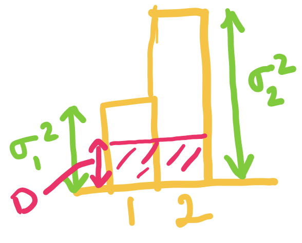

When $D$ exceeds $\sigma_1^2$ but is below $\frac{1}{2}(\sigma_1^2 + \sigma_2^2)$, we set $D_1$ to be $\sigma_1^2$, and choose $D_2$ such that the average distortion is $D$.
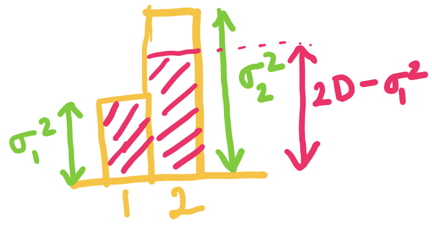

When $D$ is equal to $\frac{1}{2}(\sigma_1^2 + \sigma_2^2)$ we can just set $D_1 = \sigma_1^2$ and $D_2 = \sigma_2^2$.

Now consider a setting with $\sigma_1^2 = 1$ and $\sigma_2^2 = 3$.

#### Q1.1 (1 point)

At $D = 1.5$, what are the optimal values of $D_1$ and $D_2$:

( ) $D_1 = D_2 = 1$

( ) $D_1 = D_2 = 0.5$

( ) $D_1 = 1$, $D_2 = 3$

( ) $D_1 = 1$, $D_2 = 2$

#### Q1.2 (1 point)

At $D = 2$, what is the optimal rate

( ) $0$ bits/source component

( ) $1$ bits/source component

( ) $2$ bits/source component

( ) $3$ bits/source component

#### Q1.3 (1 point)

Which of the following is correct?

[ ] For $D$ below the two variances, we divide the distortions equally among the two components.

[ ] For $D$ below the two variances, we use a higher bitrate for the component with higher variance.

[ ] For $D$ between the two variances, we use zero bitrate for one of the component.

[ ] For $D$ between the two variances, we use zero bitrate for both of the components.

## Quiz 14 (Transform Coding in real-life: image, audio, etc.)

### Q1 (2 points)

#### Q1.1: Vector Quantization (1 point)

In which of the following cases do you expect vector quantization to improve the lossy compression performance?
(select all the correct options)

[ ] i.i.d. data compressed with scalar quantization

[ ] non-i.i.d. (correlated) data with scalar quantization

#### Q1.2: Transform Coding (1 point)

In which of the following cases do you expect transform coding to improve the lossy compression performance?
(select all the correct options)

[ ] i.i.d. data

[ ] non-i.i.d. (correlated) data

### Q2 (3 points)

Match the signals to their DCT!

#### Signal 1

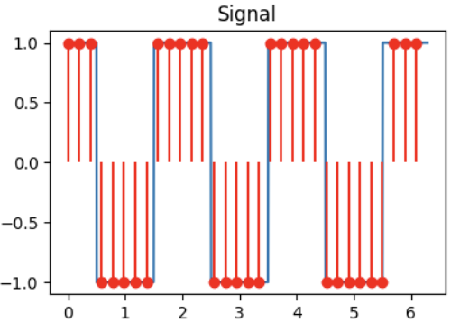

#### Signal 2

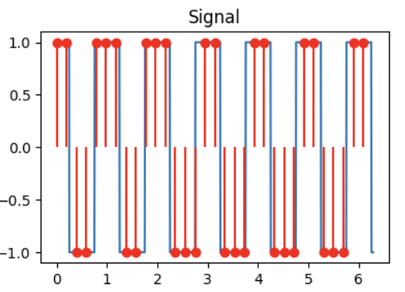

#### Signal 3

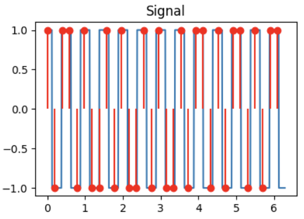

#### DCT A

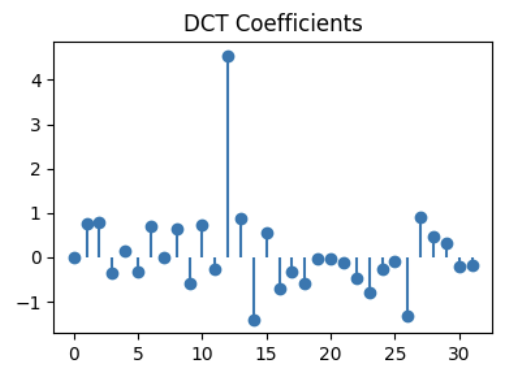

#### DCT B
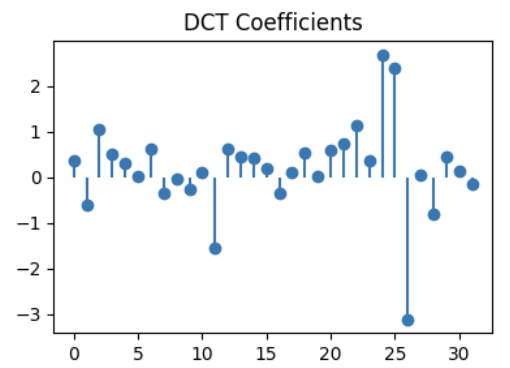

#### DCT C

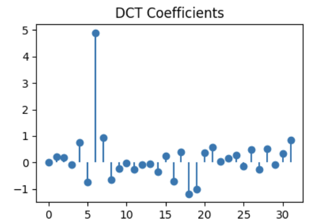

#### Q2.1 (1 point)

DCT for signal 1:

( ) DCT A

( ) DCT B

( ) DCT C

#### Q2.2 (1 point)

DCT for signal 2:

( ) DCT A

( ) DCT B

( ) DCT C

#### Q2.3 (1 point)

DCT for signal 3:

( ) DCT A

( ) DCT B

( ) DCT C

### Q3: DCT truncation (1 point)

For the signal shown above, we take the DCT and truncate (zero out) the 16 highest frequencies (out of 32 total components in the DCT). Identify the reconstructed signal obtained after performing the inverse DCT.

( ) A

( ) B

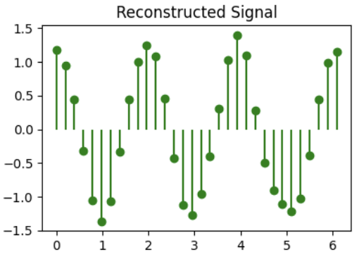

( ) C

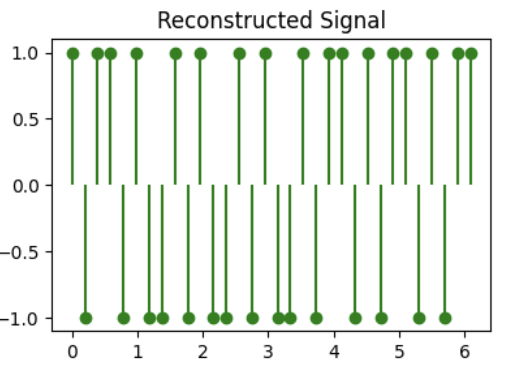

## Quiz 15 (Image Compression: JPEG, BPG)

### Q1: Image Compression (4 points)

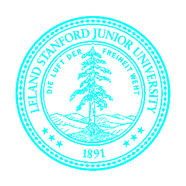

Before the next big game, facing an inevitable loss, Berkeley students hacked into Stanford website and tried to mutilate the Stanford logo into a Berkeley blue color version (but did a bad job at it). The mutilated logo is shown as an image above.

This image is of dimensions $370\times370$, and contains $4$ channels (RGBA) instead of $3$ channels for colors we saw in class. The fourth channel is alpha channel which tells the transparency of the image. The bit-depth of this image is $8$, which basically implies that every pixel in each channel is 8 bits.

This file can be compressed losslessly using PNG to $\sim14.3~\text{KB}$ (kilo-bytes).

#### Q1.1 (1 point)

What's the expected raw size of this image? Leave you answer in KB (note: Kilo Bytes not Kilo bits)

#### Q1.2 (1 point)
In this image you can see that there are basically just two colors (white and a bad version of Berkeley blue color). What will be the expected image size if we use only 2 colors to compress this image in KB? Note, we assume that you still need 8 bits for the alpha channel.

#### Q1.3 (1 point)

Now you also see that along with having just 2 colors, the image also has only two levels of transparency (perfectly transparent and perfectly opaque). Using these properties what will be the expected image size in KB?

#### Q1.4 (1 point)

PNG seems to perform better than even using 1 bit for color and 1 bit for alpha!

Give one reason why this might be the case.
Note: there are many reasons! But we are only asking for one so feel free to choose.

### Q2: JPEE274G Compressor (4 points)

EE274 students decided to come together and form JPEE274G (Joint Photographers EE 274 Group) coming up with an image compressor with the same name. Help them make the design decisions.

#### Q2.1 (1 point)

Riding on the compute revolution, JPEE274G decided to go for $64 \times 64$ block size instead of $8\times8$. 

Suppose you have the same image at resolution $480\times480$, $720\times720$, $1080\times1080$

In which of the following case do we expect increasing the block-size help the the most.

( ) $480\times480$

( ) $720\times720$

( ) $1080\times1080$

#### Q2.2 (1 point)

JPEE274G decided to use prediction of blocks based on previously encoded neighbors. In which of the following two images do we expect the prediction to help the most.

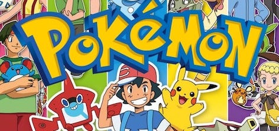

( ) Charizard (the one with the orange cranky being)

( ) Assorted Pokémons (the one with Pokemon written in it)

### Q3: Predictive Coding (2 points)

You find a source where consecutive values are very close, so you decide to do predictive lossy compression. Encoder works in following fashion: it first transmits the first symbol and after that it quantizes the error based on prediction from last encoded symbol. The quantized prediction error is transmitted. 

Formally, suppose $X_1,X_2,\dots$ is your original sequence and $\hat{X}_1,\hat{X}_2,\dots$ is the reconstruction sequence. Then we have:

- for the first symbol the reconstruction $\hat{X}_1 = X_1$, i.e., you are losslessly encoding the first symbol
- prediction for $X_n$ is simply $\hat{X}_{n-1}$
- prediction error is $e_n = X_n-\hat{X}_{n-1}$
- quantized prediction error is $\hat{e}_n$
- reconstruction for $X_n$ is $\hat{X}_n = \hat{X}_{n-1} + \hat{e}_n$
- the transmitted sequence is $X_1, \hat{e}_2, \hat{e}_3, \dots$

For this question, assume that the quantization for the prediction error is simply integer floor.

Example encoding for source sequence: $0.4, 1.1, 1.5, 0.9, 2.1, 2.9$

|$n$|$\hat{X}_{n-1}$|$X_n$|$e_n$|$\hat{e}_n$|
|-----|-----------------|-------|-------|-------------|
|    1|                -|    0.4|      -|            -|
|    2|              0.4|    1.1|    0.7|            0|
|    3|              0.4|    1.5|    1.1|            1|
|    4|              1.4|    0.9|   -0.5|           -1|
|    5|              0.4|    2.1|    1.7|            1|
|    6|              1.4|    2.9|    1.5|            1|
|    7|              2.4|      -|      -|            -|

#### Q3.1: Errors (1 point)

What is the absolute value of reconstruction error $|X_n - \hat{X}_{n}|$ for the last symbol?

#### Q3.2: Now Decode (1 point)

Given the transmitted sequence $X_1, \hat{e}_2, \hat{e}_3, \dots$ = $1.1, 0, 1, -1, 2, -1$, what is the final decoded value $\hat{X}_6$?

## Quiz 16 (Learnt Image Compression)

### Q1 (7 points)

Have a look at the notebook we showed in class to answer following questions. The notebook can be found at class website as well as on [this link](https://colab.research.google.com/drive/1O3eQAaxlyLYI1HO7K1b12eJQsQKxjWwx?usp=sharing).

#### Q1.1 (2 points)

We have defined the transforms, but we need to define a training procedure to train these non-linear transforms. We are using the distribution `tfp.distributions.Normal(loc=0., scale=1.)` as a prior for codelayer `y`. i.e. we are making the `analysis_transform` decorrelate input data to unit gaussians. 

In which case do you expect the output of `estimated_rate_loss(self.prior, y)` to be higher:

( ) `y=5`

( ) `y=0`

#### Q1.2 (3 points)

Explain briefly why with unit normal prior for code layer `y` with `latent_dims=50`, the `bits_used` can never go below `50 bits`. 

Hint: take a look at the prior distribution on the integers on slide 41 [here](https://stanforddatacompressionclass.github.io/Fall23/static_files/slide_16_2023.pdf).

Bonus: can you think of a tighter lower-bound?

#### Q1.3 (2 points)

Which of the following would you expect to reduce the rate where the loss function is $R+\lambda D$.
Select all that apply.

[ ] increase $\lambda$

[ ] decrease $\lambda$

[ ] increase the latent space dimension

[ ] decrease the latent space dimension

### Solutions

1. 

(X) y=5

( ) y=0

Solution: Note that the rate loss is defined as the negative log probability of the quantized Gaussian probability distribution, and hence y farther away from 0 gives us lower probability and hence higher rate.

2. Solution: The best you can do in terms of bits used is to have all the quantized latent variables be 0 (since that has the highest probability). Looking at the figure, we see the probability is below 0.4 so the number of bits used by arithmetic coder is more than log2(1/0.4) ~ 1.32 bits/latent dimension. Thus we will not go below 50 bits and a tighter bound would be 50*1.32=66 bits.

3. 

[ ] increase $\lambda$

[X] decrease $\lambda$

[ ] increase the latent space dimension 

[X] decrease the latent space dimension

Solution: Lower $\lambda$ gives lower emphasis on distortion and hence the training will lead to a model with higher distortion but lower rate. Decreasing the latent space dimension will also reduce the rate (in particular it will reduce the lowest rate you can achieve as you have seen in the previous question).

## Quiz 17 (Humans and Compression)

### Q1: MSE vs. L1 error vs. visual perception (1 point)

Recall the distortion functions MSE (mean square error) and L1 distortion (mean absolute error). Which of the following is always true?

( ) Lower MSE implies better visual perception

( ) Lower L1 implies better visual perception

( ) None of the above

### Q2: Chroma subsampling (2 points)

In which of the following settings will chroma subsampling typically lead to most noticeable artifacts?
(select all that apply)

[ ] Landscape image (natural images have low spatial frequencies)

[ ] Text image (say screenshot of wikipedia page)

[ ] Cartoon/Animated Content (note cartoons are artificially generated and have sharp edges)

[ ] Videos (note videos have temporal variance in noise along with spatial variance)

### Q3: YCbCr matrix (4 points)

Look at the images we saw in class on color-space below. Recall that `Y` represents luminance or white/black opponent channel, `Cb` represents blue/yellow and `Cr` represents red/green color channel. It might be helpful to know that yellow can be represented as a combination of red and green. Answer the following questions:

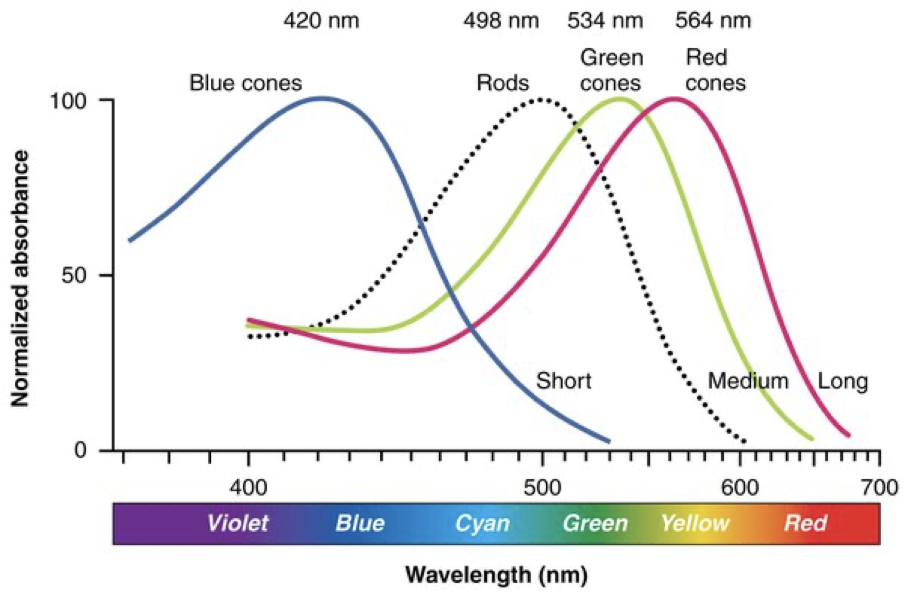
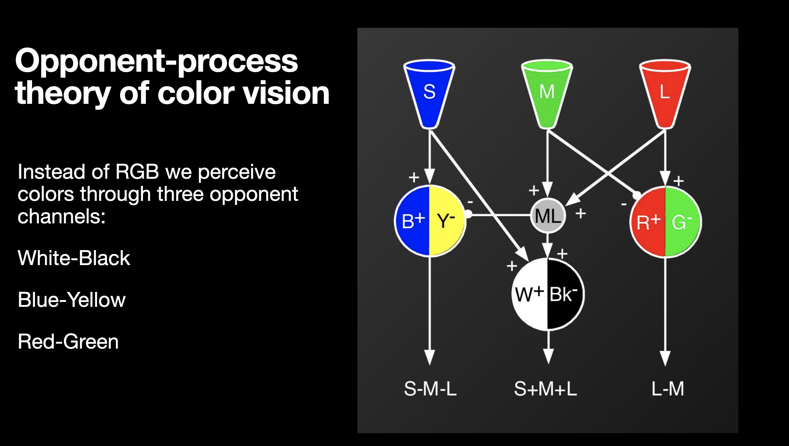
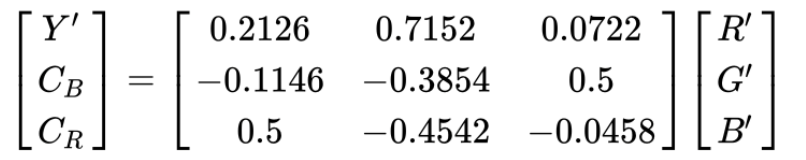

A student comes up with a new colorspace conversion recommendation for RGB to YUV conversion. Which of the following matrices are possibly correct color conversions:
(select all that apply)

[ ] 

$$
\begin{pmatrix}
Y' \\
C_B \\
C_R
\end{pmatrix} = 
\begin{bmatrix}
0.33 & 0.33 & 0.33\\
-0.25 & -0.25 & 0.5\\
0.5 & -0.5 & 0
\end{bmatrix}
\begin{pmatrix}
R' \\
G' \\
B'
\end{pmatrix}
$$

[ ] 

$$
\begin{pmatrix}
Y' \\
C_B \\
C_R
\end{pmatrix} = 
\begin{bmatrix}
0.33 & 0.33 & 0.33\\
-0.25 & -0.25 & 0.5\\
0.5 & 0 & -0.5
\end{bmatrix}
\begin{pmatrix}
R' \\
G' \\
B'
\end{pmatrix}
$$

[ ] 

$$
\begin{pmatrix}
Y' \\
C_B \\
C_R
\end{pmatrix} = 
\begin{bmatrix}
0.33 & 0.33 & 0.33\\
0 & -0.5 & 0.5\\
0.5 & -0.5 & 0
\end{bmatrix}
\begin{pmatrix}
R' \\
G' \\
B'
\end{pmatrix}
$$

[ ] 

$$
\begin{pmatrix}
Y' \\
C_B \\
C_R
\end{pmatrix} = 
\begin{bmatrix}
0 & 0.5 & 0.5\\
0 & -0.5 & 0.5\\
0.5 & -0.5 & 0
\end{bmatrix}
\begin{pmatrix}
R' \\
G' \\
B'
\end{pmatrix}
$$

### Solutions

Q1

( ) Lower MSE implies better visual perception

( ) Lower L1 implies better visual perception

(X) None of the above

Solution: Neither MSE nor L1 are an accurate estimate of visual perception.

Q2

[ ] Landscape image (natural images have low spatial frequencies)

[X] Text image (say screenshot of wikipedia page)

[X] Cartoon/Animated Content (note cartoons are artificially generated and have sharp edges)

[ ] Videos (note videos have temporal variance in noise along with spatial variance)

Solution: As seen in class, chroma subsampling produces significant artifacts when you have a lot of sharp edges like in text/screenshot and cartoons.

Q3

Solution: Only the first matrix is correct. In each of the other options, one of the rows doesn't represent the proper meaning of the YCbCr components. For example in the second option, the third row corresponding to Cr has R-B instead of R-G.